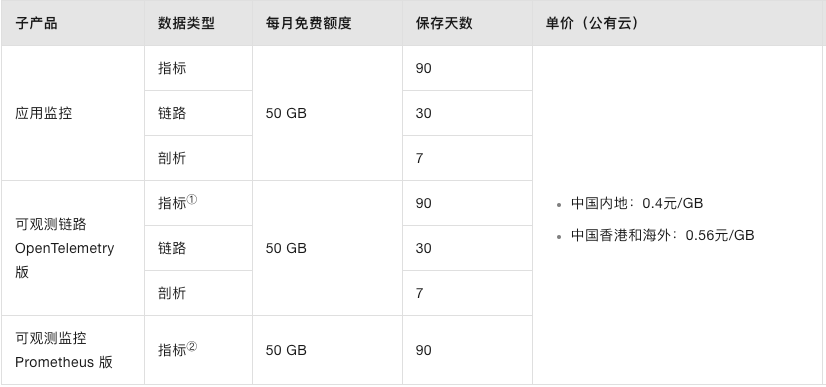

# ARMS服务中的应用监控和可观测链路 OpenTelemetry 版关系

都属于ARMS（[应用实时监控服务ARMS](https://help.aliyun.com/zh/arms/?spm=a2c4g.11174283.0.0.3e0540dcOkXSYn)）产品家族的子产品。

ARMS应用监控是一款应用性能管理（Application Performance Management，简称APM）产品。您无需修改代码，只需为应用安装一个探针，ARMS就能够对应用进行全方位监控，帮助您全面掌控应用运行状态，快速定位出错接口和慢接口，洞察性能瓶颈，重现调用参数、从而大幅提升线上问题诊断的效率。关于产品详情，请参见[什么是应用监控](https://help.aliyun.com/zh/arms/application-monitoring/product-overview/overview-9)。

**可观测链路 OpenTelemetry 版**为分布式应用的开发者提供了完整的调用链路还原、调用请求量统计、链路拓扑、应用依赖分析等工具，可以帮助开发者快速分析和诊断分布式应用架构下的性能瓶颈，提高微服务时代下的开发诊断效率。

## 产品功能对比

| **差异项** | **ARMS应用监控**                                                                                                    | **可观测链路 OpenTelemetry 版**                                                                                     |
| ---------------- | ------------------------------------------------------------------------------------------------------------------------- | ------------------------------------------------------------------------------------------------------------------------- |
| 产品定位         | APM工具类产品，包含应用性能监控、用户体验监控、调用链追踪和问题诊断等多项功能。                                           | 专注分布式链路追踪，拥抱开源标准。                                                                                        |
| 探针提供方       | 阿里云                                                                                                                    | 开源社区                                                                                                                  |
| 探针SLA          | 支持                                                                                                                      | 不支持                                                                                                                    |
| 接入方式         | 无侵入式Agent加载接入。                                                                                                   | 以侵入式SDK编程方式为主，部分语言提供了无侵入式Agent加载接入。                                                            |
| 应用程序语言支持 | Java                                                                                                                      | Java、Go、Python、JS、.NET、C++等主流编程语言                                                                             |
| 计费模式         | 按观测数据量收费，详情参见[产品计费（新版）](https://help.aliyun.com/zh/arms/product-overview/product-billing-new-version)。 | 按观测数据量收费，详情参见[产品计费（新版）](https://help.aliyun.com/zh/arms/product-overview/product-billing-new-version)。 |
| 智能洞察         | 支持                                                                                                                      | 不支持                                                                                                                    |
| 内存快照         | 支持                                                                                                                      | 不支持                                                                                                                    |
| 线程和内存诊断   | 支持                                                                                                                      | 不支持                                                                                                                    |
| 本地方法堆栈     | 支持                                                                                                                      | 不支持                                                                                                                    |
| CPU&内存诊断     | 支持                                                                                                                      | 不支持                                                                                                                    |
| 端侧预聚合       | 支持                                                                                                                      | 不支持                                                                                                                    |

* 对于Java应用，推荐接入ARMS应用监控，获得更多的功能支持，以及更好的探针稳定性保障。
* ARMS应用监控和**可观测链路 OpenTelemetry 版**在链路数据上已经实现了互通，产品控制台也提供融合的操作体验。在一个多语言混合的微服务架构中其他以将Java应用接入ARMS应用监控，其它应用接入**可观测链路 OpenTelemetry 版**，实现全栈链路跟踪。

# 产品计费

ARMS新版计费模式计费项分为按写入的可观测数据量收费和按可观测功能收费

### 链路监控服务按写入的可观测数据量收费

## 费用预估

应用监控

| **应用规模**            | **预估每月数据量** | **新版计费-按量付费** | **旧版计费-按量付费** | **旧版计费-资源包**                                                 |
| ----------------------------- | ------------------------ | --------------------------- | --------------------------- | ------------------------------------------------------------------------- |
| 小规模（50个节点=50个探针）   | 3000 GB                  | 1200元/每月                 | 10080元/每月新版节省88%     | 5250元/每月，新版节省77%需购买8400元资源包，28800 Agent\*Hour规格×2      |
| 中规模（200个节点=200个探针） | 12000 GB                 | 4800元/每月                 | 40320元/每月新版节省88%     | 11140元/每月，新版节省57%需购买25200元资源包，230400 Agent\*Hour规格×1   |
| 大规模（500个节点=500个探针） | 30000 GB                 | 12000元/每月                | 100800元/每月新版节省88%    | 19892.5元/每月，新版节省40%需购买50400元资源包，230400 Agent\*Hour规格×2 |

可观测链路 OpenTelemetry 版

| **业务规模** | **预估每天数据量** | **新版计费-按量付费** | **旧版计费-按量付费** | **相比旧版节省** |
| ------------------ | ------------------------ | --------------------------- | --------------------------- | ---------------------- |
| 1亿Span，保存30天  | 121 GB                   | 48元/每天                   | 72元/天                     | 33%                    |

# 使用区别

ARMS提供的**应用监控**功能，脱胎于阿里巴巴内部的分布式跟踪与监控系统（内部称为“鹰眼系统”），可以在不修改任何现有代码的情况下帮助网站开发人员和运维人员解决上述问题。
