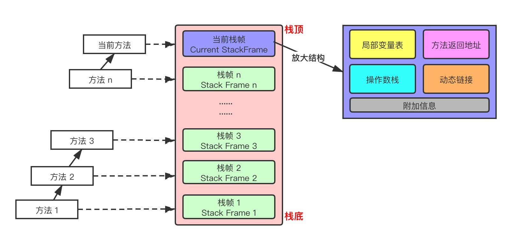

# JVM内存结构

内存是非常重要的系统资源，是硬盘和 CPU 的中间仓库及桥梁，承载着操作系统和应用程序的实时运行。JVM 内存布局规定了 Java 在运行过程中内存申请、分配、管理的策略，保证了 JVM 的高效稳定运行。不同的 JVM 对于内存的划分方式和管理机制存在着部分差异。JVM通过定义若干种程序运行期间会使用到的运行时数据区来统一运行时内存的控制。

下图是 JVM 整体架构，中间部分就是 Java 虚拟机定义的各种运行时数据区域。

中间部分的运行时数据区主要有以下几种：
*    线程私有：程序计数器、虚拟机栈、本地方法区
*    线程共享：堆、方法区, 堆外内存（Java7的永久代或JDK8的元空间、代码缓存）

接下来我们逐个区域分析。

# 程序计数器

全称程序计数寄存器（Program Counter Register），命名源于 CPU 的寄存器。CPU寄存器存储指令相关的线程信息，只有把数据装载到寄存器CPU 才能够运行对应的指令。这里，并非是广义上所指的物理寄存器，叫程序计数器（或PC计数器或指令计数器）会更加贴切，并且也不容易引起一些不必要的误会。JVM 中的 PC 寄存器是对物理 PC 寄存器的一种抽象模拟。程序计数器是一块较小的内存空间，可以看作是当前线程所执行的字节码的行号指示器。

## 作用

程序计数器器用来存储指向下一条指令的地址，即将要执行的指令代码。由执行引擎读取下一条指令。

## 深入理解

> 通过下面两个问题，理解下PC计数器

* 使用PC寄存器存储字节码指令地址有什么用呢？为什么使用PC寄存器记录当前线程的执行地址呢？

因为CPU需要不停的切换各个线程，这时候切换回来以后，就得知道接着从哪开始继续执行。JVM的字节码解释器就需要通过改变PC寄存器的值来明确下一条应该执行什么样的字节码指令。

* PC寄存器为什么会被设定为线程私有的？

多线程在一个特定的时间段内只会执行其中某一个线程方法，CPU会不停的做任务切换，这样必然会导致经常中断或恢复。为了能够准确的记录各个线程正在执行的当前字节码指令地址，所以为每个线程都分配了一个PC寄存器，每个线程都独立计算，不会互相影响。

## 总结

* 它是一块很小的内存空间，几乎可以忽略不计。也是运行速度最快的存储区域
* 在 JVM 规范中，每个线程都有它自己的程序计数器，是线程私有的，生命周期与线程的生命周期一致
* 任何时间一个线程都只有一个方法在执行，也就是所谓的当前方法。如果当前线程正在执行的是 Java 方法，程序计数器记录的是 JVM 字节码指令地址，如果是执行 native 方法，则是未指定值（undefined）
* 它是程序控制流的指示器，分支、循环、跳转、异常处理、线程恢复等基础功能都需要依赖这个计数器来完成
* 字节码解释器工作时就是通过改变这个计数器的值来选取下一条需要执行的字节码指令
* 它是唯一一个在 JVM 规范中没有规定任何 OutOfMemoryError 情况的区域

# 虚拟机栈

## 作用：
主管 Java 程序的运行，它保存方法的局部变量、部分结果，并参与方法的调用和返回。

特点：
* 栈是一种快速有效的分配存储方式，访问速度仅次于程序计数器
* JVM 直接对虚拟机栈的操作只有两个：每个方法执行，伴随着入栈（进栈/压栈），方法执行结束出栈
* 栈不存在垃圾回收问题

栈中可能出现的异常：
Java 虚拟机规范允许 Java虚拟机栈的大小是动态的或者是固定不变的
* 如果采用固定大小的 Java 虚拟机栈，那每个线程的 Java 虚拟机栈容量可以在线程创建的时候独立选定。
* 如果线程请求分配的栈容量超过 Java 虚拟机栈允许的最大容量，Java 虚拟机将会抛出一个 StackOverflowError 异常
* 如果 Java 虚拟机栈可以动态扩展，并且在尝试扩展的时候无法申请到足够的内存，或者在创建新的线程时没有足够的内存去创建对应的虚拟机栈，那 Java 虚拟机将会抛出一个OutOfMemoryError异常

可以通过参数-Xss来设置线程的最大栈空间，栈的大小直接决定了函数调用的最大可达深度。

## 深入理解

栈中存储什么？

* 每个线程都有自己的栈，栈中的数据都是以栈帧（Stack Frame）的格式存在
* 在这个线程上正在执行的每个方法都各自有对应的一个栈帧
* 栈帧是一个内存区块，是一个数据集，维系着方法执行过程中的各种数据信息

### 运行原理

* JVM 直接对 Java 栈的操作只有两个，对栈帧的压栈和出栈，遵循“先进后出/后进先出”原则
* 在一条活动线程中，一个时间点上，只会有一个活动的栈帧。即只有当前正在执行的方法的栈帧（栈顶栈帧）是有效的，这个栈帧被称为当前栈帧（Current Frame），与当前栈帧对应的方法就是当前方法（Current Method），定义这个方法的类就是当前类（Current Class）执行引擎运行的所有字节码指令只针对当前栈帧进行操作
* 如果在该方法中调用了其他方法，对应的新的栈帧会被创建出来，放在栈的顶端，称为新的当前栈帧
* 不同线程中所包含的栈帧是不允许存在相互引用的，即不可能在一个栈帧中引用另外一个线程的栈帧
* 如果当前方法调用了其他方法，方法返回之际，当前栈帧会传回此方法的执行结果给前一个栈帧，接着，虚拟机会丢弃当前栈帧，使得前一个栈帧重新成为当前栈帧
* Java 方法有两种返回函数的方式，一种是正常的函数返回，使用 return 指令，另一种是抛出异常，不管用哪种方式，都会导致栈帧被弹出

### 详细内部结构

每个栈帧（Stack Frame）中存储着：
* 局部变量表（Local Variables）
* 操作数栈（Operand Stack）(或称为表达式栈)
* 动态链接（Dynamic Linking）：指向运行时常量池的方法引用
* 方法返回地址（Return Address）：方法正常退出或异常退出的地址
* 一些附加信息

下面将简要介绍栈帧中的五个部分：

#### 局部变量表

* 局部变量表也被称为局部变量数组或者本地变量表
* 是一组变量值存储空间，主要用于存储方法参数和定义在方法体内的局部变量，包括编译器可知的各种 Java 虚拟机基本数据类型（boolean、byte、char、short、int、float、long、double）、对象引用（reference类型，它并不等同于对象本身，可能是一个指向对象起始地址的引用指针，也可能是指向一个代表对象的句柄或其他与此相关的位置）和 returnAddress 类型（指向了一条字节码指令的地址，已被异常表取代）
* 由于局部变量表是建立在线程的栈上，是线程的私有数据，因此不存在数据安全问题
* 局部变量表所需要的容量大小是编译期确定下来的，并保存在方法的 Code 属性的 maximum local variables 数据项中。在方法运行期间是不会改变局部变量表的大小的
* 方法嵌套调用的次数由栈的大小决定。一般来说，栈越大，方法嵌套调用次数越多。对一个函数而言，它的参数和局部变量越多，使得局部变量表膨胀，它的栈帧就越大，以满足方法调用所需传递的信息增大的需求。进而函数调用就会占用更多的栈空间，导致其嵌套调用次数就会减少。
* 局部变量表中的变量只在当前方法调用中有效。在方法执行时，虚拟机通过使用局部变量表完成参数值到参数变量列表的传递过程。当方法调用结束后，随着方法栈帧的销毁，局部变量表也会随之销毁。
* 参数值的存放总是在局部变量数组的 index0 开始，到数组长度 -1 的索引结束

> 在局部变量表内部是由许多Slot组成：
> * 局部变量表最基本的存储单元是 Slot（变量槽）在局部变量表中，32 位以内的类型只占用一个 Slot(包括returnAddress类型)，64 位的类型（long和double）占用两个连续的 Slot
>> - byte、short、char 在存储前被转换为int，boolean也被转换为int，0 表示 false，非 0 表示 true
>> - long 和 double 则占据两个 Slot
> - JVM 会为局部变量表中的每一个 Slot 都分配一个访问索引，通过这个索引即可成功访问到局部变量表中指定的局部变量值，索引值的范围从 0 开始到局部变量表允许的最大的 Slot 数量
> - 当一个实例方法被调用的时候，它的方法参数和方法体内部定义的局部变量将会按照顺序被复制到局部变量表中的每一个 Slot 上
> - 如果需要访问局部变量表中一个 64bit 的局部变量值时，只需要使用前一个索引即可。（比如：访问 long 或 double 类型变量，不允许采用任何方式单独访问其中的某一个 Slot）
> - 如果当前帧是由构造方法或实例方法创建的，那么该对象引用 this 将会存放在 index 为 0 的 Slot 处，其余的参数按照参数表顺序继续排列（这里就引出一个问题：静态方法中为什么不可以引用 this，就是因为this 变量不存在于当前方法的局部变量表中）
> - 栈帧中的局部变量表中的槽位是可以重用的，如果一个局部变量过了其作用域，那么在其作用域之后申明的新的局部变量就很有可能会复用过期局部变量的槽位，从而达到节省资源的目的。（下图中，this、a、b、c 理论上应该有 4 个变量，c 复用了 b 的槽）
> - 在栈帧中，与性能调优关系最为密切的就是局部变量表。在方法执行时，虚拟机使用局部变量表完成方法的传递
> - 局部变量表中的变量也是重要的垃圾回收根节点，只要被局部变量表中直接或间接引用的对象都不会被回收

#### 操作数栈

* 每个独立的栈帧中除了包含局部变量表之外，还包含一个后进先出（Last-In-First-Out）的操作数栈，也可以称为表达式栈（Expression Stack）
* 操作数栈，在方法执行过程中，根据字节码指令，往操作数栈中写入数据或提取数据，即入栈（push）、出栈（pop）
* 某些字节码指令将值压入操作数栈，其余的字节码指令将操作数取出栈。使用它们后再把结果压入栈。比如，执行复制、交换、求和等操作
* 主要用于保存计算过程的中间结果，同时作为计算过程中变量临时的存储空间

#### 主要作用

* 操作数栈，操作数栈就是 JVM 执行引擎的一个工作区，当一个方法刚开始执行的时候，一个新的栈帧也会随之被创建出来，此时这个方法的操作数栈是空的
* 每一个操作数栈都会拥有一个明确的栈深度用于存储数值，其所需的最大深度在编译期就定义好了，保存在方法的 Code 属性的 max_stack 数据项中
* 栈中的任何一个元素都可以是任意的 Java 数据类型 32bit 的类型占用一个栈单位深度64bit 的类型占用两个栈单位深度
* 操作数栈并非采用访问索引的方式来进行数据访问的，而是只能通过标准的入栈和出栈操作来完成一次数据访问
* 如果被调用的方法带有返回值的话，其返回值将会被压入当前栈帧的操作数栈中，并更新 PC 寄存器中下一条需要执行的字节码指令
* 操作数栈中元素的数据类型必须与字节码指令的序列严格匹配，这由编译器在编译期间进行验证，同时在类加载过程中的类检验阶段的数据流分析阶段要再次验证

#### 动态链接（指向方法区中运行时常量池的方法引用）

* 每一个栈帧内部都包含一个指向运行时常量池中该栈帧所属方法的引用。包含这个引用的目的就是为了支持当前方法的代码能够实现动态链接(Dynamic Linking)。
* 在 Java 源文件被编译到字节码文件中时，所有的变量和方法引用都作为符号引用（Symbolic Reference）保存在 Class 文件的常量池中。比如：描述一个方法调用了另外的其他方法时，就是通过一个符号指向常量池中方法的引用来表示的，动态链接的作用就是为了将这些符号引用转换为调用方法的直接引用

> 相关知识延伸
> **JVM 是如何执行方法调用的** 
>> 方法调用不同于方法执行，方法调用阶段的唯一任务就是确定被调用方法的版本（即调用哪一个方法），暂时还不涉及方法内部的具体运行过程。Class 文件的编译过程中不包括传统编译器中的连接步骤，一切方法调用在 Class文件里面存储的都是符号引用，而不是方法在实际运行时内存布局中的入口地址（直接引用）。也就是需要在类加载阶段，甚至到运行期才能确定目标方法的直接引用。
>>
> 在 JVM 中，将符号引用转换为调用方法的直接引用与方法的绑定机制有关，早期绑定（Early Binding）和晚期绑定（Late Binding）。绑定是一个字段、方法或者类在符号引用被替换为直接引用的过程，这仅仅发生一次。
> 早期绑定：早期绑定就是指被调用的目标方法如果在编译期可知，且运行期保持不变时，即可将这个方法与所属的类型进行绑定，这样一来，由于明确了被调用的目标方法究竟是哪一个，因此也就可以使用静态链接的方式将符号引用转换为直接引用。
> 晚期绑定：如果被调用的方法在编译器无法被确定下来，只能够在程序运行期根据实际的类型绑定相关的方法，这种绑定方式就被称为晚期绑定。
>
> 对应的如果方法在编译器就确定了具体的调用版本，这个版本在运行时是不可变的，即静态链接进行早期绑定。这样的方法称为非虚方法，比如静态方法、私有方法、final 方法、实例构造器、父类方法都是非虚方法。
其他方法称为虚方法，使用晚期绑定。

#### 方法返回地址

用来存放调用该方法时的程序计数器的值。
一个方法的结束，有两种方式
* 正常执行完成
* 出现未处理的异常，非正常退出

无论通过哪种方式退出，在方法退出后都返回到该方法被调用的位置。方法正常退出时，调用者的 程序计数器地址作为返回地址，即调用该方法的指令的下一条指令的地址。
而通过异常退出的，返回地址是要通过异常表来确定的，栈帧中一般不会保存这部分信息。
当一个方法开始执行后，只有两种方式可以退出这个方法：
1. 执行引擎遇到任意一个方法返回的字节码指令，会有返回值传递给上层的方法调用者，简称正常完成出口
一个方法的正常调用完成之后究竟需要使用哪一个返回指令还需要根据方法返回值的实际数据类型而定
在字节码指令中，返回指令包含 ireturn(当返回值是 boolean、byte、char、short 和 int 类型时使用)、lreturn、freturn、dreturn 以及 areturn，另外还有一个 return 指令供声明为 void 的方法、实例初始化方法、类和接口的初始化方法使用。
2. 在方法执行的过程中遇到了异常，并且这个异常没有在方法内进行处理，也就是只要在本方法的异常表中没有搜索到匹配的异常处理器，就会导致方法退出。简称异常完成出口
方法执行过程中异常处理部分，存储在一个异常处理表，方便在发生异常的时候找到处理异常的代码。本质上，方法的退出就是当前栈帧出栈的过程。此时，需要恢复上层方法的局部变量表、操作数栈、将返回值压入调用者栈帧的操作数栈、设置PC寄存器值等，让调用者方法继续执行下去。

正常完成出口和异常完成出口的区别在于：通过异常完成出口退出的不会给他的上层调用者产生任何的返回值。

#### 附加信息

栈帧中还允许携带与 Java 虚拟机实现相关的一些附加信息。例如，对程序调试提供支持的信息，但这些信息取决于具体的虚拟机实现。

# 本地方法栈

## 本地方法

简单的讲，一个 Native Method 就是一个 Java 调用非 Java 代码的接口。我们知道的 Unsafe 类就有很多本地方法。

## 本地方法栈（Native Method Stack）

* Java 虚拟机栈用于管理 Java 方法的调用，而本地方法栈用于管理本地方法的调用
* 本地方法栈也是线程私有的允许线程固定或者可动态扩展的内存大小
    - 如果线程请求分配的栈容量超过本地方法栈允许的最大容量，Java 虚拟机将会抛出一个 StackOverflowError 异常
    - 如果本地方法栈可以动态扩展，并且在尝试扩展的时候无法申请到足够的内存，或者在创建新的线程时没有足够的内存去创建对应的本地方法栈，那么 Java虚拟机将会抛出一个OutofMemoryError异常
* 本地方法是使用 C 语言实现的它的具体做法是 Native Method Stack 中登记 native 方法，在 Execution Engine 执行时加载本地方法库
* 当某个线程调用一个本地方法时，它就进入了一个全新的并且不再受虚拟机限制的世界。
* 它和虚拟机拥有同样的权限。本地方法可以通过本地方法接口来访问虚拟机内部的运行时数据区，它甚至可以直接使用本地处理器中的寄存器，直接从本地内存的堆中分配任意数量的内存
* 并不是所有 JVM 都支持本地方法。因为 Java 虚拟机规范并没有明确要求本地方法栈的使用语言、具体实现方式、数据结构等。如果 JVM 产品不打算支持 native 方法，也可以无需实现本地方法栈
* 在 Hotspot JVM 中，直接将本地方法栈和虚拟机栈合二为一

# 堆内存

> **栈是运行时的单位，而堆是存储的单位。**
栈解决程序的运行问题，即程序如何执行，或者说如何处理数据。堆解决的是数据存储的问题，即数据怎么放、放在哪。

## 堆内存划分

对于大多数应用，Java 堆是 Java 虚拟机管理的内存中最大的一块，被所有线程共享。此内存区域的唯一目的就是存放对象实例，几乎所有的对象实例以及数据都在这里分配内存。

为了进行高效的垃圾回收，虚拟机把堆内存逻辑上划分成三块区域（分代的唯一理由就是优化 GC 性能）：
* 新生带（年轻代）：新对象和没达到一定年龄的对象都在新生代
* 老年代（养老区）：被长时间使用的对象，老年代的内存空间应该要比年轻代更大
* 方法区（JDK1.8 之前叫永久代之后有元空间以及堆来承担）：像一些方法中的操作临时对象等，JDK1.8 之前是占用 JVM 内存，JDK1.8 之后直接使用物理内存

Java 虚拟机规范规定，Java 堆可以是处于物理上不连续的内存空间中，只要逻辑上是连续的即可，像磁盘空间一样。实现时，既可以是固定大小，也可以是可扩展的，主流虚拟机都是可扩展的（通过 -Xmx 和 -Xms 控制），如果堆中没有完成实例分配，并且堆无法再扩展时，就会抛出 OutOfMemoryError 异常。

## 年轻代 (Young Generation)
年轻代是所有新对象创建的地方。当填充年轻代时，执行垃圾收集。这种垃圾收集称为 Minor GC。年轻一代被分为三个部分——伊甸园（Eden Memory）和两个幸存区（Survivor Memory，被称为from/to或s0/s1），默认比例是8:1:1
* 大多数新创建的对象都位于 Eden 内存空间中
* 当 Eden 空间被对象填充时，执行Minor GC，并将所有幸存者对象移动到一个幸存者空间中
* Minor GC 检查幸存者对象，并将它们移动到另一个幸存者空间。所以每次，一个幸存者空间总是空的
* 经过多次 GC 循环后存活下来的对象被移动到老年代。通常，这是通过设置年轻一代对象的年龄阈值来实现的，然后他们才有资格提升到老一代

## 老年代(Old Generation)
老年代内存包含那些经过许多轮小型 GC 后仍然存活的对象。
通常，Major GC是在老年代内存满时执行的。老年代垃圾收集称为 主GC（Major GC），通常需要更长的时间。大对象直接进入老年代（大对象是指需要大量连续内存空间的对象）。这样做的目的是避免在 Eden 区和两个Survivor 区之间发生大量的内存拷贝

## 元空间
不管是 JDK8 之前的永久代，还是 JDK8 及以后的元空间，都可以看作是 Java 虚拟机规范中方法区的实现。

虽然 Java 虚拟机规范把方法区描述为堆的一个逻辑部分，但是它却有一个别名叫 Non-Heap（非堆），目的应该是与 Java 堆区分开。所以元空间放在后边的方法区再说。

## 设置堆内存大小和 OOM

Java 堆用于存储 Java 对象实例，堆的大小在 JVM 启动的时候就确定了，我们可以通过 -Xmx 和 -Xms 来设定
* -Xms 用来表示堆的起始内存，等价于 -XX:InitialHeapSize
* -Xmx 用来表示堆的最大内存，等价于 -XX:MaxHeapSize

如果堆的内存大小超过 -Xmx 设定的最大内存， 就会抛出 OutOfMemoryError 异常。
我们通常会将 -Xmx 和 -Xms 两个参数配置为相同的值，其目的是为了能够在垃圾回收机制清理完堆区后不再需要重新分隔计算堆的大小导致内存扩容进行对象拷贝，从而提高性能
默认情况下，初始堆内存大小为：电脑内存大小/64，最大堆内存大小为：电脑内存大小/4

##  查看 JVM 堆内存分配

1. 在默认不配置 JVM 堆内存大小的情况下，JVM 根据默认值来配置当前内存大小
2. 默认情况下新生代和老年代的比例是 1:2，可以通过 –XX:NewRatio 来配置
    * 新生代中的 Eden:From Survivor:To Survivor 的比例是 8:1:1，可以通过 -XX:SurvivorRatio 来配置
3. 若在 JDK 7 中开启了 -XX:+UseAdaptiveSizePolicy，JVM 会动态调整 JVM 堆中各个区域的大小以及进入老年代的年龄此时 –XX:NewRatio 和 -XX:SurvivorRatio 将会失效，而 JDK 8 是默认开启-XX:+UseAdaptiveSizePolicy
在 JDK 8中，不要随意关闭-XX:+UseAdaptiveSizePolicy，除非对堆内存的划分有明确的规划

## 对象在堆中的生命周期
1. 在 JVM 内存模型的堆中，堆被划分为新生代和老年代 
    * 新生代又被进一步划分为 Eden区 和 Survivor区，Survivor 区由 From Survivor 和 To Survivor 组成
2. 当创建一个对象时，对象会被优先分配到新生代的 Eden 区 
    * 此时 JVM 会给对象定义一个对象年轻计数器（-XX:MaxTenuringThreshold）
3. 当 Eden 空间不足时，JVM 将执行新生代的垃圾回收（Minor GC） 
    * JVM 会把存活的对象转移到 Survivor 中，并且对象年龄 +1
    * 对象在 Survivor 中同样也会经历 Minor GC，每经历一次 Minor GC，对象年龄都会+1
4. 如果分配的对象超过了-XX:PetenureSizeThreshold，对象会直接被分配到老年代

## GC垃圾回收简介

### Minor GC、Major GC、Full GC

JVM 在进行 GC 时，并非每次都对堆内存（新生代、老年代；方法区）区域一起回收的，大部分时候回收的都是指新生代。

针对 HotSpot VM 的实现，它里面的 GC 按照回收区域又分为两大类：
* 部分收集（Partial GC），整堆收集（Full GC）部分收集：不是完整收集整个 Java 堆的垃圾收集。其中又分为： 
    * 新生代收集（Minor GC/Young GC）：只是新生代的垃圾收集
    * 老年代收集（Major GC/Old GC）：只是老年代的垃圾收集 
        * 目前，只有 CMS GC 会有单独收集老年代的行为
        * 很多时候 Major GC 会和 Full GC 混合使用，需要具体分辨是老年代回收还是整堆回收
    * 混合收集（Mixed GC）：收集整个新生代以及部分老年代的垃圾收集 
        * 目前只有 G1 GC 会有这种行为
* 整堆收集（Full GC）：收集整个 Java 堆和方法区的垃圾

> 拓展知识： 并不是所有对象都必须分配到堆中。基于逃逸分析算法可以将满足要求的对象分配到栈中。
逃逸分析(Escape Analysis)是目前 Java 虚拟机中比较前沿的优化技术。这是一种可以有效减少 Java 程序中同步负载和内存堆分配压力的跨函数全局数据流分析算法。通过逃逸分析，Java Hotspot 编译器能够分析出一个新的对象的引用的使用范围从而决定是否要将这个对象分配到堆上。
> 
> 逃逸分析的基本行为就是分析对象动态作用域：当一个对象在方法中被定义后，对象只在方法内部使用，则认为没有发生逃逸。当一个对象在方法中被定义后，它被外部方法所引用，则认为发生逃逸。例如作为调用参数传递到其他地方中，称为方法逃逸。
> 使用逃逸分析，编译器可以对代码做优化：
> * 栈上分配：将堆分配转化为栈分配。如果一个对象在子程序中被分配，要使指向该对象的指针永远不会逃逸，对象可能是栈分配的候选，而不是堆分配
> * 同步省略：如果一个对象被发现只能从一个线程被访问到，那么对于这个对象的操作可以不考虑同步分离
> * 对象或标量替换：有的对象可能不需要作为一个连续的内存结构存在也可以被访问到，那么对象的部分（或全部）可以不存储在内存，而存储在 CPU 寄存器
> 参考示例：[逃逸分析优化](https://pdai.tech/md/java/jvm/java-jvm-struct.html#%E9%80%83%E9%80%B8%E5%88%86%E6%9E%90)
> 
> 关于逃逸分析的论文在1999年就已经发表了，但直到JDK 1.6才有实现，而且这项技术到如今也并不是十分成熟的。
> 
> 其根本原因就是无法保证逃逸分析的性能消耗一定能高于他的消耗。虽然经过逃逸分析可以做标量替换、栈上分配、和锁消除。但是逃逸分析自身也是需要进行一系列复杂的分析的，这其实也是一个相对耗时的过程。
> 
> 一个极端的例子，就是经过逃逸分析之后，发现没有一个对象是不逃逸的。那这个逃逸分析的过程就白白浪费掉了。
>
> 虽然这项技术并不十分成熟，但是他也是即时编译器优化技术中一个十分重要的手段。

# 方法区

* 方法区（Method Area）与 Java 堆一样，是所有线程共享的内存区域。
* 虽然 Java 虚拟机规范把方法区描述为堆的一个逻辑部分，但是它却有一个别名叫 Non-Heap（非堆），目的应该是与 Java 堆区分开。
* 运行时常量池（Runtime Constant Pool）是方法区的一部分。Class 文件中除了有类的版本/字段/方法/接口等描述信息外，还有一项信息是常量池（Constant Pool Table），用于存放编译期生成的各种字面量和符号引用，这部分内容将类在加载后放入方法区的运行时常量池中存放。运行期间也可能将新的常量放入池中，这种特性被开发人员利用得比较多的是 String.intern()方法。受方法区内存的限制，当常量池无法再申请到内存时会抛出 OutOfMemoryError 异常。
* 方法区的大小和堆空间一样，可以选择固定大小也可选择可扩展，方法区的大小决定了系统可以放多少个类，如果系统类太多，导致方法区溢出，虚拟机同样会抛出内存溢出错误
* JVM 关闭后方法区即被释放

## 深入理解
永久代，元数据区、方法区的区别：

* 方法区（method area）只是 JVM 规范中定义的一个概念，用于存储类信息、常量池、静态变量、JIT编译后的代码等数据，并没有规定如何去实现它，不同的厂商有不同的实现。而永久代（PermGen）是 Hotspot 虚拟机特有的概念， Java8 的时候又被元空间取代了，永久代和元空间都可以理解为方法区的落地实现。
* 永久代物理空间上是堆的一部分，和新生代，老年代地址是连续的（受垃圾回收器管理），而元空间存在于本地内存（我们常说的堆外内存，不受垃圾回收器管理），这样就不受 JVM 限制了，也比较难发生OOM（都会有溢出异常）
* Java7 中我们通过-XX:PermSize 和 -xx:MaxPermSize 来设置永久代参数，Java8 之后，随着永久代的取消，这些参数也就随之失效了，改为通过-XX:MetaspaceSize 和 -XX:MaxMetaspaceSize 用来设置元空间参数
* 存储内容不同，元空间存储类的元信息，静态变量和常量池等并入堆中。相当于永久代的数据被分到了堆和元空间中
* 如果方法区域中的内存不能用于满足分配请求，则 Java 虚拟机抛出 OutOfMemoryError
* JVM 规范说方法区在逻辑上是堆的一部分，但目前实际上是与 Java 堆分开的（Non-Heap）

所以对于方法区，Java8 之后的变化：
* 移除了永久代（PermGen），替换为元空间（Metaspace）；
* 永久代中的 class metadata 转移到了 native memory（本地内存，而不是虚拟机）；
* 永久代中的 interned Strings 和 class static variables 转移到了 Java heap；
* 永久代参数 （PermSize MaxPermSize） -> 元空间参数（MetaspaceSize MaxMetaspaceSize）

## 设置方法区内存的大小

JDK8 及以后：
* 元数据区大小可以使用参数 -XX:MetaspaceSize 和 -XX:MaxMetaspaceSize 指定，替代上述原有的两个参数
* 默认值依赖于平台。Windows 下，-XX:MetaspaceSize 是 21M，-XX:MaxMetaspacaSize 的值是 -1，即没有限制
* 与永久代不同，如果不指定大小，默认情况下，虚拟机会耗尽所有的可用系统内存。如果元数据发生溢出，虚拟机一样会抛出异常 OutOfMemoryError:Metaspace
* -XX:MetaspaceSize ：设置初始的元空间大小。对于一个 64 位的服务器端 JVM 来说，其默认的 -XX:MetaspaceSize 的值为20.75MB，这就是初始的高水位线，一旦触及这个水位线，Full GC 将会被触发并卸载没用的类（即这些类对应的类加载器不再存活），然后这个高水位线将会重置，新的高水位线的值取决于 GC 后释放了多少元空间。如果释放的空间不足，那么在不超过 MaxMetaspaceSize时，适当提高该值。如果释放空间过多，则适当降低该值
* 如果初始化的高水位线设置过低，上述高水位线调整情况会发生很多次，通过垃圾回收的日志可观察到 Full GC 多次调用。为了避免频繁 GC，建议将 -XX:MetaspaceSize 设置为一个相对较高的值。

## 方法区在 JDK6、7、8中的演进细节

只有 HotSpot 才有永久代的概念
| JDK版本 | 永久代情况                         | 静态变量存放位置         | 字符串常量池存放位置 | 其他信息存放位置               |
|---------|----------------------------------|--------------------------|----------------------|--------------------------------|
| JDK1.6及之前 | 有永久代                         | 永久代                   | 永久代               | 类型信息、字段、方法、常量在永久代 |
| JDK1.7   | 有永久代，但逐步“去永久代”       | 堆中                     | 堆中                 | 类型信息、字段、方法、常量在永久代 |
| JDK1.8及之后 | 取消永久代                       | 堆中                     | 堆中                 | 类型信息、字段、方法、常量在元空间（本地内存） |

**HotSpot中字符串常量池保存哪里？永久代？方法区还是堆区？**

1. 运行时常量池（Runtime Constant Pool）是虚拟机规范中是方法区的一部分，在加载类和结构到虚拟机后，就会创建对应的运行时常量池；而字符串常量池是这个过程中常量字符串的存放位置。所以从这个角度，字符串常量池属于虚拟机规范中的方法区，它是一个逻辑上的概念；而堆区，永久代以及元空间是实际的存放位置。即实际物理空间位于堆中，概念上1.8之前位于永久代之后位于元空间。
2. 不同的虚拟机对虚拟机的规范（比如方法区）是不一样的，只有 HotSpot 才有永久代的概念。

| JDK版本       | 是否有永久代 | 字符串常量池存放位置 | 方法区逻辑规范的实际实现                                                                 |
|---------------|--------------|----------------------|----------------------------------------------------------------------------------------|
| JDK1.6及之前  | 有永久代     | 永久代               | 方法区在HotSpot中由永久代实现（包括运行时常量池、字符串常量池、静态变量等）              |
| JDK1.7        | 有永久代，但逐步“去永久代” | 堆中               | 方法区在HotSpot中由永久代（类型信息、字段、方法、常量）和堆（字符串常量池、静态变量）共同实现 |
| JDK1.8及之后  | 取消永久代   | 堆中                 | 方法区在HotSpot中由元空间（本地内存，存放类型信息、字段、方法、常量）和堆（字符串常量池、静态变量）共同实现 |
