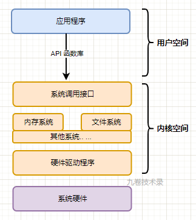
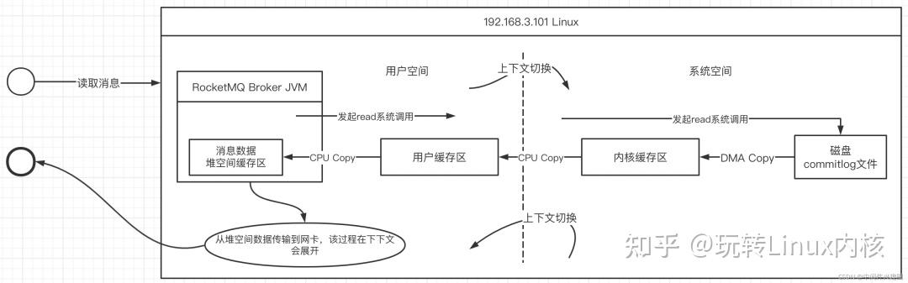
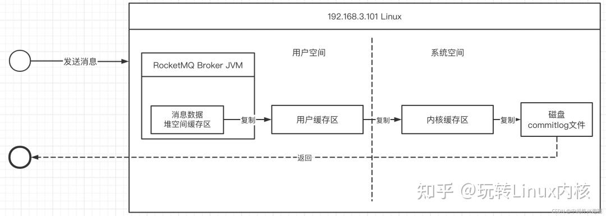
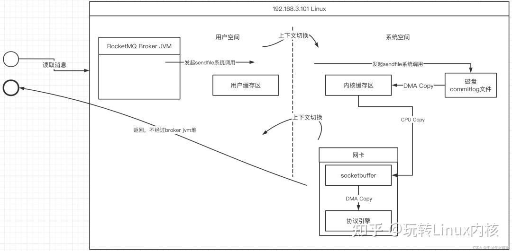
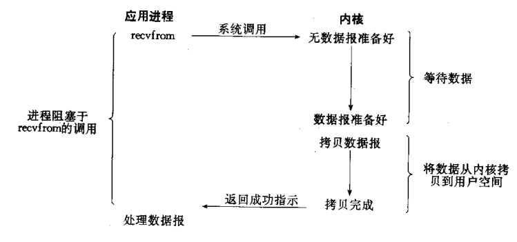
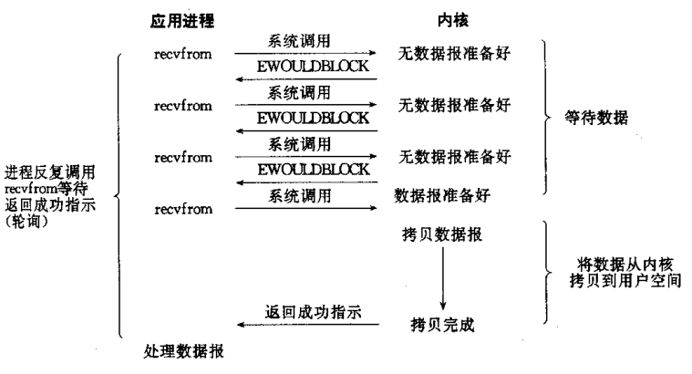
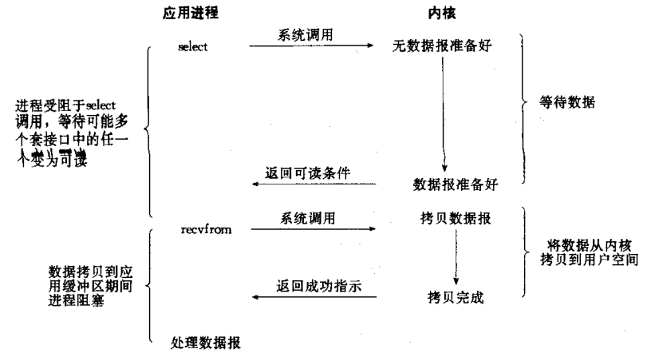
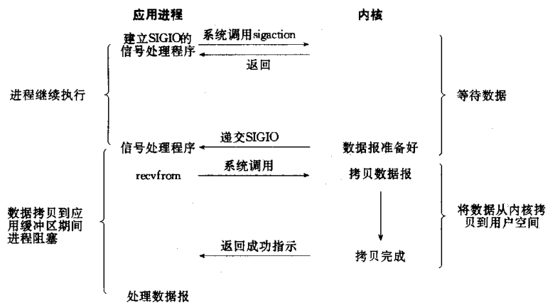
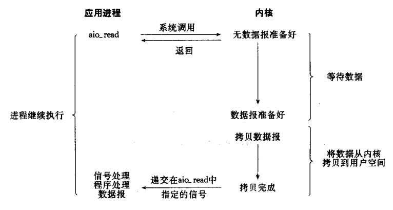
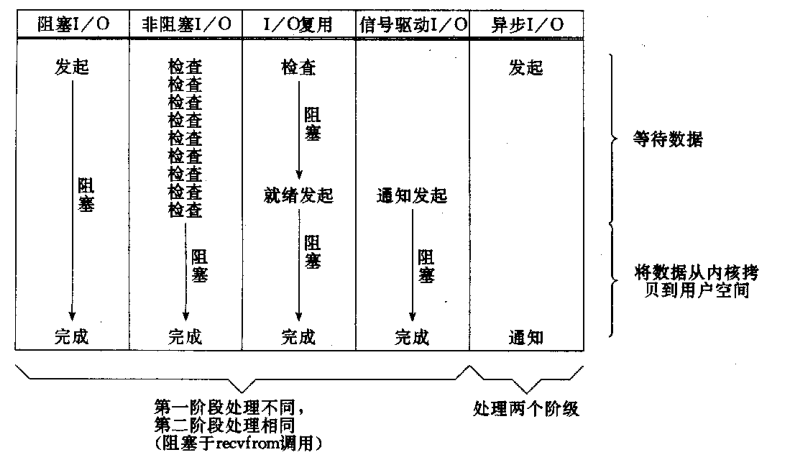

# 前置基础知识

## 用户态与内核态

在一个 linux 操作系统中，一般分为用户空间和内核空间。

用户空间一般就是我们进行应用程序编程的地方。

内核空间就是 linux 操作系统自己运行的一些系统，比如内存系统，文件系统，进程调度，硬件驱动程序等等，都是操作系统内核进行控制。

处于 2 个不同的空间，那应用程序怎么对内核进行一些操作呢？

> 应用程序运行在用户空间，是不具备直接操作系统功能的权限。应用程序要访问内核系统的一些功能，需要通过系统调用（System Call）来完成。
具体就是操作系统内核为应用程序提供了一些接口 API（封装的函数），供应用程序使用，来访问操作内核的一些功能。



## 阻塞非阻塞、同步与异步

其实阻塞和非阻塞是和异步没关系的。阻塞和非阻塞这两个概念都是来描述主线程的行为的。
异步阻塞就是主线程把任务交给异步线程执行后，主线程再通过阻塞的方式来拿异步线程执行的结果（这里可以类比java中提交了一个异步任务FutureTask，但是由于你的主线程需要该任务的结果因此你调用了其get方法导致主线程一直在等待其执行完毕）。
而异步非阻塞就是主线程时不时的去拿异步线程执行的结果或者其主线程根本不关心结果或异步线程执行完成后回调（这里的时不时可以理解为通过轮询，或者时不时检查一下主线程与异步线程所共享的信号量、资源等）

所以很多文章把异步和阻塞非阻塞联系起来这里是一个很大的错误。

而且阻塞非阻塞、同步与异步在不同场景下指代的对象可能不尽相同，比如IO的阻塞非阻塞、同步与异步，此时的主体是IO即socket、file等，有可能其部分函数调用是阻塞的，但对于请求（socket）来说是非阻塞的，比如NIO的Selector就会被阻塞，但是select感知到事件后返回的socket的channel是非阻塞的。

# 零拷贝

“零拷贝”其实包括两个层面的含义：
>   拷贝 一份相同的数据从一个地方移动到另外一个地方的过程，叫拷贝。
    零 希望在IO读写过程中，*CPU控制*的数据拷贝到次数为0。

在IO编程领域，当然是拷贝的次数越少越好，逐步优化，将其拷贝次数将为0，最大化的提高性能。

# Java中的零拷贝

在Java应用中传统的IO要读取文件内容时基本流程如下：

1. 当broker收到read请求时发起一次read系统调用，此时操作系统会进行一次上下文的切换，从用户态切换到内核态。
2. 通过直接存储访问器(DMA)从磁盘将数据加载到内核缓存区（DMA Copy
，这个阶段不需要CPU参与，如果是阻塞型IO，该过程用户线程会处于阻塞状态）
3. 然后在CPU的控制下，将内核缓存区的数据copy到用户空间的缓存区(由于这个是操作系统级别的行为，通常这里指的内存缓存区，通常使用的是堆外内存)，这里将发生一次CPU复制与一次上下文切换（从内核态切换到用户态）
4. 将堆外内存中的数据复制到应用程序的堆内存，供应用程序使用，本次复制需要经过CPU控制。
5. 将数据加载到堆空间，需要传输到网卡，这个过程又要进入到内核空间，然后复制到sockebuffer，然后进入网卡协议引擎，从而进入到网络传输中。

在Java应用中传统的IO要写文件内容时基本流程如下：

核心关键步骤如下：

1. 在broker收到消息时首先会在堆空间中创建一个堆缓存区，用于存储用户需要写入的数据，然后需要将jvm堆内存中数据复制到操作系统内存(CPU COPY)
2. 发起write系统调用，将用户空间中的数据复制到内存缓存区，**此过程发生一次上下文切换（用户态切换到内核态）**并进行一次CPU Copy。
3. 通过直接存储访问器(DMA)将内核空间的数据写入到磁盘，并返回结果，此过程发生一次DMA Copy 与一次上下文切换(内核态切换到用户态)

在传统IO过程中存在很多次CPU的IO拷贝，而零拷贝技术就在于优化拷贝过程。

## MappedByteBuffer实现零拷贝

jvm堆空间中数据要发送到内核缓存区，通常需要先将jvm堆空间中的数据拷贝到系统内存（一个非官方的理解，用C语言实现的本地方法调用中，首先需要将堆空间中数据拷贝到C语言相关的存储结构)，故提高性能的第一个措施：使用堆外内存。

MappedByteBuffer 是 NIO 基于**内存映射（mmap）**这种零拷贝方式的提供的一种实现，它继承自 ByteBuffer。FileChannel 定义了一个 map() 方法，它可以把一个文件从 position 位置开始的 size 大小的区域映射为内存映像文件。抽象方法 map() 方法在 FileChannel 中的定义如下：
```java
public abstract MappedByteBuffer map(MapMode mode, long position, long size)
        throws IOException;
```
- mode：限定内存映射区域（MappedByteBuffer）对内存映像文件的访问模式，包括只可读（READ_ONLY）、可读可写（READ_WRITE）和写时拷贝（PRIVATE）三种模式。
- position：文件映射的起始地址，对应内存映射区域（MappedByteBuffer）的首地址。
- size：文件映射的字节长度，从 position 往后的字节数，对应内存映射区域（MappedByteBuffer）的大小。

MappedByteBuffer 相比 ByteBuffer 新增了 fore()、load() 和 isLoad() 三个重要的方法：fore()：对于处于 READ_WRITE 模式下的缓冲区，把对缓冲区内容的修改强制刷新到本地文件。load()：将缓冲区的内容载入物理内存中，并返回这个缓冲区的引用。isLoaded()：如果缓冲区的内容在物理内存中，则返回 true，否则返回 false。

下面给出一个利用 MappedByteBuffer 对文件进行读写的使用示例：
```java
public class ZeroCopyDemo {
    private final static String CONTENT = "Zero copy implemented by MappedByteBuffer";

    private final static String FILE_NAME = "juc/mmap.txt";

    private final static String CHARSET = "UTF-8";

    public static void main(String[] args) {

        new ZeroCopyDemo().writeToFileByMappedByteBuffer();
        new ZeroCopyDemo().readFromFileByMappedByteBuffer();
    }

    /**
     * 方法writeToFileByMappedByteBuffer作用为：
     * 通过MappedByteBuffer写入文件
     *
     * @param
     * @return void
     * @throws
     * @author ziyu
     */
    public void writeToFileByMappedByteBuffer() {
        Path path = Paths.get(FILE_NAME);
        byte[] bytes = CONTENT.getBytes(Charset.forName(CHARSET));
        try (FileChannel fileChannel = FileChannel.open(path, StandardOpenOption.READ,
                                                        StandardOpenOption.WRITE,
                                                        StandardOpenOption.TRUNCATE_EXISTING)) {
            MappedByteBuffer mappedByteBuffer = fileChannel.map(FileChannel.MapMode.READ_WRITE, 0, bytes.length);
            if (mappedByteBuffer != null) {
                mappedByteBuffer.put(bytes);
                mappedByteBuffer.force();
            }
        } catch (IOException e) {
            e.printStackTrace();
        }
    }

    /**
     * 方法readFromFileByMappedByteBuffer作用为：
     * 通过MappedByteBuffer读取文件
     *
     * @param
     * @return void
     * @throws
     * @author ziyu
     */
    public void readFromFileByMappedByteBuffer() {
        Path path = Paths.get(FILE_NAME);
        int length = CONTENT.getBytes(Charset.forName(CHARSET)).length;
        try (FileChannel fileChannel = FileChannel.open(path, StandardOpenOption.READ)) {
            MappedByteBuffer mappedByteBuffer = fileChannel.map(FileChannel.MapMode.READ_ONLY, 0, length);
            if (mappedByteBuffer != null) {
                byte[] bytes = new byte[length];
                mappedByteBuffer.get(bytes);
                String content = new String(bytes, StandardCharsets.UTF_8);
                assertEquals(content, "Zero copy implemented by MappedByteBuffer");
            }
        } catch (IOException e) {
            e.printStackTrace();
        }
    }

    private void assertEquals(String content, String zeroCopyImplementedByMappedByteBuffer) {
        if (!content.equals(zeroCopyImplementedByMappedByteBuffer)) {
            throw new RuntimeException("content is not equal");
        }
    }

}
```

之所有说上述copy是零拷贝是因为核心的map方法在底层实现时使用了堆外内存。

map() 方法是 java.nio.channels.FileChannel 的抽象方法，由子类 sun.nio.ch.FileChannelImpl.java 实现，下面是和内存映射相关的核心代码：
```java
    public MappedByteBuffer map(MapMode mode, long position, long size) throws IOException {
        if (size > Integer.MAX_VALUE)
            throw new IllegalArgumentException("Size exceeds Integer.MAX_VALUE");
        boolean isSync = isSync(Objects.requireNonNull(mode, "Mode is null"));
        int prot = toProt(mode);
        Unmapper unmapper = mapInternal(mode, position, size, prot, isSync);
        if (unmapper == null) {
            // a valid file descriptor is not required
            FileDescriptor dummy = new FileDescriptor();
            if ((!writable) || (prot == MAP_RO))
                return Util.newMappedByteBufferR(0, 0, dummy, null, isSync);
            else
                return Util.newMappedByteBuffer(0, 0, dummy, null, isSync);
        } else if ((!writable) || (prot == MAP_RO)) {
            return Util.newMappedByteBufferR((int)unmapper.cap,
                    unmapper.address + unmapper.pagePosition,
                    unmapper.fd,
                    unmapper, isSync);
        } else {
            return Util.newMappedByteBuffer((int)unmapper.cap,
                    unmapper.address + unmapper.pagePosition,
                    unmapper.fd,
                    unmapper, isSync);
        }
    }

```
map() 方法通过本地方法 mapInternal()内部调用map0方法 为文件分配一块虚拟内存，作为它的内存映射区域，然后返回这块内存映射区域的起始地址。
* 文件映射需要在 Java 堆中创建一个 MappedByteBuffer 的实例。如果第一次文件映射导致 OOM，则手动触发垃圾回收，休眠 100ms 后再尝试映射，如果失败则抛出异常。
* 通过 Util 的 newMappedByteBuffer （可读可写）方法或者 newMappedByteBufferR（仅读） 方法方法反射创建一个 ** DirectByteBuffer **实例，其中 DirectByteBuffer 是 MappedByteBuffer 的子类。

map() 方法返回的是内存映射区域的起始地址，通过（起始地址 + 偏移量）就可以获取指定内存的数据。这样一定程度上替代了 read() 或 write() 方法，底层直接采用 sun.misc.Unsafe类的 getByte() 和 putByte() 方法对数据进行读写。

map0方法定义如下：
```java
    // -- Native methods --

    // Creates a new mapping
    private native long map0(int prot, long position, long length, boolean isSync)
        throws IOException;
```
它通过 JNI（Java Native Interface）调用底层 C 的实现，这个 native 函数（Java_sun_nio_ch_FileChannelImpl_map0）的实现位于 JDK 源码包下的 native/sun/nio/ch/FileChannelImpl.c这个源文件里面。

最终在C文件中使用mmap64方法，该方法定义如下：
```c
#include <sys/mman.h>

void *mmap64(void *addr, size_t len, int prot, int flags, int fd, off64_t offset);
```

最终总结一下 MappedByteBuffer 实现的零拷贝的特点和不足之处：
- MappedByteBuffer 使用是堆外的虚拟内存，因此分配（map）的内存大小不受 JVM 的 -Xmx 参数限制，但是也是有大小限制的。 如果当文件超出 Integer.MAX_VALUE 字节限制时，可以通过 position 参数重新 map 文件后面的内容。
- MappedByteBuffer 在处理大文件时性能的确很高，但也存内存占用、文件关闭不确定等问题，被其打开的文件只有在垃圾回收的才会被关闭，而且这个时间点是不确定的。
- MappedByteBuffer 提供了文件映射内存的 mmap() 方法，也提供了释放映射内存的 unmap() 方法。然而 unmap() 是 FileChannelImpl 中的私有方法，无法直接显示调用。因此，用户程序需要通过 Java 反射的调用 sun.misc.Cleaner 类的 clean() 方法手动释放映射占用的内存区域。

在MappedByteBuffer实现零拷贝的底层还有一个 DirectByteBuffer 类。

DirectByteBuffer 的对象引用位于 Java 内存模型的堆里面，JVM 可以对 DirectByteBuffer 的对象进行内存分配和回收管理，一般使用 DirectByteBuffer 的静态方法 allocateDirect() 创建 DirectByteBuffer 实例并分配内存。

DirectByteBuffer 内部的字节缓冲区位在于堆外的（用户态）直接内存，它是通过 Unsafe 的本地方法 allocateMemory() 进行内存分配，底层调用的是操作系统的 malloc() 函数。

那么 DirectByteBuffer 和零拷贝有什么关系？前面有提到在 MappedByteBuffer 进行内存映射时，它的 map() 方法会通过 Util.newMappedByteBuffer() 来创建一个缓冲区实例，初始化的代码如下：
```java
    static MappedByteBuffer newMappedByteBuffer(int size, long addr,
                                                FileDescriptor fd,
                                                Runnable unmapper,
                                                boolean isSync)
    {
        MappedByteBuffer dbb;
        if (directByteBufferConstructor == null)
            initDBBConstructor();
        try {
            dbb = (MappedByteBuffer)directByteBufferConstructor.newInstance(
              new Object[] { size,
                             addr,
                             fd,
                             unmapper,
                             isSync, null});
        } catch (InstantiationException |
                 IllegalAccessException |
                 InvocationTargetException e) {
            throw new InternalError(e);
        }
        return dbb;
    }

    private static void initDBBConstructor() {
        AccessController.doPrivileged(new PrivilegedAction<Void>() {
                public Void run() {
                    try {
                        Class<?> cl = Class.forName("java.nio.DirectByteBuffer");
                        Constructor<?> ctor = cl.getDeclaredConstructor(
                            new Class<?>[] { int.class,
                                             long.class,
                                             FileDescriptor.class,
                                             Runnable.class,
                                             boolean.class, MemorySegmentProxy.class});
                        ctor.setAccessible(true);
                        directByteBufferConstructor = ctor;
                    } catch (ClassNotFoundException   |
                             NoSuchMethodException    |
                             IllegalArgumentException |
                             ClassCastException x) {
                        throw new InternalError(x);
                    }
                    return null;
                }});
    }
```
我们可以看出DirectByteBuffer 是 MappedByteBuffer 的具体实现类。实际上，Util.newMappedByteBuffer() 方法通过反射机制获取 DirectByteBuffer 的构造器，然后创建一个 DirectByteBuffer 的实例，对应的是一个单独用于内存映射的构造方法：
```java
protected DirectByteBuffer(int cap, long addr, FileDescriptor fd, Runnable unmapper) {
    super(-1, 0, cap, cap, fd);
    address = addr;
    cleaner = Cleaner.create(this, unmapper);
    att = null;
}
```
因此，除了允许分配操作系统的直接内存以外，DirectByteBuffer 本身也具有文件内存映射的功能，这里不做过多说明。我们需要关注的是，DirectByteBuffer 在 MappedByteBuffer 的基础上提供了内存映像文件的随机读取 get() 和写入 write() 的操作。

- 内存映像文件的随机读操作:
```java
public byte get() {
    return ((unsafe.getByte(ix(nextGetIndex()))));
}

public byte get(int i) {
    return ((unsafe.getByte(ix(checkIndex(i)))));
}
```
- 内存映像文件的随机写操作:
```java
public ByteBuffer put(byte x) {
    unsafe.putByte(ix(nextPutIndex()), ((x)));
    return this;
}

public ByteBuffer put(int i, byte x) {
    unsafe.putByte(ix(checkIndex(i)), ((x)));
    return this;
}
```
内存映像文件的随机读写都是借助 ix() 方法实现定位的， ix() 方法通过内存映射空间的内存首地址（address）和给定偏移量 i 计算出指针地址，然后由 unsafe 类的 get() 和 put() 方法和对指针指向的数据进行读取或写入。
```java
private long ix(int i) {
    return address + ((long)i << 0);
}
```


### FileChannel实现零拷贝

FileChannel 是一个用于文件读写、映射和操作的通道，同时它在并发环境下是线程安全的，基于 FileInputStream、FileOutputStream 或者 RandomAccessFile 的 getChannel() 方法可以创建并打开一个文件通道。FileChannel 定义了 transferFrom() 和 transferTo() 两个抽象方法，它通过在通道和通道之间建立连接实现数据传输的。

- transferTo()：通过 FileChannel 把文件里面的源数据写入一个 WritableByteChannel 的目的通道。
```java
public abstract long transferTo(long position, long count, WritableByteChannel target)
        throws IOException;
```
- transferFrom()：把一个源通道 ReadableByteChannel 中的数据读取到当前 FileChannel 的文件里面。
```java
public abstract long transferFrom(ReadableByteChannel src, long position, long count)
        throws IOException;
```
对于 transferTo() 方法而言，目的通道 toChannel 可以是任意的单向字节写通道 WritableByteChannel；而对于 transferFrom() 方法而言，源通道 fromChannel 可以是任意的单向字节读通道 ReadableByteChannel。其中，FileChannel、SocketChannel 和 DatagramChannel 等通道实现了 WritableByteChannel 和 ReadableByteChannel 接口，都是同时支持读写的双向通道。为了方便测试，下面给出基于 FileChannel 完成 channel-to-channel 的数据传输示例。

通过 transferTo() 将 fromChannel 中的数据拷贝到 toChannel
```java
@Test
public void transferTo() throws Exception {
    try (FileChannel fromChannel = new RandomAccessFile(
             getClassPath(SOURCE_FILE), "rw").getChannel();
         FileChannel toChannel = new RandomAccessFile(
             getClassPath(TARGET_FILE), "rw").getChannel()) {
        long position = 0L;
        long offset = fromChannel.size();
        fromChannel.transferTo(position, offset, toChannel);
    }
}
```
通过 transferFrom() 将 fromChannel 中的数据拷贝到 toChannel

```java
@Test
public void transferFrom() throws Exception {
    try (FileChannel fromChannel = new RandomAccessFile(
             getClassPath(SOURCE_FILE), "rw").getChannel();
         FileChannel toChannel = new RandomAccessFile(
             getClassPath(TARGET_FILE), "rw").getChannel()) {
        long position = 0L;
        long offset = fromChannel.size();
        toChannel.transferFrom(fromChannel, position, offset);
    }
}
```

ransferTo() 和 transferFrom() 方法的底层实现原理，这两个方法也是 java.nio.channels.FileChannel 的抽象方法，由子类 sun.nio.ch.FileChannelImpl.java 实现。transferTo() 和 transferFrom() 底层都是基于 sendfile 实现数据传输的，其中 FileChannelImpl.java 定义了 3 个常量，用于标示当前操作系统的内核是否支持 sendfile 以及 sendfile 的相关特性。
```java
private static volatile boolean transferSupported = true;
private static volatile boolean pipeSupported = true;
private static volatile boolean fileSupported = true;
```
- transferSupported：用于标记当前的系统内核是否支持 sendfile() 调用，默认为 true。
- pipeSupported：用于标记当前的系统内核是否支持文件描述符（fd）基于管道（pipe）的 sendfile() 调用，默认为 true。
- fileSupported：用于标记当前的系统内核是否支持文件描述符（fd）基于文件（file）的 sendfile() 调用，默认为 true。

下面以 transferTo() 的源码实现为例。
```java
public long transferTo(long position, long count, WritableByteChannel target)
        throws IOException {
    // 计算文件的大小
    long sz = size();
    // 校验起始位置
    if (position > sz)
        return 0;
    int icount = (int)Math.min(count, Integer.MAX_VALUE);
    // 校验偏移量
    if ((sz - position) < icount)
        icount = (int)(sz - position);

    long n;

    if ((n = transferToDirectly(position, icount, target)) >= 0)
        return n;

    if ((n = transferToTrustedChannel(position, icount, target)) >= 0)
        return n;

    return transferToArbitraryChannel(position, icount, target);
}
```
FileChannelImpl 首先执行 transferToDirectly() 方法，以 sendfile 的零拷贝方式尝试数据拷贝。如果系统内核不支持 sendfile，进一步执行 transferToTrustedChannel() 方法，以 mmap 的零拷贝方式进行内存映射，这种情况下目的通道必须是 FileChannelImpl 或者 SelChImpl 类型。如果以上两步都失败了，则执行 transferToArbitraryChannel() 方法，基于传统的 I/O 方式完成读写，具体步骤是初始化一个临时的 DirectBuffer，将源通道 FileChannel 的数据读取到 DirectBuffer，再写入目的通道 WritableByteChannel 里面。

最终由 transferToDirectlyInternal() 调用本地方法 transferTo0() ，尝试以 sendfile 的方式进行数据传输。如果系统内核完全不支持 sendfile，比如 Windows 操作系统，则返回 UNSUPPORTED 并把 transferSupported 标识为 false。如果系统内核不支持 sendfile 的一些特性，比如说低版本的 Linux 内核不支持 DMA gather copy 操作，则返回 UNSUPPORTED_CASE 并把 pipeSupported 或者 fileSupported 标识为 false。

```java
private long transferToDirectlyInternal(long position, int icount,
                                        WritableByteChannel target,
                                        FileDescriptor targetFD) throws IOException {
    assert !nd.transferToDirectlyNeedsPositionLock() ||
            Thread.holdsLock(positionLock);

    long n = -1;
    int ti = -1;
    try {
        begin();
        ti = threads.add();
        if (!isOpen())
            return -1;
        do {
            n = transferTo0(fd, position, icount, targetFD);
        } while ((n == IOStatus.INTERRUPTED) && isOpen());
        if (n == IOStatus.UNSUPPORTED_CASE) {
            if (target instanceof SinkChannelImpl)
                pipeSupported = false;
            if (target instanceof FileChannelImpl)
                fileSupported = false;
            return IOStatus.UNSUPPORTED_CASE;
        }
        if (n == IOStatus.UNSUPPORTED) {
            transferSupported = false;
            return IOStatus.UNSUPPORTED;
        }
        return IOStatus.normalize(n);
    } finally {
        threads.remove(ti);
        end (n > -1);
    }
}
```

本地方法（native method）transferTo0() 通过 JNI（Java Native Interface）调用底层 C 的函数，这个 native 函数（Java_sun_nio_ch_FileChannelImpl_transferTo0）同样位于 JDK 源码包下的 native/sun/nio/ch/FileChannelImpl.c 源文件里面。JNI 函数 Java_sun_nio_ch_FileChannelImpl_transferTo0() 基于条件编译对不同的系统进行预编译，下面是 JDK 基于 Linux 系统内核对 transferTo() 提供的调用封装。

对 Linux、Solaris 以及 Apple 系统而言，transferTo0() 函数底层会执行 sendfile64 这个系统调用完成零拷贝操作.

### sendfile

在Linux 2.1内核引入了sendfile函数用于将文件通过socket传送。

> 注意sendfile的传播方向：使用于将文件中的内容直接传播到Socket，通常使用客户端从服务端文件中读取数据，在服务端内部实现零拷贝，2.6.1之后可以对文件使用。

从服务端写入到客户端网络中的过程，接下来看看sendfile的数据拷贝图解：

### 其他常见的零拷贝实现

#### Netty零拷贝
Netty 中的零拷贝和上面提到的操作系统层面上的零拷贝不太一样, 我们所说的 Netty 零拷贝完全是基于（Java 层面）用户态的，它的更多的是偏向于数据操作优化这样的概念，具体表现在以下几个方面：

Netty 通过 DefaultFileRegion 类对 java.nio.channels.FileChannel 的 tranferTo() 方法进行包装，在文件传输时可以将文件缓冲区的数据直接发送到目的通道（Channel）ByteBuf 可以通过 wrap 操作把字节数组、ByteBuf、ByteBuffer 包装成一个 ByteBuf 对象, 进而避免了拷贝操作

ByteBuf 支持 slice 操作, 因此可以将 ByteBuf 分解为多个共享同一个存储区域的 ByteBuf，避免了内存的拷贝 Netty 提供了 CompositeByteBuf 类，它可以将多个 ByteBuf 合并为一个逻辑上的 ByteBuf，避免了各个 ByteBuf 之间的拷贝 其中第 1 条属于操作系统层面的零拷贝操作，后面 3 条只能算用户层面的数据操作优化。

#### RocketMQ和Kafka

对比RocketMQ 选择了 mmap + write 这种零拷贝方式，适用于业务级消息这种小块文件的数据持久化和传输；而 Kafka 采用的是 sendfile 这种零拷贝方式，适用于系统日志消息这种高吞吐量的大块文件的数据持久化和传输。但是值得注意的一点是，Kafka 的索引文件使用的是 mmap + write 方式，数据文件使用的是 sendfile 方式。


sendfile的主要特点是在内核空间中通过DMA将数据从磁盘文件拷贝到内核缓存区，然后可以直接将内核缓存区中的数据在CPU控制下将数据复制到socket缓存区，最终在DMA的控制下将socketbufer中拷贝到协议引擎，然后经网卡传输到目标端。

sendfile的优势(特点)：

    一次sendfile调用会只设计两次上下文切换，比read+write减少两次上下文切换。
    一次sendfile会存在3次copy,其中一次CPU拷贝，两次DMA拷贝。

#### Linux Gather

Linux2.4内核引入了gather机制，用以消除最后一次CPU拷贝，即不再将内核缓存区中的数据拷贝到socketbuffer，而是将内存缓存区中的内存地址、需要读取数据的长度写入到socketbuffer中，然后DMA直接根据socketbuffer中存储的内存地址，直接从内核缓存区中的数据拷贝到协议引擎（注意，这次拷贝由DMA控制）。

从而实现真正的零拷贝,也就是我们常说的操作系统0拷贝。

# IO模型

为了详细解析java中NIO，我们需要先了解一下UNIX IO模型下所有IO类型，以及他们之间的区别.

一个输入操作通常包括两个阶段:
1. 等待数据准备好从内核向进程复制数据对于一个套接字上的输入操作，第一步通常涉及等待数据从网络中到达。
2. 当所等待分组到达时，它被复制到内核中的某个缓冲区。第二步就是把数据从内核缓冲区复制到应用进程缓冲区。

对于不同的操作系统，可能同名的IO模型会使用不同的底层技术（操作系统提供的接口），比如我们常见的windows与linux操作系统，对于NIO的支持底层使用不同的指令（windows（Linux操作系统的 kernels 2.4内核版本之前）使用select，Linux kernels 2.6内核版本及以后使用epoll进行支持）。

*Unix* 下有五种 I/O 模型:
* 阻塞式 I/O - Blocking I/O
* 非阻塞式 I/O - Non-Blocking I/O
* I/O 复用(select 和 poll) - I/O Multiplexin
* 信号驱动式 I/O(SIGIO) - Signal Driven I/O
* 异步 I/O（aio_ 系列函数）- Asynchronous I/O

## I/O模型简介
### 1.阻塞IO模型

应用程序进程发起 IO 系统调用，这里是 recvfrom 函数。这个进程一直阻塞在 recvfrom 调用，直到内核把数据准备好，然后从内核空间拷贝数据到用户空间缓冲区，最后返回数据。

这里进程阻塞的整段时间是指调用 recvfrom 开始到系统返回成功指示，应用进程开始处理数据。

### 非阻塞IO模型

把套接字接口设置成非阻塞方式，就是告诉内核，请求I/O操作没有数据时，不要使进程阻塞（进程睡眠），而是返回一个错误。

等到内核把数据准备好，被拷贝到应用程序缓冲区，程序返回成功。


### IO多路复用模型（Java NIO）

把多个接收的 socket FD 注册到 select（多路复用器）上，然后使用一个进程监听 select。只要有一个 socket 上准备好，就返回该 socket 数据。

多路复用函数有select，poll，epoll(操作系统提供的接口)。IO多路复用利用非阻塞的特性，它可以同时处理多个连接，原来单路的话是一个处理完才能接入新的连接，多路复用就是可以同时接入多个连接。主要的差别是，多路复用只要新连接准备好就可以返回，然后会记录所有连接的信息，由处理线程处理完返回响应。如果一个连接不能读写（socket.read()返回0或者socket.write()返回0），我们可以把这件事记下来，记录的方式通常是在Selector上注册标记位，然后切换到其它就绪的连接（channel）继续进行读写。
NIO的主要事件有几个：读就绪、写就绪、有新连接到来。
我们事先准备好这几个事件到来的时候所对应的处理器。其次，用一个死循环选择就绪的事件，会执行系统调用（Linux 2.6之前是select、poll，2.6之后是epoll，Windows是IOCP），还会阻塞的等待新事件的到来。新事件到来的时候，会在selector上注册标记位，标示可读、可写或者有连接到来。
注意，select是阻塞的，无论是通过操作系统的通知（epoll）还是不停的轮询(select，poll)，这个函数是阻塞的。所以你可以放心大胆地在一个while(true)里面调用这个函数而不用担心CPU空转。

以socket.read()为例子：

传统的BIO里面socket.read()，如果TCP RecvBuffer里没有数据，函数会一直阻塞，直到收到数据，返回读到的数据。

对于NIO，如果TCP RecvBuffer有数据，就把数据从网卡读到内存，并且返回给用户；反之则直接返回0，永远不会阻塞（selector.select()方法内部做的事情）。

最新的AIO(Async I/O)里面会更进一步：不但等待就绪是非阻塞的，就连数据从网卡到内存的过程也是异步的。

换句话说，BIO里用户最关心“我要读”，NIO里用户最关心”我可以读了”，在AIO模型里用户更需要关注的是“读完了”。

NIO一个重要的特点是：socket主要的读、写、注册和接收函数，在等待就绪阶段都是非阻塞的，真正的I/O操作是同步阻塞的（消耗CPU但性能非常高）。
并且IO多路复用存在多种实现方式，目前主流有Reactor模型和Proactor模型去实现。




目前针对多路复用IO实现主要有以下几种：
| IO模型  | 相对性能 | 关键思路        | 操作系统支持 | JAVA支持情况                                                                 |
|---------|----------|-----------------|--------------|-------------------------------------------------------------------------------|
| select  | 较高     | Reactor         | Windows/Linux | 支持，Reactor模式（反应器设计模式）。Linux kernels 2.4内核版本之前默认使用select；Windows下对同步IO的支持都是select模型 |
| poll    | 较高     | Reactor         | Linux        | 支持，Linux下的JAVA NIO框架，Linux kernels 2.6内核版本之前使用poll进行支持，也是使用的Reactor模式 |
| epoll   | 高       | Reactor/Proactor | Linux        | 支持，Linux kernels 2.6内核版本及以后使用epoll进行支持；Linux kernels 2.6内核版本之前使用poll进行支持；注意：Linux下没有Windows下的IOCP技术提供真正的异步IO支持，所以Linux下使用epoll模拟异步IO |
| kqueue  | 高       | Proactor        | Linux        | 目前JAVA的版本不支持                                                                 |

### 信号驱动IO模型

信号驱动就是内核在 FD（文件描述符）准备好时用信号 SIGIO 通知应用程序。

首先，套接字接口允许信号驱动I/O，通过系统调用 sigacton 安装一个信号处理。此系统调用立即返回，进程继续工作，它是非阻塞的。当内核数据报准备好时，就为该进程生成一个 SIGIO 信号，给进程发信号。可以立即在信号处理程序中调用 recvfrom 程序读取数据报，



### 异步IO模型

异步IO是Posix.1的一个扩展，让内核来操作整个数据过程，在内核把数据准备完成后，从内核拷贝到应用进程缓冲区，然后通知应用进程。

接口函数一般以 aio_ 开头。


另外关于异步IO模型，在windows与linux是完全不同的。在 Windows 操作系统中，提供了一个叫做 I/O Completion Ports 的方案，通常简称为 IOCP，操作系统负责管理线程池，其性能非常优异，所以在 Windows 中 JDK 直接采用了 IOCP 的支持。

Linux AIO主要有三种实现：

glibc 的 AIO 本质上是由多线程在用户态下模拟出来的异步IO，但是glibc下的POSIX AIO的bug太多，而且找不到相关资料，

而libeio的实现和glibc很像，也是由多线程在用户态下模拟出来的异步IO，是libev 的作者 Marc Alexander Lehmann大佬写的。

Linux 2.6以上的版本实现了内核级别的AIO，内核的AIO只能以 O_DIRECT(直接写入磁盘) 的方式做直接 IO(使用了虚拟文件系统，其他OS不一定能用)

### 5种IO模型区别


从上面5种模型可以看出，各个模型都有 2 个阶段。

第一阶段：等待内核准备好数据。

第二阶段：将数据从内核拷贝到用户空间（应用进程缓冲区）

前面4种模型当数据从内核拷贝到应用进程缓冲区时，进程都会阻塞在 recvfrom 的调用。

最后第5种异步IO模型两阶段处理都不同于前面4种IO模型。

