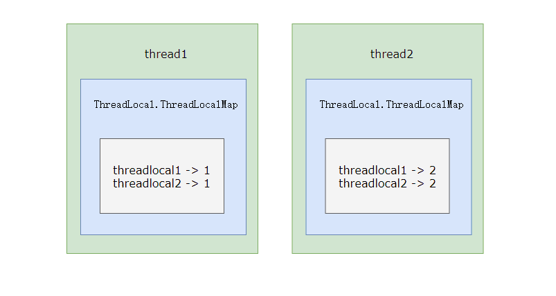

# JUC工具类: Semaphore

Semaphore直译就是信号量。

Semaphore底层是基于AbstractQueuedSynchronizer来实现的。Semaphore称为计数信号量，它允许n个任务同时访问某个资源，可以将信号量看做是在向外分发使用资源的许可证，只有成功获取许可证，才能使用资源。

并且信号量与其他并发时常用的Lock、Sync等有一些容易混淆区别，那就是信号量不存在重入概念，令牌没有重入的概念。你只要调用一次acquire方法，就需要有对应个数的可用令牌才能继续运行。其次信号量常用的tryAcquire与release方法并不像lock和unlock等一样，需要先持有资源才能释放资源。对于Semaphore来说两个方法可以以任何顺序调用，tryAcquire就是获取资源（小于0就会阻塞），release就是使可用信号量+1，即使release之后导致超过了初始化时信号量大小。
以下是多次调用lock与Semaphore的示例：

```java
    public static void main(String[] args) {
        int permitsNum = 2;
        final Semaphore semaphore = new Semaphore(permitsNum);
        try {
            // 直接获取信号量会返回false
            System.out.println("availablePermits:"+semaphore.availablePermits()+",semaphore.tryAcquire(3,1, TimeUnit.SECONDS):"+semaphore.tryAcquire(3,1, TimeUnit.SECONDS));
            // 直接release使信号量+1，信号量变成了3个超过了permitsNum
            semaphore.release();
            // 再次尝试获取3个信号量，返回true说明直接release使信号量+1是可行的
            System.out.println("availablePermits:"+semaphore.availablePermits()+",semaphore.tryAcquire(3,1, TimeUnit.SECONDS):"+semaphore.tryAcquire(3, 1, TimeUnit.SECONDS));
        }catch (Exception e) {

        }

        ReentrantLock lock = new ReentrantLock();
        lock.lock();  // 计数器 = 1

        try {
            // 临界区代码...
        } finally {
            lock.unlock();  // 计数器 = 0，锁释放 ✅
            lock.unlock();  // 计数器 = -1，抛出 IllegalMonitorStateException ❌
        }
    }
```

# ThreadLocal

首先我们需要回顾并发场景下对于线程安全的定义：一个类在可以被多个线程安全调用时就是线程安全的。

线程安全不是一个非真即假的命题，可以将共享数据按照安全程度的强弱顺序分成以下五类: 不可变、绝对线程安全、相对线程安全、线程兼容和线程对立。

而使用ThreadLocal被用于解决线程安全的场景往往指广义上的共享资源访问安全性，因为线程隔离（ThreadLocal）是通过副本保证本线程访问资源安全性，它不保证线程之间还存在共享关系，即狭义上的安全性。

本地存储(Thread Local)。官网的解释是这样的：
> This class provides thread-local variables. These variables differ from their normal counterparts in that each thread that accesses one (via its {@code get} or {@code set} method) has its own, independently initialized copy of the variable. {@code ThreadLocal} instances are typically private static fields in classes that wish to associate state with a thread (e.g., a user ID or Transaction ID) 
该类提供了线程局部 (thread-local) 变量。这些变量不同于它们的普通对应物，因为访问某个变量(通过其 get 或 set 方法)的每个线程都有自己的局部变量，它独立于变量的初始化副本。ThreadLocal 实例通常是类中的 private static 字段，它们希望将状态与某一个线程(例如，用户 ID 或事务 ID)相关联。

总结而言：ThreadLocal是一个将在多线程中为每一个线程创建单独的变量副本的类; 当使用ThreadLocal来维护变量时, ThreadLocal会为每个线程创建单独的变量副本, 避免因多线程操作共享变量而导致的数据不一致的情况。

## ThreadLocal原理
### ThreadLocal的存储结构,大概如下：



### ThreadLocal的存储结构详细解释

在Thread对象中有一个ThreadLocalMap类型的变量threadLocals, 负责存储当前线程的所有ThreadLocal对象, ThreadLocalMap的Key为你在代码中调用的ThreadLocal对象, 以你在线程中set的实际值为value，或者是你使用new ThreadLocal的构造方法传入了initialValue函数。 

如果使用构造函数进行初始化value， 线程第一次读取的时候（某一个线程第一次执行ThreadLocalMap的get方法时）如果不存在就会调用ThreadLocal的initialValue方法创建一个对象并且返回。

ThreadLocal的get方法具体的执行流程如下：

```java
public T get() {
    Thread t = Thread.currentThread();
    ThreadLocalMap threadLocals = getMap(t);
    if (threadLocals != null) {
        ThreadLocalMap.Entry e = threadLocals.getEntry(this);
        if (e != null) {
            @SuppressWarnings("unchecked")
            T result = (T)e.value;
            return result;
        }
    }
    return setInitialValue();
}
```
* 首先获取当前线程对象t, 然后从线程t中获取到ThreadLocalMap的成员属性threadLocals。
* 如果当前线程的threadLocals已经初始化(即不为null) 并且存在以当前ThreadLocal对象为Key的值, 则直接返回当前线程要获取的对象。
* 如果当前线程的threadLocals已经初始化(即不为null)但是不存在以当前ThreadLocal对象为Key的的对象, 那么重新创建一个Connection对象, 并且添加到当前线程的threadLocals Map中,并返回。
* 如果当前线程的threadLocals属性还没有被初始化, 则重新创建一个ThreadLocalMap对象, 并且创建一个Connection对象并添加到ThreadLocalMap对象中并返回。

对于setInitialValue方法：

```java
private T setInitialValue() {
    T value = initialValue();
    Thread t = Thread.currentThread();
    ThreadLocalMap map = getMap(t);
    if (map != null)
        map.set(this, value);
    else
        createMap(t, value);
    return value;
}
```
initialValue就是构造函数中我们传递进去的initialValue方法。

对于getMap方法：
```java
    ThreadLocalMap getMap(Thread t) {
        return t.threadLocals;
    }
```
其实就是取得当前线程中的threadLocals。

那么我们看过代码之后就很清晰的知道了为什么ThreadLocal能够实现变量的多线程隔离了; 其实就是用了Map的数据结构给当前线程缓存了, 要使用的时候就从本线程的ThreadLocalMap对象中获取就可以了, key就是ThreadLocal对象实例。

当然了在当前线程下获取当前线程里面的Map里面的对象并操作肯定没有线程并发问题了, 当然能做到变量的线程间隔离了。

## ThreadLocalMap对象
ThreadLocal的实现其实还依赖于其内部的一个内部类。

* 本质上来讲, 它就是一个Map, 但是这个ThreadLocalMap与我们平时见到的Map有点不一样它没有实现Map接口。
* 它没有public的方法, 最多有一个default的构造方法, 因为这个ThreadLocalMap的方法仅仅在ThreadLocal类中调用, 属于静态内部类。
* ThreadLocalMap的Entry实现继承了WeakReference<ThreadLocal<?>>，因此ThreadLocalMap对ThreadLocal持有的引用是弱引用。
* Entry并不是链表形式, 而是每个Entry里面仅仅放一个ThreadLocal，产生hash冲突时向后位移;

从ThreadLocalMap的set方法我们可以快速了解该类：
```java
        private void set(ThreadLocal<?> key, Object value) {

            // We don't use a fast path as with get() because it is at
            // least as common to use set() to create new entries as
            // it is to replace existing ones, in which case, a fast
            // path would fail more often than not.

            Entry[] tab = table;
            int len = tab.length;
            int i = key.threadLocalHashCode & (len-1);

            for (Entry e = tab[i];
                 e != null;
                 e = tab[i = nextIndex(i, len)]) {
                if (e.refersTo(key)) {
                    e.value = value;
                    return;
                }

                if (e.refersTo(null)) {
                    replaceStaleEntry(key, value, i);
                    return;
                }
            }

            tab[i] = new Entry(key, value);
            int sz = ++size;
            if (!cleanSomeSlots(i, sz) && sz >= threshold)
                rehash();
        }

```
主要流程如下：
* 取当前ThreadLocalMap中的所有Entry，取当前ThreadLocal对象的hashCode。
* 检查该hashCode对length进行按位与之后的index是否存在值
* 如果当前位置上面的 Entry 的 Key为空, 说明ThreadLocal对象已经被回收了, 那么就调用replaceStaleEntry并返回。
* 如果当前位置有值，则需要将其值取出与当前ThreadLocal比较是否相同，如果相同进行值覆盖并返回。如果不同循环调用nextIndex，直到找到一个相同的ThreadLocal或者是为空的ThreadLocal或者最终任何一个都没有找到执行后续操作。
* 将最后一次的tab[i] 赋值为new Entry(key, value)。然后判断是否有被清理掉的无用Entry需要进行删除，并判断当前size是否大于阈值，如果均满足将进行一次所有元素
rehash。

其中nextIndex方法
```java
        private static int nextIndex(int i, int len) {
            return ((i + 1 < len) ? i + 1 : 0);
        }
```
就是进行向后移位，也就是ThreadLocalMap解决hash冲突的方法。

对于Get方法：
```java
        /**
         * Get the entry associated with key.  This method
         * itself handles only the fast path: a direct hit of existing
         * key. It otherwise relays to getEntryAfterMiss.  This is
         * designed to maximize performance for direct hits, in part
         * by making this method readily inlinable.
         *
         * @param  key the thread local object
         * @return the entry associated with key, or null if no such
         */
        private Entry getEntry(ThreadLocal<?> key) {
            int i = key.threadLocalHashCode & (table.length - 1);
            Entry e = table[i];
            if (e != null && e.refersTo(key))
                return e;
            else
                return getEntryAfterMiss(key, i, e);
        }
```
就是简单的hash位置取值并判断key是否匹配，否则向后移位直到找到。

## ThreadLocal造成内存泄露的问题

```java
import java.util.concurrent.LinkedBlockingQueue;
import java.util.concurrent.ThreadPoolExecutor;
import java.util.concurrent.TimeUnit;

public class ThreadLocalDemo {
    static class LocalVariable {
        private Long[] a = new Long[1024 * 1024];
    }

    // (1)
    final static ThreadPoolExecutor poolExecutor = new ThreadPoolExecutor(5, 5, 1, TimeUnit.MINUTES,
            new LinkedBlockingQueue<>());
    // (2)
    final static ThreadLocal<LocalVariable> localVariable = new ThreadLocal<LocalVariable>();

    public static void main(String[] args) throws InterruptedException {
        // (3)
        Thread.sleep(5000 * 4);
        for (int i = 0; i < 50; ++i) {
            poolExecutor.execute(new Runnable() {
                public void run() {
                    // (4)
                    localVariable.set(new LocalVariable());
                    // (5)
                    System.out.println("use local varaible" + localVariable.get());
                    // localVariable.remove();
                }
            });
        }
        // (6)
        System.out.println("pool execute over");
    }
}
```
如果用线程池来操作ThreadLocal 对象确实会造成内存泄露, 因为对于线程池里面不会销毁的线程, 线程里面总会存在着<ThreadLocal, LocalVariable>的强引用, 因为final static 修饰的 ThreadLocal 并不会释放, 而ThreadLocalMap 对于 Key 虽然是弱引用, 但是强引用不会释放, 弱引用当然也会一直有值, 同时创建的LocalVariable对象也不会释放, 就造成了内存泄露; 如果LocalVariable对象不是一个大对象的话, 其实泄露的并不严重, 泄露的内存 = 核心线程数 * LocalVariable对象的大小。
所以, 为了避免出现内存泄露的情况, ThreadLocal提供了一个清除线程中对象的方法, 即 remove, 其实内部实现就是调用 *ThreadLocalMap* 的remove方法:
```java
private void remove(ThreadLocal<?> key) {
    Entry[] tab = table;
    int len = tab.length;
    int i = key.threadLocalHashCode & (len-1);
    for (Entry e = tab[i];
         e != null;
         e = tab[i = nextIndex(i, len)]) {
        if (e.get() == key) {
            e.clear();
            expungeStaleEntry(i);
            return;
        }
    }
}
```

## ThreadLocal的应用场景

ThreadLocal的应用场景经常被用于为每个线程维护了一个“上下文”，比如当前线程处理请求的session信息，当前线程的事务，当前请求统一的traceId等。

还有一种用法是在线程类内部创建ThreadLocal，基本步骤如下：
* 在多线程的类(如ThreadDemo类)中，创建一个ThreadLocal对象threadXxx，用来保存线程间需要隔离处理的对象xxx。
* 在ThreadDemo类中，创建一个获取要隔离访问的数据的方法getXxx()，在方法中判断，若ThreadLocal对象为null时候，应该new()一个隔离访问类型的对象，并强制转换为要应用的类型。
* 在ThreadDemo类的run()方法中，通过调用getXxx()方法获取要操作的数据，这样可以保证每个线程对应一个数据对象，在任何时刻都操作的是这个对象。
```java
public class ThreadLocalTest implements Runnable{
    
    ThreadLocal<Student> StudentThreadLocal = new ThreadLocal<Student>();

    @Override
    public void run() {
        String currentThreadName = Thread.currentThread().getName();
        System.out.println(currentThreadName + " is running...");
        Random random = new Random();
        int age = random.nextInt(100);
        System.out.println(currentThreadName + " is set age: "  + age);
        Student Student = getStudentt(); //通过这个方法，为每个线程都独立的new一个Studentt对象，每个线程的的Studentt对象都可以设置不同的值
        Student.setAge(age);
        System.out.println(currentThreadName + " is first get age: " + Student.getAge());
        try {
            Thread.sleep(500);
        } catch (InterruptedException e) {
            e.printStackTrace();
        }
        System.out.println( currentThreadName + " is second get age: " + Student.getAge());
        
    }
    
    private Student getStudentt() {
        Student Student = StudentThreadLocal.get();
        if (null == Student) {
            Student = new Student();
            StudentThreadLocal.set(Student);
        }
        return Student;
    }

    public static void main(String[] args) {
        ThreadLocalTest t = new ThreadLocalTest();
        Thread t1 = new Thread(t,"Thread A");
        Thread t2 = new Thread(t,"Thread B");
        t1.start();
        t2.start();
    }
    
}

class Student{
    int age;
    public int getAge() {
        return age;
    }
    public void setAge(int age) {
        this.age = age;
    }
    
}
```
java 开发手册中推荐的 ThreadLocal：
```java
import java.text.DateFormat;
import java.text.SimpleDateFormat;
 
public class DateUtils {
    public static final ThreadLocal<DateFormat> df = new ThreadLocal<DateFormat>(){
        @Override
        protected DateFormat initialValue() {
            return new SimpleDateFormat("yyyy-MM-dd");
        }
    };
}
DateUtils.df.get().format(new Date());
```

