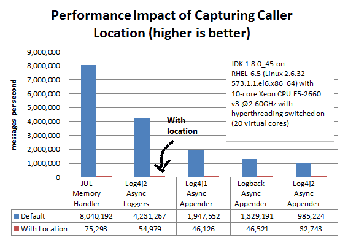
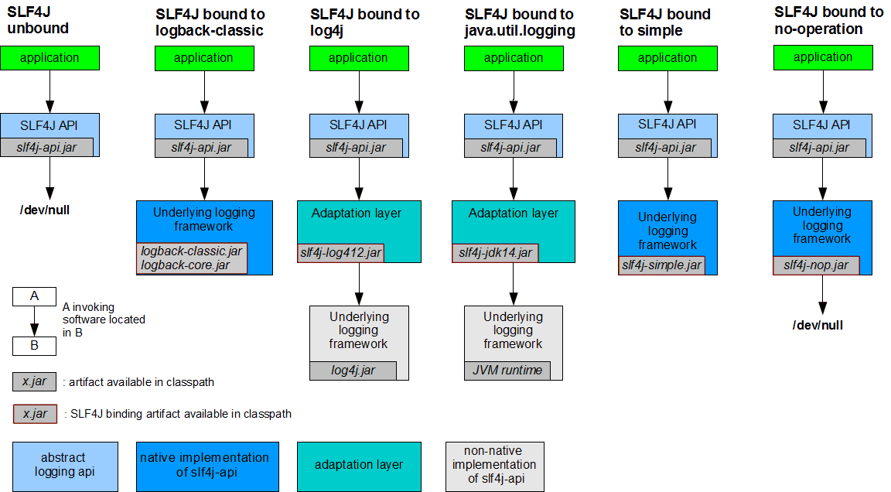

# Java日志体系简介

* 最重要的一点是 区分**日志系统**和**日志门面**;
* 其次是日志库的使用, 包含配置与API使用；配置侧重于日志系统的配置，API使用侧重于日志门面；
* 最后是选型，改造和最佳实践等

# 日志体系之日志系统
##  java.util.logging (JUL)

JDK1.4 开始，通过 java.util.logging 提供日志功能。虽然是官方自带的log lib，JUL的使用却不广泛。主要原因:
* JUL从JDK1.4 才开始加入(2002年)，当时各种第三方log lib已经被广泛使用了
* JUL早期存在性能问题，到JDK1.5上才有了不错的进步，但现在和Logback/Log4j2相比还是有一定差距
* JUL的功能不如Logback/Log4j2等完善，比如Output Handler就没有Logback/Log4j2的丰富，有时候需要自己来继承定制，又比如默认没有从ClassPath里加载配置文件的功能

## Log4j

Log4j 是 apache 的一个开源项目，创始人 Ceki Gulcu。Log4j 应该说是 Java 领域资格最老，应用最广的日志工具。Log4j 是高度可配置的，并可通过在运行时的外部文件配置。它根据记录的优先级别，并提供机制，以指示记录信息到许多的目的地，诸如：数据库，文件，控制台，UNIX 系统日志等。

Log4j 中有三个主要组成部分：
* loggers - 负责捕获记录信息。
* appenders - 负责发布日志信息，以不同的首选目的地。
* layouts - 负责格式化不同风格的日志信息。

官网地址：http://logging.apache.org/log4j/2.x/
Log4j 的短板在于性能，在Logback 和 Log4j2 出来之后，Log4j的使用也减少了。
## Logback
Logback 是由 log4j 创始人 Ceki Gulcu 设计的又一个开源日志组件，是作为 Log4j 的继承者来开发的，提供了性能更好的实现，异步 logger，Filter等更多的特性。
logback 当前分成三个模块：logback-core、logback-classic 和 logback-access。
* logback-core - 是其它两个模块的基础模块。
* logback-classic - 是 log4j 的一个 改良版本。此外 logback-classic 完整实现 SLF4J API 使你可以很方便地更换成其它日志系统如 log4j 或 JDK14 Logging。
* logback-access - 访问模块与 Servlet 容器集成提供通过 Http 来访问日志的功能。

官网地址: http://logback.qos.ch/

## Log4j2
维护 Log4j 的人为了性能又搞出了 Log4j2。

Log4j2 和 Log4j1.x 并不兼容，设计上很大程度上模仿了 SLF4J/Logback，性能上也获得了很大的提升。

Log4j2 也做了 Facade/Implementation 分离的设计，分成了 log4j-api 和 log4j-core。

官网地址: http://logging.apache.org/log4j/2.x/

## Log4j vs Logback vs Log4j2
> 从性能上Log4J2要强，但从生态上Logback+SLF4J优先。

### 初步对比
> logback和log4j2都宣称自己是log4j的后代，一个是出于同一个作者，另一个则是在名字上根正苗红。

撇开血统不谈，比较一下log4j2和logback：
* log4j2比logback更新：log4j2的GA版在2014年底才推出，比logback晚了好几年，这期间log4j2确实吸收了slf4j和logback的一些优点（比如日志模板），同时应用了不少的新技术
* 由于采用了更先进的锁机制和LMAX Disruptor库，log4j2的性能优于logback，特别是在多线程环境下和使用异步日志的环境下二者都支持Filter（应该说是log4j2借鉴了logback的Filter），能够实现灵活的日志记录规则（例如仅对一部分用户记录debug级别的日志）
* 二者都支持对配置文件的动态更新
* 二者都能够适配slf4j，logback与slf4j的适配应该会更好一些，毕竟省掉了一层适配库
* logback能够自动压缩/删除旧日志
* logback提供了对日志的HTTP访问功能
* log4j2实现了“无垃圾”和“低垃圾”模式。简单地说，log4j2在记录日志时，能够重用对象（如String等），尽可能避免实例化新的临时对象，减少因日志记录产生的垃圾对象，减少垃圾回收带来的性能下降
* og4j2和logback各有长处，总体来说，如果对性能要求比较高的话，log4j2相对还是较优的选择。

### 使用细节

日志作为常用功能，我们虽然不会付出太多精力，但是实际上日志输出常常会带来很大的I/O、CPU消耗。因此我们需要注意一些数据细节，以减少损失。
常见的日志Pattern中不必要时不包含Location信息（如日志代码行号 ，调用者信息，Class名/源码文件名等），如果输出Location信息的话，性能会大幅降低。


# 日志体系之日志门面

java中主要日志门面目前有以下几个：

## common-logging

> common-logging 是 apache 的一个开源项目。也称Jakarta Commons Logging，缩写 JCL。

common-logging 的功能是提供日志功能的 API 接口，本身并不提供日志的具体实现（当然，common-logging 内部有一个 Simple logger 的简单实现，但是功能很弱，直接忽略），而是在运行时动态的绑定日志实现组件来工作（如 log4j、java.util.loggin）。

官网地址: http://commons.apache.org/proper/commons-logging/

## slf4j

> 全称为 Simple Logging Facade for Java，即 java 简单日志门面。

作者又是 Ceki Gulcu！这位大神写了 Log4j、Logback 和 slf4j，专注日志组件开发五百年，一直只能超越自己。

类似于 Common-Logging，slf4j 是对不同日志框架提供的一个 API 封装，可以在部署的时候不修改任何配置即可接入一种日志实现方案。但是，slf4j 在编译时静态绑定真正的 Log 库。使用 SLF4J 时，如果你需要使用某一种日志实现，那么你必须选择正确的 SLF4J 的 jar 包的集合（各种桥接包）。

官网地址: http://www.slf4j.org/


## common-logging vs slf4j

> slf4j 库类似于 Apache Common-Logging。但是，他在编译时静态绑定真正的日志库。这点似乎很麻烦，其实也不过是导入桥接 jar 包而已。

slf4j 一大亮点是提供了更方便的日志记录方式：
不需要使用logger.isDebugEnabled()来解决日志因为字符拼接产生的性能问题。slf4j 的方式是使用{}作为字符串替换符，形式如下：
```java
logger.debug("id: {}, name: {} ", id, name);
```

## 日志库使用方案

