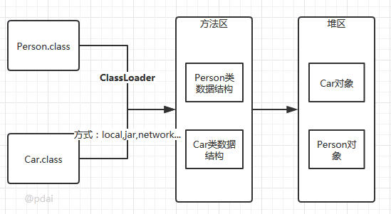
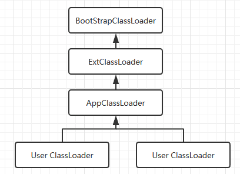

# Java 类加载机制

# 类的生命周期

类加载的过程包括了加载、验证、准备、解析、初始化五个阶段。在这五个阶段中，加载、验证、准备和初始化这四个阶段发生的顺序是确定的，而解析阶段则不一定，它在某些情况下可以在初始化阶段之后开始，这是为了支持Java语言的运行时绑定(也成为动态绑定或晚期绑定,继承中基于方法的重写)。

另外注意这里的几个阶段是按顺序开始，而不是按顺序进行或完成，因为这些阶段通常都是互相交叉地混合进行的，通常在一个阶段执行的过程中调用或激活另一个阶段。


## 类加载阶段

加载是珍格格类加载过程的第一个阶段，在加载阶段，虚拟机需要完成以下三件事情:通过一个类的全限定名来获取其定义的二进制字节流。将这个字节流所代表的静态存储结构转化为方法区的运行时数据结构。在Java堆中生成一个代表这个类的java.lang.Class对象，作为对方法区中这些数据的访问入口。



相对于类加载的其他阶段而言，加载阶段(准确地说，是加载阶段获取类的二进制字节流的动作)是可控性最强的阶段，因为开发人员既可以使用系统提供的类加载器来完成加载，也可以自定义自己的类加载器来完成加载(比如从网咯中加载一个class文件)。

加载阶段完成后，虚拟机外部的 二进制字节流就按照虚拟机所需的格式存储在方法区之中，而且在Java堆中也创建一个java.lang.Class类的对象，这样便可以通过该对象访问方法区中的这些数据。

类加载器并不需要等到某个类被“首次主动使用”时再加载它，JVM规范允许类加载器在预料某个类将要被使用时就预先加载它（在impor列表单未被使用也会被加载），如果在预先加载的过程中遇到了.class文件缺失或存在错误，类加载器必须在程序首次主动使用该类时才报告错误(LinkageError错误)如果这个类一直没有被程序主动使用，那么类加载器就不会报告错误(也就是说如果import了一个不存在的类，但只要在实际执行过程中不用到该类，那么程序不会报错，直到该类被使用)。

> 加载.class文件的方式

* 从本地系统中直接加载
* 通过网络下载.class文件
* 从zip，jar等归档文件中加载.class文件
* 从专有数据库中提取.class文件
* 将Java源文件动态编译为.class文件

## 连接阶段

我们将验证、准备、解析三个阶段合称为连接。

### 验证

验证是连接阶段的第一步，这一阶段的目的是为了确保Class文件的字节流中包含的信息符合当前虚拟机的要求，并且不会危害虚拟机自身的安全。验证阶段大致会完成4个阶段的检验动作:
* 文件格式验证: 验证字节流是否符合Class文件格式的规范；例如: 是否以0xCAFEBABE开头、主次版本号是否在当前虚拟机的处理范围之内、常量池中的常量是否有不被支持的类型。
* 元数据验证: 对字节码描述的信息进行语义分析(注意: 对比javac编译阶段的语义分析)，以保证其描述的信息符合Java语言规范的要求；例如: 这个类是否有父类，除了java.lang.Object之外。
* 字节码验证: 通过数据流和控制流分析，确定程序语义是合法的、符合逻辑的。
* 符号引用验证: 确保解析动作能正确执行。

> 验证阶段是非常重要的，但不是必须的，它对程序运行期没有影响，如果所引用的类经过反复验证，那么可以考虑采用-Xverifynone参数来关闭大部分的类验证措施，以缩短虚拟机类加载的时间。

### 准备

准备阶段是正式为类变量分配内存并设置类变量初始值的阶段，这些内存都将在方法区中分配。对于该阶段有以下几点需要注意:
* 这时候进行内存分配的仅包括类变量(static)，而不包括实例变量，实例变量会在对象实例化时随着对象一块分配在Java堆中。
* 这里所设置的初始值通常情况下是数据类型默认的零值(如0、0L、null、false等)，而不是被在Java代码中被显式地赋予的值。假设一个类变量的定义为: public static int value = 3；那么变量value在准备阶段过后的初始值为0，而不是3，因为这时候尚未开始执行任何Java方法，而把value赋值为3的put static指令是在程序编译后，存放于类构造器<clinit>()方法之中的，所以把value赋值为3的动作将在初始化阶段才会执行。

> 这里还需要注意如下几点

* 对基本数据类型来说，对于类变量(static)和全局变量，如果不显式地对其赋值而直接使用，则系统会为其赋予默认的零值，而对于局部变量来说，在使用前必须显式地为其赋值，否则编译时不通过。
* 对于同时被static和final修饰的常量，必须在声明的时候就为其显式地赋值，否则编译时不通过；而只被final修饰的常量则既可以在声明时显式地为其赋值，也可以在类初始化时显式地为其赋值，总之，在使用前必须为其显式地赋值，系统不会为其赋予默认零值。
* 对于引用数据类型reference来说，如数组引用、对象引用等，如果没有对其进行显式地赋值而直接使用，系统都会为其赋予默认的零值，即null。
* 如果在数组初始化时没有对数组中的各元素赋值，那么其中的元素将根据对应的数据类型而被赋予默认的零值。
* 如果类字段的字段属性表中存在ConstantValue属性，即同时被final和static修饰，那么在准备阶段变量value就会被初始化为ConstValue属性所指定的值。假设上面的类变量value被定义为:  public static final int value = 3；编译时Javac将会为value生成ConstantValue属性，在准备阶段虚拟机就会根据ConstantValue的设置将value赋值为3。我们可以理解为static final常量在编译期就将其结果放入了调用它的类的常量池中.

### 解析

解析阶段是虚拟机将常量池内的符号引用替换为直接引用的过程，解析动作主要针对类或接口、字段、类方法、接口方法、方法类型、方法句柄和调用点限定符7类符号引用进行。即：将文件中的类信息、方法、对象属性调用等转换为实际的内存引用地址。
不同虚拟机实现可以根据需要判断到底是在类被加载器加载的时候对常量池的符号引用进行解析（也就是初始化之前），还是等到一个符号引用被使用之前进行解析（也就是在初始化之后）。

符号引用就是一组符号来描述目标，可以是任何字面量。
直接引用就是直接指向目标的指针、相对偏移量或一个间接定位到目标的句柄。

详细的解析过程：

#### 类或者接口解析
要把一个类或者接口的符号引用解析为直接引用，需要以下三个步骤：

1. 如果该符号引用不是一个数组类型，那么虚拟机将会把该符号代表的全限定名称传递给类加载器去加载这个类。这个过程由于涉及验证过程所以可能会触发其他相关类的加载

2. 如果该符号引用是一个数组类型，并且该数组的元素类型是对象。我们知道符号引用是存在方法区的常量池中的，该符号引用的描述符会类似”[java/lang/Integer”的形式，将会按照上面的规则进行加载数组元素类型，如果描述符如前面假设的形式，需要加载的元素类型就是java.lang.Integer ,接着由虚拟机将会生成一个代表此数组对象的直接引用

3. 如果上面的步骤都没有出现异常，那么该符号引用已经在虚拟机中产生了一个直接引用，但是在解析完成之前需要对符号引用进行验证，主要是确认当前调用这个符号引用的类是否具有访问权限，如果没有访问权限将抛出java.lang.IllegalAccess异常

#### 字段解析

对字段的解析需要首先对其所属的类进行解析，因为字段是属于类的，只有在正确解析得到其类的正确的直接引用才能继续对字段的解析。对字段的解析主要包括以下几个步骤：

1. 如果该字段符号引用就包含了简单名称和字段描述符都与目标相匹配的字段，则返回这个字段的直接引用，解析结束

2. 否则，如果在该符号的类实现了接口，将会按照继承关系从下往上递归搜索各个接口和它的父接口，如果在接口中包含了简单名称和字段描述符都与目标相匹配的字段，那么久直接返回这个字段的直接引用，解析结束

3. 否则，如果该符号所在的类不是Object类的话，将会按照继承关系从下往上递归搜索其父类，如果在父类中包含了简单名称和字段描述符都相匹配的字段，那么直接返回这个字段的直接引用，解析结束

4. 否则，解析失败，抛出java.lang.NoSuchFieldError异常

5. 如果最终返回了这个字段的直接引用，就进行权限验证，如果发现不具备对字段的访问权限，将抛出java.lang.IllegalAccessError异常

#### 类方法解析

进行类方法的解析仍然需要先解析此类方法的类，在正确解析之后需要进行如下的步骤：
1. 类方法和接口方法的符号引用是分开的，所以如果在类方法表中发现class_index（类中方法的符号引用）的索引是一个接口，那么会抛出java.lang.IncompatibleClassChangeError的异常

2. 如果class_index的索引确实是一个类，那么在该类中查找是否有简单名称和描述符都与目标字段相匹配的方法，如果有的话就返回这个方法的直接引用，查找结束

3. 否则，在该类的父类中递归查找是否具有简单名称和描述符都与目标字段相匹配的字段，如果有，则直接返回这个字段的直接引用，查找结束

4. 否则，在这个类的接口以及它的父接口中递归查找，如果找到的话就说明这个方法是一个抽象类，查找结束，返回java.lang.AbstractMethodError异常

5. 否则，查找失败，抛出java.lang.NoSuchMethodError异常

如果最终返回了直接引用，还需要对该符号引用进行权限验证，如果没有访问权限，就抛出java.lang.IllegalAccessError异常

#### 接口方法解析

同类方法解析一样，也需要先解析出该方法的类或者接口的符号引用，如果解析成功，就进行下面的解析工作：
1. 如果在接口方法表中发现class_index的索引是一个类而不是一个接口，那么也会抛出java.lang.IncompatibleClassChangeError的异常

2. 否则，在该接口方法的所属的接口中查找是否具有简单名称和描述符都与目标字段相匹配的方法，如果有的话就直接返回这个方法的直接引用。

3. 否则，在该接口以及其父接口中查找，直到Object类，如果找到则直接返回这个方法的直接引用

4. 否则，查找失败

## 初始化阶段

初始化，为类的静态变量赋予正确的初始值，JVM负责对类进行初始化，主要对类变量进行初始化。在Java中对类变量进行初始值设定有两种方式:
* 声明类变量是指定初始值
* 使用静态代码块为类变量指定初始值

### 初始化详细步骤

* 假如这个类还没有被加载和连接，则程序先加载并连接该类
* 假如该类的直接父类还没有被初始化，则先初始化其直接父类
* 假如类中有初始化语句，则系统依次执行这些初始化语句

*类初始化时机*: 只有当对类的主动使用的时候才会导致类的初始化，类的主动使用包括以下六种:
* 创建类的实例，也就是new的方式
* 访问某个类或接口的静态变量，或者对该静态变量赋值调用类的静态方法
* 反射(如Class.forName("com.pdai.jvm.Test"))初始化某个类的子类，则其父类也会被初始化
* Java虚拟机启动时被标明为启动类的类(Java Test)，直接使用java.exe命令来运行某个主类

# 使用阶段

对于初始化好的类使用就是访问方法区内的数据结构的接口，创建好对象放到Heap区。

# 卸载

Java虚拟机将结束生命周期的几种情况

* 执行了System.exit()方法
* 程序正常执行结束
* 程序在执行过程中遇到了异常或错误而异常终止
* 由于操作系统出现错误而导致Java虚拟机进程终止

# 类加载器

## Java 类加载器的层次



> 注意: 这里父类加载器并不是通过继承关系来实现的，而是采用组合实现的。

> 站在Java虚拟机的角度来讲，只存在两种不同的类加载器: 启动类加载器: 它使用C++实现(这里仅限于Hotspot，也就是JDK1.5之后默认的虚拟机，有很多其他的虚拟机是用Java语言实现的)，是虚拟机自身的一部分；所有其他的类加载器: 这些类加载器都由Java语言实现，独立于虚拟机之外，并且全部继承自抽象类java.lang.ClassLoader，这些类加载器需要由启动类加载器加载到内存中之后才能去加载其他的类。

*站在Java开发人员的角度来看，类加载器可以大致划分为以下三类 :*

启动类加载器: `Bootstrap ClassLoader`，负责加载存放在JDK\jre\lib(JDK代表JDK的安装目录，下同)下，或被-Xbootclasspath参数指定的路径中的，并且能被虚拟机识别的类库(如rt.jar，所有的java.*开头的类均被Bootstrap ClassLoader加载)。启动类加载器是无法被Java程序直接引用的。

扩展类加载器: `Extension ClassLoader`，该加载器由sun.misc.Launcher$ExtClassLoader实现，它负责加载JDK\jre\lib\ext目录中，或者由java.ext.dirs系统变量指定的路径中的所有类库(如javax.*开头的类)，开发者可以直接使用扩展类加载器。

应用程序类加载器: `Application ClassLoader`，该类加载器由sun.misc.Launcher$AppClassLoader来实现，它负责加载用户类路径(ClassPath)所指定的类，开发者可以直接使用该类加载器，如果应用程序中没有自定义过自己的类加载器，一般情况下这个就是程序中默认的类加载器。

应用程序都是由这三种类加载器互相配合进行加载的，如果有必要，我们还可以加入自定义的类加载器。因为JVM自带的ClassLoader只是懂得从本地文件系统加载标准的java class文件，因此如果编写了自己的ClassLoader，便可以做到如下几点:
* 在执行非置信代码之前，自动验证数字签名。
* 动态地创建符合用户特定需要的定制化构建类。
* 从特定的场所取得java class，例如数据库中和网络中。

## JVM类加载机制
* 全盘负责，当一个类加载器负责加载某个Class时，该Class所依赖的和引用的其他Class也将由该类加载器负责载入，除非显示使用另外一个类加载器来载入
* 父类委托，先让父类加载器试图加载该类，只有在父类加载器无法加载该类时才尝试从自己的类路径中加载该类
* 缓存机制，缓存机制将会保证所有加载过的Class都会被缓存，当程序中需要使用某个Class时，类加载器先从缓存区寻找该Class，只有缓存区不存在，系统才会读取该类对应的二进制数据，并将其转换成Class对象，存入缓存区。这就是为什么修改了Class后，必须重启JVM，程序的修改才会生效
* 双亲委派机制, 如果一个类加载器收到了类加载的请求，它首先不会自己去尝试加载这个类，而是把请求委托给父加载器去完成，依次向上，因此，所有的类加载请求最终都应该被传递到顶层的启动类加载器中，只有当父加载器在它的搜索范围中没有找到所需的类时，即无法完成该加载，子加载器才会尝试自己去加载该类。

> 双亲委派机制过程？
1. 当AppClassLoader加载一个class时，它首先不会自己去尝试加载这个类，而是把类加载请求委派给父类加载器ExtClassLoader去完成。
2. 当ExtClassLoader加载一个class时，它首先也不会自己去尝试加载这个类，而是把类加载请求委派给BootStrapClassLoader去完成。
3. 如果BootStrapClassLoader加载失败(例如在$JAVA_HOME/jre/lib里未查找到该class)，会使用ExtClassLoader来尝试加载；
4. 若ExtClassLoader也加载失败，则会使用AppClassLoader来加载，如果AppClassLoader也加载失败，则会报出异常ClassNotFoundException。

以上过程其实在`ClassLoader`类的`protected Class<?> loadClass(String name, boolean resolve)`方法中有体现。
以上过程可以有效防止内存中出现多分字节码，保证Java程序安全稳定运行。

## 自定义类加载器

通常情况下，我们都是直接使用系统类加载器。但是，有的时候，我们也需要自定义类加载器。比如应用是通过网络来传输 Java 类的字节码，为保证安全性，这些字节码经过了加密处理，这时系统类加载器就无法对其进行加载，这样则需要自定义类加载器来实现。自定义类加载器一般都是继承自 ClassLoader 类，从上面对 loadClass 方法来分析来看，我们只需要重写 findClass 方法即可。下面我们通过一个示例来演示自定义类加载器的流程:

```java
package com.platform.ahj.classloader;

import java.io.*;

public class MyClassLoader extends ClassLoader {

    private String root;

    protected Class<?> findClass(String name) throws ClassNotFoundException {
        byte[] classData = loadClassData(name);
        if (classData == null) {
            throw new ClassNotFoundException();
        } else {
            return defineClass(null, classData, 0, classData.length);
        }
    }

    private byte[] loadClassData(String className) {
        String fileName = root + File.separatorChar
                + className.replace('.', File.separatorChar) + ".class";
        try {
            InputStream ins = new FileInputStream(fileName);
            ByteArrayOutputStream baos = new ByteArrayOutputStream();
            int bufferSize = 1024;
            byte[] buffer = new byte[bufferSize];
            int length = 0;
            while ((length = ins.read(buffer)) != -1) {
                baos.write(buffer, 0, length);
            }
            return baos.toByteArray();
        } catch (IOException e) {
            e.printStackTrace();
        }
        return null;
    }

    public String getRoot() {
        return root;
    }

    public void setRoot(String root) {
        this.root = root;
    }

    public static void main(String[] args)  {

        MyClassLoader classLoader = new MyClassLoader();
        ClassLoader parent = classLoader.getParent();
        // 验证实际上的父类加载器是AppClassLoader
        System.out.println("自定义类加载器的parent是："+parent);
        classLoader.setRoot("/Users/ziyu/IdeaProjects/PersonalProjects/reactor/juc/src/main/");

        Class<?> testClass = null;
        try {
            testClass = classLoader.loadClass("com.platform.ahj.Test2");
            Object object = testClass.newInstance();
            System.out.println(object.getClass().getClassLoader());
        } catch (ClassNotFoundException e) {
            e.printStackTrace();
        } catch (InstantiationException e) {
            e.printStackTrace();
        } catch (IllegalAccessException e) {
            e.printStackTrace();
        }
    }
}
```
注意：com.platform.ahj.Test2类不能存在于项目类路径下，否则由于双亲委派机制，会调用AppClassLoader 加载，而不会通过我们自定义类加载器来加载。
