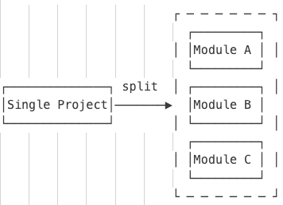

# Maven 

首先Maven是一个工具，目的是为了在构建项目时提供标准、统一的构建流程。所以要了解maven整个运行过程可以想象一下假如没有maven，你想要构建一个大型项目，你需要做哪些事，而这些事在Maven中是如何对应实现的。
## 简化构建编译流程

在没有maven之前，其实我们写java代码可以带任意的文件夹，我们可以将任意一个文件夹定义为lib或者是我们的src，但是这样就会导致没有办法统一构建流程，也就是编译哪些地方的java，打包的时候将哪些文件夹下的内容加到classpath中。因此maven顶一个一套默认的目录结构，用于解决这个问题：
```shell
a-maven-project
├── pom.xml
├── src
│   ├── main
│   │   ├── java
│   │   └── resources
│   └── test
│       ├── java
│       └── resources
└── target
```
有了标准的项目结构，单个项目的编译打包流程基本解决了，但是对于jar包引用问题还没有办法解决，比如A项目希望使用B项目生成的jar，但是有可能B项目会有同名的以及版本的变化。
因此为了区分不同的jar Maven定义了groupId，artifactId和version作为唯一标识，用于定位到一个准确的jar文件。
有了这些还不够，有的时候我们一个项目还有很多其他配置，比如源文件编码，使用的JDK版本等，因此Maven还定义了properties，用于属性配置。
## 依赖管理

maven第一个解决的问题就是依赖管理问题。比如我们依赖了spring-boot-web，但实际其内部会依赖更多其他模块。如果没有maven我们需要一个个把所有需要的组件下载下来放到lib库下，但是有了maven，他会帮我们自动实现以上内容。
为了实现自动分析依赖，进行依赖传递，Maven还引入了很多机制，如：
最近定义原则用于解决依赖版本冲突问题。
依赖管理（Dependency management），用于限制依赖方的版本。
依赖范围（Dependency scope），用于指定被依赖项何时被build。
依赖排除（Excluded）。
可选依赖（Optional dependencies），如果项目 Y 依赖于项目 Z，则项目 Y 的所有者可以使用“optional”元素将项目 Z 标记为可选依赖项。当项目 X 依赖于项目 Y 时，X 将仅依赖于 Y，而不依赖于 Y 的可选依赖项 Z。然后，项目 X 的所有者可以根据自己的选择显式添加对 Z 的依赖项。
Maven为了使我们的依赖关系更加清晰还未我们提供了mvn dependency：tree 用于分析POM中的传递关系，对于指定依赖项还可以使用dependency:analyze记性分析。
### Maven Scope
前置知识：
>classpath：这个东西其实涉及到JVM加载class文件的机制。
当用 Java 编程时，你可以通过在源文件的顶部放置如下内容来使其他类对你正在编写的类可用：
> 
```java 
import org.javaguy.coolframework.MyClass;
```
> Java 虚拟机将知道在哪里可以找到已编译的类。
让JVM查看计算机上的每个文件夹是不切实际的，因此必须为JVM提供要查找的位置列表。通过将 文件夹 和 jar 文件放在 Classpath 上，JVM将去这些地方查找文件。
对于Classpath的设置之前，我们还需要一些前置知识。
>>首先，我们假设 MyClass 是您作为项目的一部分构建的，它位于项目中名为 output 的目录中。.class 文件将位于 output/org/javaguy/coolframework/MyClass.class（以及该包中的所有其他文件）。为了访问该文件，您的路径只需包含文件夹 'output'，而不是整个包结构，因为您的 import 语句向 VM 提供了所有这些信息。
>>
>> 现在，假设将 CoolFramework 构建到一个 .jar 文件中，并将该CoolFramework.jar放入项目的 lib 目录中。现在，您需要将 lib/CoolFramework.jar 放入 Classpath 中。JVM 将在 jar 文件中查找 org/javaguy/coolframework 部分，并找到你的类。
因此在classpath设置时可以有以下两种主要形式：
>>- JAR文件
>>- 一个完整的package，包含编译后的class文件
对于设置Classpath就比较简单了，我们可以设置全局环境变量CLASSPATH，也可以在启动时使用java -cp来指定。
```java
 java -cp "/home/myaccount/myproject/lib/CoolFramework.jar:/home/myaccount/myproject/output/"  MyMainClass
```

maven帮我们自动分析加载依赖，但是也并不是我们所有的依赖在任意阶段都需要放到Classpath内或者是传递给依赖方。所以Maven为我们定义了几种依赖范围，分别是compile、test、runtime和provided。
| Scope     | 说明                                 | 示例             |
|-----------|--------------------------------------|------------------|
| compile   |在项目的所有 Classpath 中都可用。此外，这些依赖项将传播到依赖项目     | commons-logging |
| test      | 仅适用于测试编译和执行阶段。此范围不可传递。  | junit            |
| runtime   | 此范围表示依赖项不是编译所必需的，而是执行所必需的。Maven 在运行时和测试类的classpath中包含具有此范围的依赖项，编译时classpath中不包含该依赖。 | mysql            |
| provided  | 此范围的依赖项将添加到用于编译和测试的 Classpath 中，而不是运行时 Classpath 中。不传递到依赖方。 | servlet-api      |
| system    | 表示该依赖不从中央仓库中下载，需要显式提供Jar文件|    |
| import    | 只有在项目声明为pom时有效，用于标识将匹配的依赖项替换为dependencyManagement中所指定的版本|    |

还有就是如果你指定了直接依赖项的scope，那么直接依赖项所依赖的间接依赖的scope传递效果如下：（左侧是直接依赖规定的scope。空列表示该scope的间接依赖根本不会向下传递，影响到主项目）

| Scope      | compile编译      | provided提供    | runtime运行      | test测试        |
|------------|------------------|-----------------|------------------|-----------------|
| compile编译 | compile(*)编译（*） | -               | runtime运行      | -               |
| provided提供| provided提供     | -               | provided提供     | -               |
| runtime运行 | runtime运行      | -               | runtime运行      | -               |
| test测试    | test测试         | -               | test测试         | -               |

## 构建流程

Maven还规范了整个构建流程中的每一个阶段以及可以做什么。

### Lifecycle和Phase

使用Maven时，我们首先要了解什么是Maven的生命周期（lifecycle）。
目前Maven内置三个构建生命周期：default、clean 和 site。default生命周期处理项目部署，clean生命周期处理项目清理，site生命周期处理项目网站的创建。
Maven的生命周期由一系列阶段（phase）构成，以内置的生命周期default为例[完整生命周期列表](https://maven.apache.org/guides/introduction/introduction-to-the-lifecycle.html#Lifecycle_Reference)，它包含以下phase：

| Phase阶段             | Description描述                                                                                                    |
|-----------------------|--------------------------------------------------------------------------------------------------------------------|
| validate              | 验证项目是否正确，以及所有必要的信息是否可用。                |
| initialize            | 初始化构建状态，例如 set properties 或 create directories。 |
| generate-sources      |  生成任何源代码以包含在编译中。                                     |
| process-sources       |  处理源代码，例如筛选任何值。                                |
| generate-resources    | 生成要包含在包中的资源。                                              |
| process-resources     |  将资源复制并处理到目标目录中，以备打包。                  |
| compile               | 编译项目的源码。                                                            |
| process-classes       |  对编译生成的文件进行后处理，例如对 Java 类进行字节码增强。 |
| generate-test-sources | 生成任何测试源代码以包含在编译中。                              |
| process-test-sources  |  处理测试源代码，例如筛选任何值。                         |
| generate-test-resources |  创建用于测试的资源。                                                              |
| process-test-resources |  将资源复制并处理到 test destination 目录中。         |
| test-compile          | 将测试源码编译到 test destination 目录下。               |
| process-test-classes  | 对测试编译生成的文件进行后处理，例如对 Java 类进行字节码增强。 |
| test                  |  使用合适的单元测试框架运行测试。这些测试不需要打包或部署代码。 |
| prepare-package       |  在实际打包之前执行准备包所需的任何操作。这通常会导致包的解包、处理版本。 |
| package               |  获取编译后的代码并将其打包为可分发格式，例如 JAR。             |
| pre-integration-test  |  执行集成测试之前所需的操作。这可能涉及设置所需环境等操作。 |
| integration-test      |  处理并将包部署到可以运行集成测试的环境中（如有必要）。 |
| post-integration-test | 执行集成测试后所需的操作。这可能包括清理环境。 |
| verify                | 运行任何检查以验证包是否有效并符合质量标准。                  |
| install               | 将包安装到本地存储库中，以用作本地其他项目中的依赖项。 |
| deploy                |  在集成或发布环境中完成，将最终包复制到远程存储库，以便与其他开发人员和项目共享。 |

结合我们常见的命令：
例如，运行mvn clean package，Maven先执行clean生命周期并运行到clean这个phase，然后执行default生命周期并运行到package这个phase，实际执行的phase如下：

pre-clean
clean （注意这个clean是phase）
validate （开始执行default生命周期的第一个phase）
initialize
...
prepare-package
package

在phase之下还有一个goal的概念：
比如针对不同的场景每一个phase之下需要执行不同的操作，比如当packing是jar的时候phase绑定的goal如下：

| Phase阶段             | plugin:goal for the jar packaging (plugin：goal 用于 jar 打包) |
|-----------------------|-------------------------------------------------------------|
| process-resources     | resources:resources                                         |
| compile               | compiler:compile                                            |
| process-test-resources | resources:testResources                                    |
| test-compile          | compiler:testCompile                                        |
| test                  | surefire:test                                               |
| package               | jar:jar                                                     |
| install               | install:install                                             |
| deploy                | deploy:deploy                                               |

如果我们想要仅执行某一个goal可以以abc:xyz这种形式，比如 mvn compiler:compile

### maven插件

在上边我们提到使用maven构建项目就是执行其生命周期，而生命周期会再执行到指定的phase，然后phase再绑定执行自己的一个或多个goal。
但是实际上maven在执行每个phase时他并不知道如何执行具体操作，而是由插件执行触发默认的goal。
所以使用Maven就是配置好很多插件，然后通过phase调用这个插件。
而我们日常使用时，Maven为我们内置了一些常用的标准插件：

| Phase阶段             | plugin:goal for the jar packaging (plugin：goal 用于 jar 打包) |
|-----------------------|-------------------------------------------------------------|
| process-resources     | resources:resources                                         |
| compile               | compiler:compile                                            |
| process-test-resources | resources:testResources                                    |
| test-compile          | compiler:testCompile                                        |
| test                  | surefire:test                                               |
| package               | jar:jar                                                     |
| install               | install:install                                             |
| deploy                | deploy:deploy                                               |

如果我们所需的编译步骤默认插件无法满足我们可以使用自定义插件。比如使用maven-shade-plugin可以创建一个可执行的jar，这个时候需要我们在pom.xml中进行声明。
```xml
<project>
    ...
	<build>
		<plugins>
			<plugin>
				<groupId>org.apache.maven.plugins</groupId>
				<artifactId>maven-shade-plugin</artifactId>
                <version>3.2.1</version>
				<executions>
					<execution>
						<phase>package</phase>
						<goals>
							<goal>shade</goal>
						</goals>
						<configuration>
                            ...插件配置...
						</configuration>
					</execution>
				</executions>
			</plugin>
		</plugins>
	</build>
</project>
```

## 模块管理

把一个大项目分拆为多个模块是降低软件复杂度的有效方法：



那么我们可以借助Maven中的moudle来管理三个模块，并且可以利用依赖传递机制将相同的部分提取到parent中进行统一的版本控制。

## mvnw

我们使用Maven时，基本上只会用到mvn这一个命令。有些童鞋可能听说过mvnw，这个是啥？

mvnw是Maven Wrapper的缩写。因为我们安装Maven时，默认情况下，系统所有项目都会使用全局安装的这个Maven版本。但是，对于某些项目来说，它可能必须使用某个特定的Maven版本，这个时候，就可以使用Maven Wrapper，它可以负责给这个特定的项目安装指定版本的Maven，而其他项目不受影响。

简单地说，Maven Wrapper就是给一个项目提供一个独立的，指定版本的Maven给它使用。
### 生成Maven Wrapper
安装Maven Wrapper最简单的方式是在项目的根目录（即pom.xml所在的目录）下运行安装命令：
```shell
$ mvn wrapper:wrapper
```
它会自动使用最新版本的Maven。如果要指定使用的Maven版本，使用下面的安装命令指定版本，例如3.9.0：
```sh
$ mvn wrapper:wrapper -Dmaven=3.9.0
```
安装后，查看项目结构会：
```sh
my-project
├── .mvn
│   └── wrapper
│       └── maven-wrapper.properties
├── mvnw
├── mvnw.cmd
├── pom.xml
└── src
    ├── main
    │   ├── java
    │   └── resources
    └── test
        ├── java
        └── resources
```
而在运行时我们使用mvnw时就会使用项目中指定的mvn环境。该场景多用于统一开发人员的Maven版本。

## 发布依赖
当我们使用commons-logging这些第三方开源库的时候，我们实际上是通过Maven自动下载它的jar包，并根据其pom.xml解析依赖，自动把相关依赖包都下载后加入到classpath。

那么问题来了：当我们自己写了一个牛逼的开源库时，非常希望别人也能使用，总不能直接放个jar包的链接让别人下载吧？

如果我们把自己的开源库放到Maven的repo中，那么，别人只需按标准引用groupId:artifactId:version，即可自动下载jar包以及相关依赖。因此，本节我们介绍如何发布一个库到Maven的repo中。

把自己的库发布到Maven的repo中有好几种方法，我们介绍最常用的方法。

### mvn deploy
使用mvn deploy 命令实际上会生成将生成的jar推送到远程仓库，可以是公网的Nexus，也可以自建一个Nexus服务。
在maven推送的时候一般会需要几个东西：

- 1.具有远程仓库推送权限的账号密码。
- 2.要推送到的远程仓库的地址

这两项配置既可以写在maven的setting.xml中，也可以写在项目的pom文件中，看实际需要，一般账号密码写在setting文件中。
