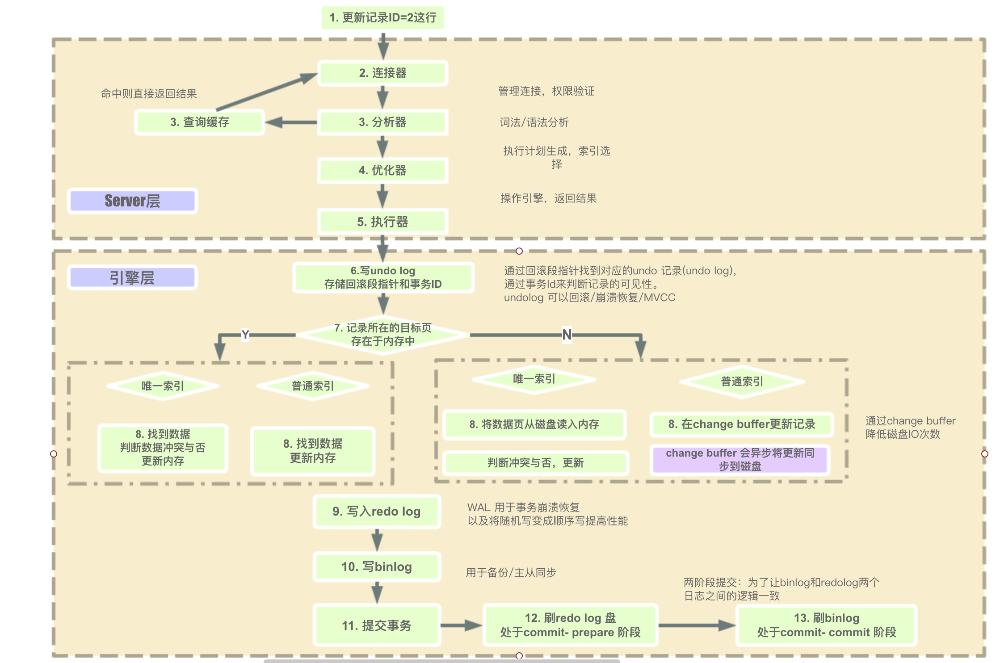
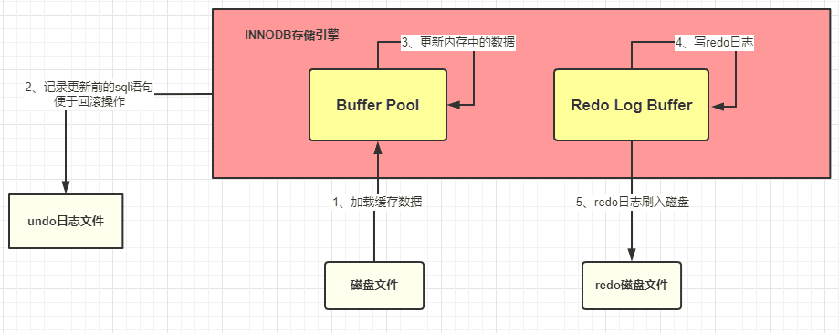

# 一条SQL的完整执行流程

下面是一张用于大概演示了Mysql中sql的处理过程。


上图仅展示了一条SQL被发送到Mysql之后Mysql的处理流程。其实在我们编程中，往往要从应用程序发送sql开始。因此这里从Mysql驱动开始。
## MySQL 驱动
我们的系统在和 MySQL 数据库进行通信的时候，总不可能是平白无故的就能接收和发送请求，就算是你没有做什么操作，那总该是有其他的“人”帮我们做了一些事情，基本上使用过 MySQL 数据库的程序员多多少少都会知道 MySQL 驱动这个概念的。就是这个 MySQL 驱动在底层帮我们做了对数据库的连接，只有建立了连接了，才能够有后面的交互。看下图表示


这样的话，在系统和 MySQL 进行交互之前，MySQL 驱动会帮我们建立好连接，然后我们只需要发送 SQL 语句就可以执行 CRUD 了。一次 SQL 请求就会建立一个连接，多个请求就会建立多个连接，那么问题来了，我们系统肯定不是一个人在使用的，换句话说肯定是存在多个请求同时去争抢连接的情况。我们的 web 系统一般都是部署在 tomcat 容器中的，而 tomcat 是可以并发处理多个请求的，这就会导致多个请求会去建立多个连接，然后使用完再都去关闭，这样会有什么问题呢？如下图


java 系统在通过 MySQL 驱动和 MySQL 数据库连接的时候是基于 TCP/IP 协议的，所以如果每个请求都是新建连接和销毁连接，那这样势必会造成不必要的浪费和性能的下降，也就说上面的多线程请求的时候频繁的创建和销毁连接显然是不合理的。必然会大大降低我们系统的性能，但是如果给你提供一些固定的用来连接的线程，这样是不是不需要反复的创建和销毁连接了呢？相信懂行的朋友会会心一笑，没错，说的就是数据库连接池。

**数据库连接池**：维护一定的连接数，方便系统获取连接，使用就去池子中获取，用完放回去就可以了，我们不需要关心连接的创建与销毁，也不需要关心线程池是怎么去维护这些连接的。


常见的数据库连接池有 Druid、C3P0、DBCP，连接池实现原理在这里就不深入讨论了，采用连接池大大节省了不断创建与销毁线程的开销，这就是有名的「池化」思想，不管是线程池还是 HTTP 连接池，都能看到它的身影。

## Mysql 服务端连接池

到这里，我们已经知道的是我们的系统在访问 MySQL 数据库的时候，建立的连接并不是每次请求都会去创建的，而是从数据库连接池中去获取，这样就解决了因为反复的创建和销毁连接而带来的性能损耗问题了。

不过这里有个小问题，业务系统是并发的，而 MySQL 接受请求的线程呢，只有一个？其实 MySQL 的架构体系中也已经提供了这样的一个池子，也是数据库连池。双方都是通过数据库连接池来管理各个连接的，这样一方面线程之前不需要是争抢连接，更重要的是不需要反复的创建或销毁连接。


## SQL解析器

SQL请求到达Mysql后经由处理线程进行后续执行。首先会经过SQL解析器。

在这里 SQL 被验证并解析成 MySQL 认识的样子的。
## MySQL 查询优化器
查询优化器内部按照他自己认为的最好的方式去优化这条 SQL 语句，并生成一条条的执行计划，比如你创建了多个索引，MySQL 会依据成本最小原则来选择使用对应的索引，这里的成本主要包括两个方面, IO 成本和 CPU 成本。

* IO 成本: 即从磁盘把数据加载到内存的成本，默认情况下，读取数据页的 IO 成本是 1，MySQL 是以页的形式读取数据的，即当用到某个数据时，并不会只读取这个数据，而会把这个数据相邻的数据也一起读到内存中，这就是有名的程序局部性原理，所以 MySQL 每次会读取一整页，一页的成本就是 1。所以 IO 的成本主要和页的大小有关
* CPU 成本：将数据读入内存后，还要检测数据是否满足条件和排序等 CPU 操作的成本，显然它与行数有关，默认情况下，检测记录的成本是 0.2。

MySQL 优化器 会计算 「IO 成本 + CPU」 成本最小的那个索引来执行。

优化器执行选出最优索引等步骤后，将SQL交给执行器。
## 执行器
执行器是一个非常重要的组件，因为前面那些组件的操作最终必须通过执行器去调用存储引擎接口才能被执行。执行器最终最根据一系列的执行计划去调用存储引擎的接口去完成 SQL 的执行。


## 存储引擎
真正执行 SQL 的动作是在存储引擎中完成的。数据是被存放在内存或者是磁盘中的。

我们以一个更新的SQL语句来说明，SQL 如下
```sql
UPDATE students SET stuName = '小强' WHERE id = 1
```
当我们系统发出这样的查询去交给 MySQL 的时候，MySQL 会按照我们上面介绍的一系列的流程最终通过执行器调用存储引擎去执行，流程图就是上面那个。在执行这个 SQL 的时候 SQL 语句对应的数据要么是在内存中，要么是在磁盘中，如果直接在磁盘中操作，那这样的随机IO读写的速度肯定让人无法接受的，所以每次在执行 SQL 的时候都会将其数据加载到内存中，这块内存就是 InnoDB 中一个非常重要的组件：缓冲池 Buffer Pool

### Buffer Pool

Buffer Pool （缓冲池）是 InnoDB 存储引擎中非常重要的内存结构，顾名思义，缓冲池其实就是类似 Redis 一样的作用，起到一个缓存的作用，因为我们都知道 MySQL 的数据最终是存储在磁盘中的，如果没有这个 Buffer Pool 那么我们每次的数据库请求都会磁盘中查找，这样必然会存在 IO 操作，这肯定是无法接受的。但是有了 Buffer Pool 就是我们第一次在查询的时候会将查询的结果存到 Buffer Pool 中，这样后面再有请求的时候就会先从缓冲池中去查询，如果没有再去磁盘中查找，然后在放到 Buffer Pool 中，如下图

按照上面的那幅图，这条 SQL 语句的执行步骤大致是这样子的
* innodb 存储引擎会在缓冲池中查找 id=1 的这条数据是否存在
* 发现不存在，那么就会去磁盘中加载，并将其存放在缓冲池中
* 该条记录会被加上一个独占锁

### 脏页

就是内存数据页与磁盘内存页的内容不一致时的内存页叫做脏页。内存页数据写入磁盘后，数据一致了，就是干净页了。(其实就是将Change Buffer中缓存的更新写入到磁盘)

刷脏页的场景：

1.redo log 写满了，系统会停止所有更新操作，将checkpoint向前推进，将推进这部分日志的脏页更新到磁盘。

2.系统内存不够，需要将一部分数据页淘汰，如果是干净页，直接淘汰就行了，脏页的话，需要全部同步到磁盘。

3.MySQL自认为空闲时去刷脏页。

4.MySQL正常关闭之前，会将脏页刷入磁盘。


### undo Log日志
undo 顾名思义，就是没有做，没发生的意思。undo log 就是没有发生事情（原本事情是什么）的一些日志我们刚刚已经说了，在准备更新一条语句的时候，该条语句已经被加载到 Buffer pool 中了，实际上这里还有这样的操作，就是在将该条语句加载到 Buffer Pool 中的时候同时会往 undo 日志文件中插入一条日志，也就是将 id=1 的这条记录的原来的值记录下来。

#### undo Log日志的作用

innodb 引擎首先开启事务，获得一个事务ID(是一直递增的)，根据执行的语句生成一个反向的语句，(如果是INSERT会生成一条DELETE语句，如果UPDATE语句就会生成一个UPDATE成旧数据的语句)，用于提交失败后回滚，将这条反向语句写入undo log，得到回滚指针，并且更新这个数据行的回滚指针和事务id。（事务提交后，Undo log并不能立马被删除，而是放入待清理的链表，由purge 线程判断是否有其他事务在使用undo 段中表的上一个事务之前的版本信息，决定是否可以清理undo log的日志空间，简单的说就是看之前的事务是否提交成功，这个事务及之前的事务都提交成功了，这部分undo log才能删除。）

Innodb 存储引擎的最大特点就是支持事务，如果本次更新失败，也就是事务提交失败，那么该事务中的所有的操作都必须回滚到执行前的样子，也就是说当事务失败的时候，也不会对原始数据有影响，看图说话


到这一步，我们的执行的 SQL 语句已经被加载到 Buffer Pool 中了，然后开始更新这条语句，更新的操作实际是在Buffer Pool中执行的，那问题来了，按照我们平时开发的一套理论缓冲池中的数据和数据库中的数据不一致时候，我们就认为缓存中的数据是脏数据，那此时 Buffer Pool 中的数据岂不是成了脏数据？没错，目前这条数据就是脏数据，Buffer Pool 中的记录是小强 数据库中的记录是旺财 ，这种情况 MySQL是怎么处理的呢，继续往下看

### redo Log日志

除了从磁盘中加载文件和将操作前的记录保存到 undo 日志文件中，其他的操作是在内存中完成的，内存中的数据的特点就是：断电丢失。如果此时 MySQL 所在的服务器宕机了，那么 Buffer Pool 中的数据会全部丢失的。这个时候 redo 日志文件就可以进行恢复。

redo 记录的是数据修改之后的值，不管事务是否提交都会记录下来，例如，此时将要做的是update students set stuName='小强' where id=1; 那么这条操作就会被记录到 redo log buffer 中，啥？怎么又出来一个 redo log buffer ,很简单，MySQL 为了提高效率，所以将这些操作都先放在内存中去完成，然后会在某个时机将其持久化到磁盘中。此时redo log中这条事务的状态为prepare状态。


这个时候如果服务器宕机了，那么缓存中的数据还是丢失了。真烦，竟然数据总是丢失，那能不能不要放在内存中，直接保存到磁盘呢？很显然不行，因为在上面也已经介绍了，在内存中的操作目的是为了提高效率。

此时，如果 MySQL 真的宕机了，那么没关系的，因为 MySQL 会认为本次事务是失败的，所以数据依旧是更新前的样子，并不会有任何的影响。

好了，语句也更新好了那么需要将更新的值提交啊，也就是需要提交本次的事务了，因为只要事务成功提交了，才会将最后的变更保存到数据库，在提交事务前仍然会具有相关的其他操作将 redo Log Buffer 中的数据持久化到磁盘中，就是将 redo log buffer 中的数据写入到 redo log 磁盘文件中，一般情况下，redo log Buffer 数据写入磁盘的策略是立即刷入磁盘（具体策略情况在下面小总结出会详细介绍）,上图

如果 redo log Buffer 刷入磁盘后，数据库服务器宕机了，那我们更新的数据怎么办？此时数据是在内存中，数据岂不是丢失了？不，这次数据就不会丢失了，因为 redo log buffer 中的数据已经被写入到磁盘了，已经被持久化了，就算数据库宕机了，在下次重启的时候 MySQL 也会将 redo 日志文件内容恢复到 Buffer Pool 中（这边我的理解是和 Redis 的持久化机制是差不多的，在 Redis 启动的时候会检查 rdb 或者是 aof 或者是两者都检查，根据持久化的文件来将数据恢复到内存中）

到此为止，**从执行器开始调用存储引擎接口做了哪些事情呢**？

* 准备更新一条 SQL 语句MySQL（innodb）会先去缓冲池（BufferPool）中去查找这条数据，没找到就会去磁盘中查找，如果查找到就会将这条数据加载到缓冲池（BufferPool）中在加载到 Buffer Pool 的同时，会将这条数据的原始记录保存到 undo 日志文件中
* innodb 会在 Buffer Pool 中执行更新操作更新后的数据会记录在 redo log buffer 中
* MySQL 提交事务的时候，会将 redo log buffer 中的数据写入到 redo 日志文件中 
* 刷磁盘可以通过 innodb_flush_log_at_trx_commit 参数来设置 
值为 0 表示不刷入磁盘
值为 1 表示立即刷入磁盘
值为 2 表示先刷到 os cache
* mysql 重启的时候会将 redo 日志恢复到缓冲池中

目前一次完整的SQL执行就得到了保证。

#### Checkpoint

就是系统故障后，根据redo来恢复数据时，不需要重做所有日志，只需要重做checkpoint点之后的日志，因为redo log也不能无限大，所以当redo log空间不足时，redo log中那部分被更新到磁盘的日志可以覆盖重用。

1、缩短数据库的恢复时间；

2、缓冲池不够用时，将脏页刷新到磁盘；

3、重做日志空间不足时，刷新脏页。

## bin log 日志文件
上面介绍到的redo log是 InnoDB 存储引擎特有的日志文件，而bin log属于是 MySQL 级别的日志。redo log记录的东西是偏向于物理性质的，如：“对什么数据，做了什么修改”。bin log是偏向于逻辑性质的，类似于：“对 students 表中的 id 为 1 的记录做了更新操作” 两者的主要特点总结如下:

| 属性          | redo log                                                                 | bin log                                                                 |
|---------------|--------------------------------------------------------------------------|-------------------------------------------------------------------------|
| 文件大小      | 固定大小（可通过配置调整，通常默认值足够）                              | 可通过`max_binlog_size`设置单个文件大小（一般不建议修改）              |
| 实现方式      | 由 InnoDB 引擎层实现（InnoDB 独有）                                     | 由 MySQL 服务层实现，所有存储引擎均可使用                               |
| 日志记录方式  | 循环写入（写满后回到起点覆盖）                                          | 追加写入（文件达到指定大小后生成新文件继续记录）                        |
| 使用场景      | 崩溃恢复（crash-safe，类似 Redis 持久化特性）                           | 主从复制、数据恢复                                                      |

### bin log文件是如何刷入磁盘的?
bin log 的刷盘是有相关的策略的，策略可以通过sync_bin log来修改，默认为 0，表示先写入 os cache，也就是说在提交事务的时候，数据不会直接到磁盘中，这样如果宕机bin log数据仍然会丢失。所以建议将sync_bin log设置为 1 表示直接将数据写入到磁盘文件中。

**刷入 bin log 有以下几种模式**
* STATMENT
基于 SQL 语句的复制(statement-based replication, SBR)，每一条会修改数据的 SQL 语句会记录到 bin log 中
【优点】：不需要记录每一行的变化，减少了 bin log 日志量，节约了 IO , 从而提高了性能
【缺点】：在某些情况下会导致主从数据不一致，比如执行sysdate()、sleep()等
* ROW
基于行的复制(row-based replication, RBR)，不记录每条SQL语句的上下文信息，仅需记录哪条数据被修改了
【优点】：不会出现某些特定情况下的存储过程、或 function、或 trigger 的调用和触发无法被正确复制的问题
【缺点】：会产生大量的日志，尤其是 alter table 的时候会让日志暴涨
* MIXED
基于 STATMENT 和 ROW 两种模式的混合复制( mixed-based replication, MBR )，一般的复制使用 STATEMENT 模式保存 bin log ，对于 STATEMENT 模式无法复制的操作使用 ROW 模式保存 bin log

#### 写bin log（同时将redo log设置为commit状态）
那既然bin log也是日志文件，那它是在什么时候记录数据的呢？其实 MySQL 在提交事务的时候，不仅仅会将 redo log buffer 中的数据写入到redo log 文件中，同时也会将本次修改的数据记录到 bin log文件中，同时会将本次修改的bin log文件名和修改的内容在bin log中的位置记录到redo log中，最后还会在redo log最后写入 commit 标记，这样就表示本次事务被成功的提交了。

> 如果在数据被写入到bin log文件的时候，刚写完，数据库宕机了，数据会丢失吗？
>
> 首先可以确定的是，只要redo log最后没有 commit 标记，说明本次的事务一定是失败的。但是数据并没有丢失，因为已经被记录到redo log的磁盘文件中了。在 MySQL 重启的时候，就会将 redo log 中的数据恢复（加载）到Buffer Pool中。

好了，到目前为止，一个更新操作我们基本介绍得差不多，但是你有没有感觉少了哪件事情还没有做？是不是你也发现这个时候被更新记录仅仅是在内存中执行的，哪怕是宕机又恢复了也仅仅是将更新后的记录加载到Buffer Pool中，这个时候 MySQL 数据库中的这条记录依旧是旧值，也就是说内存中的数据在我们看来依旧是脏数据，那这个时候怎么办呢？

其实 MySQL 会有一个后台线程，它会在某个时机将我们Buffer Pool中的脏数据刷到 MySQL 数据库中，这样就将内存和数据库的数据保持统一了。


# 总结：

其实在SQL最终在存储引擎层的执行过程主要涉及到一些将磁盘文件加载到内存、记录一些log，并且每种log有自己的刷新、写入磁盘的策略，以此来保证事务的四大特性。
* undo log
undo log是一种逻辑日志，是旧数据的备份。主要有两个作用：用于事务回滚和MVCC。
执行一条INSERT语句时，会记录一条相反的DELETE语句到日志，执行一条UPDATE语句时，会记录一条相反的UPDATE语句到日志中。
主要是保证事务的原子性，事务执行失败就回滚，用于在事务执行失败后，对数据回滚。
在事务提交后，undo log日志不会立即删除，会放到一个待删除的链表中，有purge线程判断是否有其他事务在使用上一个事务之前的版本信息，然后决定是否可以清理，简单的来说就是前面的事务都提交成功了，这些undo才能删除。
* change buffer(存在于bufferpool中)
（change buffer就是将更新数据页的操作缓存下来）
在更新数据时，如果数据行所在的数据页在内存中，直接更新内存中的数据页。
如果不在内存中，为了减少磁盘IO的次数，innodb会将这些更新操作缓存在change buffer中，在下一次查询时需要访问这个数据页时，在执行change buffer中的操作对数据页进行更新。（或者是在MySQL Server空闲时，会将change buffer中所有操作更新到磁盘，也就是俗称的‘刷页’。）
适合写多读少的场景，因为这样即便立即写了，也不太可能会被访问到，延迟更新可以减少磁盘I/O，只有普通索引会用到，因为唯一性索引，在更新时就需要判断唯一性，所以没有必要。
* redo log
就是为了保证事务的持久性，在做数据更新操作时，先将对数据页的更改记录到redo log，然后再去更新内存中的数据页，在下次查询数据页或者空闲时间，将操作记录更新到磁盘。这样可以将随机I/O改为顺序I/O。
优点是减少磁盘I/O次数，即便发生故障也可以根据redo log来将数据恢复到最新状态。
缺点是会造成内存脏页，后台线程会自动对脏页刷盘，或者是淘汰数据页时刷盘，此时会暂时查询操作，影响查询。

* 二段提交制
更新时，先改内存中的数据页，将更新操作写入redo log日志，此时redo log进入prepare状态，然后通知MySQL Server执行完了，随时可以提交，MySQL Server将更新的SQL写入bin log，然后调用innodb接口将redo log设置为提交状态，更新完成。
如果只是写了redo log就标记为commit，那么忽然发生故障，主节点可以根据redo log恢复数据到最新，但是binlog没有对应记录主从同步时会丢掉这部分更新的数据。
如果只是写binlog，然后写redo log，如果忽然发生故障，主节点根据redo log恢复数据时就会丢掉这部分数据。
    * 崩溃恢复时的判断规则（以redolog是否commit或者binlog是否完整来确定）

        * 如果 redo log 里面的事务是完整的，也就是已经有了 commit 标识，则直接提交；
        * 如果 redo log 里面的事务只有完整的 prepare，则判断对应的事务 binlog 是否存在并完整： 
            a. 如果是，则提交事务； 
            b. 否则，回滚事务。

