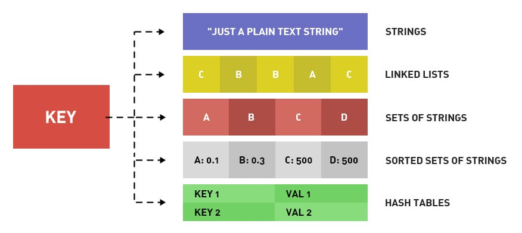

# Redis基础
首先对redis来说，所有的key（键）都是字符串。我们在谈基础数据结构时，讨论的是存储值的数据类型，主要包括常见的5种数据类型，分别是：String、List、Set、Zset、Hash。

| 结构类型       | 结构存储的值                                                                 | 结构的读写能力                                                                                                                                                                                                 |
|----------------|------------------------------------------------------------------------------|-------------------------------------------------------------------------------------------------------------------------------------------------------------------------------------------------------------|
| String 字符串  | 可以是字符串、整数或浮点数                                                   | 对整个字符串或字符串的一部分进行操作； 对整数或浮点数进行自增或自减操作                                                                                                                                    |
| List 列表      | 一个链表，链表上的每个节点都包含一个字符串                                   | 对链表的两端进行 push 和 pop 操作； 读取单个或多个元素； 根据值查找或删除元素                                                                                                                           |
| Set 集合       | 包含字符串的无序集合                                                         | 检查元素是否存在、添加、获取、删除； 计算集合的交集、并集、差集                                                                                                                                             |
| Hash 散列      | 包含键值对的无序散列表                                                       | 添加、获取、删除单个元素                                                                                                                                                                                     |
| Zset 有序集合  | 字符串成员与浮点数分数之间的有序映射； 元素的排列顺序由分数的大小决定     | 添加、获取、删除单个元素； 根据分值范围或成员来获取元素                                                                                                                                                    |