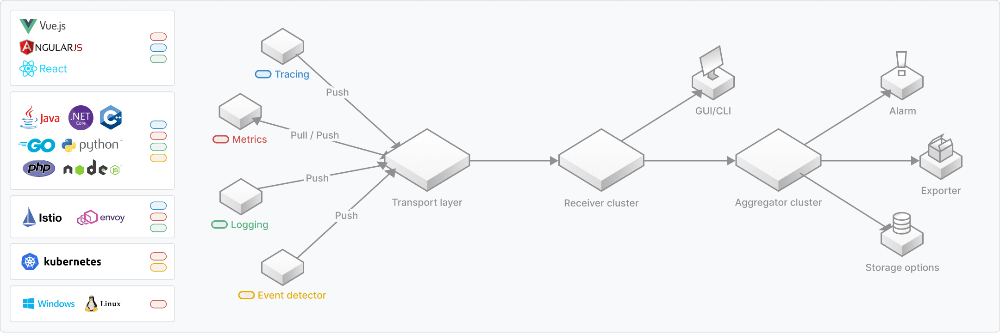

# SkyWalking

SkyWalking在整体结构上主要分为四个模块：探针、平台后端、存储和 UI。

## SkyWalking的设计目标

1. 可观测性。 无论目标系统采用何种部署方式，SkyWalking 都为其提供了集成解决方案，以保持可观测性。基于此理念，SkyWalking 提供了多种运行时形式（运行方式）和探针。

2. 将拓扑、指标以及链路追踪结合。 了解分布式系统的第一步是拓扑图。它以易于阅读的布局可视化整个复杂系统。在拓扑图下，运维人员对 service、instance、endpoint 和 calls 的指标有更高的要求。采用详细日志的形式进行链路追踪可以很好帮助你理解这些指标。 例如，当终端节点延迟变长时，您希望查看最慢的链路环节以找出原因。所以你可以看到，它们从大局到细节，都是需要的。SkyWalking 集成并提供了很多功能 使以上过程成为可能且易于理解。

3. 轻量级。 
（1）在探针模块，SkyWalking仅依赖网络通信框架，首选协议是gRPC。这样使得探针尽可能的小，并且避免库冲突和为VM带来负载，例如JVM中对永久代的大小要求。
（2）作为可观测性平台，他是您项目环境中的二级和三级系统。因此，SkyWalking使用自己的轻量级框架来构建后端核心模块。这样你就不需要专门的大数据技术平台来维护。SkyWalking在技术栈中应该十分简单。

4.可插拔。 SkyWalking 核心团队提供了许多默认的实现，但绝对是不够的， 也不适合所有情况。因此，我们提供了许多可插拔功能。

5.可移植性。 SkyWalking 可以在多种环境中运行，包括： 
（1） 使用传统的注册中心，如 eureka。 
（2） 使用包含服务发现的 RPC 框架，如 Spring Cloud、Apache Dubbo。 
（3） 在现代基础设施中使用服务网格。 
（4） 使用云服务。 
（5） 跨云部署。 SkyWalking 在以上这些情况下都应该运行良好。

6.互操作性。 可观测性领域是如此之大，以至于 SkyWalking 几乎不可能支持所有系统，即使有其社区的支持也是如此。 目前，它支持与其他 OSS 系统的互操作性，尤其是 Zipkin、Jaeger 和 OpenTelemetry 等探针。 对于最终用户来说，SkyWalking 能够接受和读取这些数据格式非常重要，因为用户不需要切换他们的库。

## 探针

在 SkyWalking 中，探针是指集成到目标系统中的 agent 或 SDK 库，负责收集 遥测数据，包括跟踪和指标。根据目标系统技术堆栈的不同，有不同的方法使用探针执行此类任务。最终，他们都朝着同一个目标努力 — 收集和重新格式化数据， 然后将它们发送到后端。

在高层次上，所有 SkyWalking 探针都有四个典型类别：

1.基于语言的本机代理。这些代理在目标服务用户空间（如用户代码的一部分）中运行。为 例如，SkyWalking Java 代理使用 -javaagent 命令行参数在运行时操作代码， 其中 manipulate 表示更改和注入用户的代码。另一个例子是 SkyWalking 代理，它利用 Golang 编译机制来在编译时编织代码。对于某些静态编译语言（如 C++），请手动引用库是唯一的选择。 这些代理都是基于语言和库的，无论我们提供自动检测代理还是手动代理。

2.Service Mesh 探测器。Service Mesh 探针从 sidecar、Service Mesh 中的控制平面或代理收集数据。在过去，代理只用作整个集群的入口，但有了 Service Mesh 和 sidecar，我们现在就可以执行可观察性函数。

3.第三方工具库。SkyWalking 接受许多广泛使用的第三方数据格式。 SkyWalking 社区与 Zipkin 社区紧密相连，它可以为Zipkin v1 和 v2  跟踪数据的替代服务器。此外，还支持 gRPC 中的 OTEL 跟踪格式，并在 SkyWalking 中转换为 Zipkin 格式。 作为替代的 Zipkin 服务器，Zipkin lens UI 可用于 Zipkin 格式跟踪数据的可视化。 有关更多信息，请参阅 Receiver for Zipkin 跟踪和 Receiver for OTEL 跟踪。

4.eBPF 代理。eBPF 代理可以收集指标并分析 使用 Linux 内核的 eBPF 技术的服务。

在使用时，我们不必安装所有探针，进安装必要的即可。 关于如何使用这些探针，有几种推荐的方法：

1.仅使用基于语言的本机代理为您的业务应用程序构建拓扑和指标。
2.仅使用第三方工具，例如 Zipkin 生态系统。
3.如果您更喜欢 Service Mesh 技术栈并且不想使用本机代理，请使用 Service Mesh 探针。
4.在纯跟踪模式下将 Service Mesh 探针与基于语言的原生代理或第三方检测库一起使用。（高级用法）
5.仅当您只想按需分析和/或激活自动性能分析时，才使用 eBPF 代理。
6.将 eBPF 代理与基于语言的本机代理协作使用。使用 eBPF 代理增强跟踪以收集额外信息。

in tracing status 是什么意思？

默认情况下，基于语言的原生代理和第三方检测库都会将分布式跟踪数据发送到 Skywalking后端 中执行这些跟踪的分析和聚合。在纯跟踪状态下，意味着Skywalking后端将这些跟踪视为类似于日志的内容。换句话说，Skywalking后端会保存它们，但不从这些跟踪数据进行指标分析。因此，不会有 service/instance/endpoint metrics and relationships 的数据。

## 服务自动检测代理（Service Auto Instrument Agent）

服务自动检测代理是基于语言的本机代理的子集。这种代理是基于 一些特定于语言的功能，尤其是基于 VM 的语言。

### 自动检测 是什么意思？

许多用户在第一次听说 “No one line of code must be changed” 时就了解了这些代理。SkyWalking 过去也在其自述文件中提到了这一点。 然而，这并不能反映全貌。对于最终用户来说，在大多数情况下，他们确实不再需要修改他们的代码。 但重要的是要了解代码实际上仍然由代理修改，这通常被称为“运行时代码操作”。底层逻辑是 auto instrument agent 使用 VM 接口进行代码修改，动态添加 instrument 代码，比如通过 javaagent premain。

### 自动检测代理有哪些限制

Auto Instrument 非常有用，因为您可以在编译时执行 Auto Instrument，而不必依赖 VM 功能。但也有一定的限制：

在大多数情况下，上下文的传播是基于线程的。许多用于构建业务系统的高级语言（如 Java 和 .NET）。 对于每个请求，大多数业务逻辑代码都在同一线程中运行，这导致上下文传播是基于线程 ID（线程本地存储（Thread Local Storage, TLS）），以便堆栈模块确保上下文是安全的。

仅适用于某些框架或库。由于代理负责在运行时修改代码，因此对于代理插件开发人员来说代码是已知的。通常有一个支持的列表标识探针支持那些框架或工具库。 例如，请参阅 [SkyWalking Java](https://github.com/apache/skywalking-java/blob/20fb8c81b3da76ba6628d34c12d23d3d45c973ef/docs/en/setup/service-agent/java-agent/Supported-list.md) 代理支持列表。

并非始终支持跨线程操作。就像上面提到的关于进程内传播的内容一样，大多数代码（尤其是业务代码） 在每个请求的单个线程中运行。但在其他一些情况下，它们跨不同的线程运行，例如将任务分配给其他线程、任务池或批处理。一些语言甚至可能提供协程或类似的组件，如 Goroutine，它允许开发人员以低负载运行异步进程。在这种情况下，自动检测将面临一些问题。

所以，自动检测（auto instrument）并没有什么神秘之处。简而言之，代理开发人员编写一个激活脚本来使检测代码为您服务。就是这样！

## 服务层次结构（Service Hierarchy）

SkyWalking v10 引入了一个新的概念 Service Hierarchy，它定义了各个层中现有逻辑相同的服务之间的关系。 OAP 将从不同层检测服务，并尝试构建连接关系。

### 检测服务层次结构连接 （Detect Service Hierarchy Connections）

有两种方法可以检测连接：

1.通过 OAP 内部机制自动匹配，无需额外工作。
2.通过特定代理建立连接。

注意：所有关系和自动匹配规则都应在 config/hierarchy-definition.yml 文件中定义。 如果您想根据自己的需求进行自定义，请参考 [服务层次结构配置](https://skywalking.apache.org/docs/main/latest/en/concepts-and-designs/service-hierarchy-configuration/)。

## 
