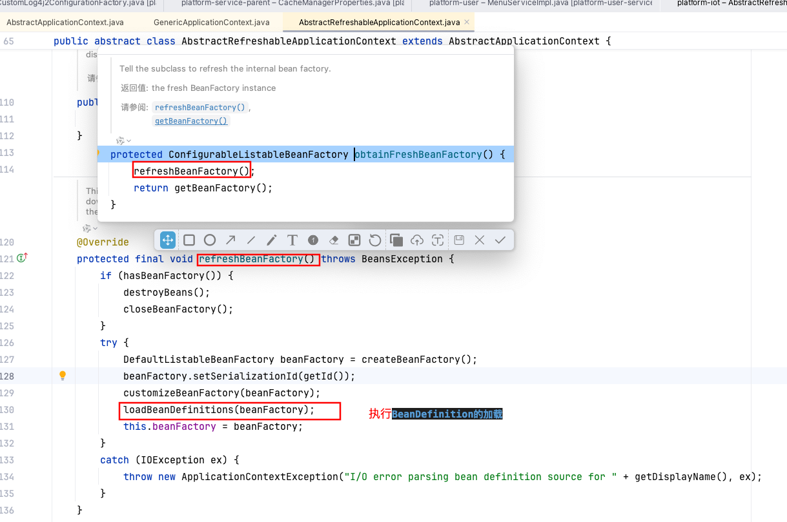

# AOP相关

## Spring AOP和AspectJ的关系

1. AspectJ是更强的AOP框架，是实际意义的AOP标准；
2. Spring为何不写类似AspectJ的框架？ Spring AOP使用纯Java实现, 它不需要专门的编译过程, 它一个重要的原则就是无侵入性（non-invasiveness）; Spring 小组完全有能力写类似的框架，只是Spring AOP从来没有打算通过提供一种全面的AOP解决方案来与AspectJ竞争。Spring的开发小组相信无论是基于代理（proxy-based）的框架如Spring AOP或者是成熟的框架如AspectJ都是很有价值的，他们之间应该是**互补而不是竞争的关系**。
3. Spring小组喜欢@AspectJ注解风格更胜于Spring XML配置； 所以在Spring 2.0使用了和AspectJ 5一样的注解，并使用AspectJ来做切入点解析和匹配。**但是，AOP在运行时仍旧是纯的Spring AOP，并不依赖于AspectJ的编译器或者织入器（weaver）**。即使使用了`@EnableAspectJAutoProxy`注解，也仅仅是开启了对AspectJ注解的支持。
4. Spring 2.5对AspectJ的支持：在一些环境下，增加了对AspectJ的装载时编织支持，同时提供了一个新的bean切入点。
5. 要实际使用AspectJ进行aop需要引入aspectj-maven-plugin插件，并配置使用对应的编译器，才会真正的使用到AspectJ的编译时增强。
6. AspectJ的编译时织入可以不基于容器环境，而是将实际的增强代码写入到了切面类中，因此在运行时有更好的性能。
### AspectJ编译器增强原理

AspectJ增强代码编译到到java代码的过程（这个过程称为织入），对于织入这个概念，可以简单理解为aspect(切面)应用到目标函数(类)的过程。

对于这个过程，一般分为**动态织入**和**静态织入**：
1. 动态织入的方式是在运行时动态将要增强的代码织入到目标类中，这样往往是通过动态代理技术完成的，如Java JDK的动态代理(Proxy，底层通过反射实现)或者CGLIB的动态代理(底层通过继承实现)，Spring AOP采用的就是基于运行时增强的代理技术ApectJ采用的就是静态织入的方式。
2. ApectJ主要采用的是编译期织入，在这个期间使用AspectJ的acj编译器(类似javac)把aspect类编译成class字节码后，在java目标类编译时织入，即先编译aspect类再编译目标类。

### Spring AOP的实现方式：动态织入
动态织入的方式是在运行时动态将要增强的代码织入到目标类中，这样往往是通过动态代理技术完成的；如Java JDK的动态代理(Proxy，底层通过反射实现)或者CGLIB的动态代理(底层通过继承实现)，Spring AOP采用的就是基于运行时增强的代理技术。因此如果一个类两个条件都不满足那么spring AOP无法为其生成代理。

# Spring MVC

## Spring Web MVC 处理请求的流程


核心架构的具体流程步骤描述：
1. 首先用户发送请求——>DispatcherServlet，前端控制器收到请求后自己不进行处理，而是委托给其他的解析器进行 处理，作为统一访问点，进行全局的流程控制；
2. DispatcherServlet——>HandlerMapping， HandlerMapping 将会把请求映射为 HandlerExecutionChain 对象（包含一 个Handler 处理器（页面控制器）对象、多个HandlerInterceptor 拦截器）对象，通过这种策略模式，很容易添加新的映射策略；
3. DispatcherServlet——>HandlerAdapter，HandlerAdapter 将会把处理器包装为适配器，从而支持多种类型的处理器， 即适配器设计模式的应用，从而很容易支持很多类型的处理器；
4. HandlerAdapter——>处理器功能处理方法的调用，HandlerAdapter 将会根据适配的结果调用真正的处理器的功能处 理方法，完成功能处理；并返回一个ModelAndView 对象（包含模型数据、逻辑视图名）；
5. ModelAndView 的逻辑视图名——> ViewResolver，ViewResolver 将把逻辑视图名解析为具体的View，通过这种策 略模式，很容易更换其他视图技术；
6. View——>渲染，View 会根据传进来的Model 模型数据进行渲染，此处的Model 实际是一个Map 数据结构，因此 很容易支持其他视图技术；
7. 返回控制权给DispatcherServlet，由DispatcherServlet 返回响应给用户，到此一个流程结束。

# Spring IOC

## 如何将Bean注册到BeanFactory中
在 Spring 容器里都通过一个 BeanDefinition 对象表示，它描述了 Bean 的配置信息。而 BeanDefinitionRegistry 接口提供了向容器手工注册 BeanDefinition 对象的方法。
源代码执行流程如下：


## BeanDefinition的作用
> Bean对象存在依赖嵌套等关系，所以设计者设计了BeanDefinition，它用来对Bean对象及关系定义；我们在理解时只需要抓住如下三个要点：
> * BeanDefinition 定义了各种Bean对象及其相互的关系
> * BeanDefinitionReader 这是BeanDefinition的解析器
> * BeanDefinitionHolder 这是BeanDefination的包装类，用来存储BeanDefinition，name以及aliases等。

## BeanDefinition的加载

对于BeanDefinition的加载时机在源码中根据不同的实现类可能有不同的触发时机。

但是根据主要的两个抽象类进行划分为以下两种：
### AbstractRefreshableApplicationContext的实现类
该类为了每次刷新ApplicationContext时创建一个新的内部Bean Factory实例，并且在obtainFreshBeanFactory时进行BeanDefinition的加载。

相比之下GenericApplicationContext的实现类在obtainFreshBeanFactory时不做任何处理


### GenericApplicationContext的实现类

该类在postProcessBeanFactory时才进行相应的BeanDefinition的加载。


但是其实无论是哪个实现最终都是使用内部的scanner与reader进行加载。

## Bean的实例化

从IOC容器已有的BeanDefinition信息，要如何实例化出Bean对象。
这里会包括三块重点内容：
1. BeanFactory中getBean的主体思路
2. Spring如何解决循环依赖问题
3. Spring中Bean的生命周期

Bean的初始化在refresh方法中的finishBeanFactoryInitialization中的最后一步。


在preInstantiateSingletons方法内会进行遍历初始化。
```java
	public void preInstantiateSingletons() throws BeansException {
		if (logger.isTraceEnabled()) {
			logger.trace("Pre-instantiating singletons in " + this);
		}

		// Iterate over a copy to allow for init methods which in turn register new bean definitions.
		// While this may not be part of the regular factory bootstrap, it does otherwise work fine.
		List<String> beanNames = new ArrayList<>(this.beanDefinitionNames);

		// Trigger initialization of all non-lazy singleton beans...
		for (String beanName : beanNames) {
			RootBeanDefinition bd = getMergedLocalBeanDefinition(beanName);
			if (!bd.isAbstract() && bd.isSingleton() && !bd.isLazyInit()) {
				if (isFactoryBean(beanName)) {
					Object bean = getBean(FACTORY_BEAN_PREFIX + beanName);
					if (bean instanceof FactoryBean) {
						FactoryBean<?> factory = (FactoryBean<?>) bean;
						boolean isEagerInit;
						if (System.getSecurityManager() != null && factory instanceof SmartFactoryBean) {
							isEagerInit = AccessController.doPrivileged(
									(PrivilegedAction<Boolean>) ((SmartFactoryBean<?>) factory)::isEagerInit,
									getAccessControlContext());
						}
						else {
							isEagerInit = (factory instanceof SmartFactoryBean &&
									((SmartFactoryBean<?>) factory).isEagerInit());
						}
						if (isEagerInit) {
							getBean(beanName);
						}
					}
				}
				else {
					getBean(beanName);
				}
			}
		}

		// Trigger post-initialization callback for all applicable beans...
		for (String beanName : beanNames) {
			Object singletonInstance = getSingleton(beanName);
			if (singletonInstance instanceof SmartInitializingSingleton) {
				StartupStep smartInitialize = this.getApplicationStartup().start("spring.beans.smart-initialize")
						.tag("beanName", beanName);
				SmartInitializingSingleton smartSingleton = (SmartInitializingSingleton) singletonInstance;
				if (System.getSecurityManager() != null) {
					AccessController.doPrivileged((PrivilegedAction<Object>) () -> {
						smartSingleton.afterSingletonsInstantiated();
						return null;
					}, getAccessControlContext());
				}
				else {
					smartSingleton.afterSingletonsInstantiated();
				}
				smartInitialize.end();
			}
		}
	}
```
在方法内部虽然有很多接口的判断进行拓展，但是其实核心在于getBean(beanName)方法。而getBean(beanName)方法内实际调用的是doGetBean(name, null, null, false);

在这个方法内就是bean对象实例化的过程：
```java
	protected <T> T doGetBean(
			String name, @Nullable Class<T> requiredType, @Nullable Object[] args, boolean typeCheckOnly)
			throws BeansException {

		String beanName = transformedBeanName(name);
		Object beanInstance;

		// Eagerly check singleton cache for manually registered singletons.
		Object sharedInstance = getSingleton(beanName);
		if (sharedInstance != null && args == null) {
			if (logger.isTraceEnabled()) {
				if (isSingletonCurrentlyInCreation(beanName)) {
					logger.trace("Returning eagerly cached instance of singleton bean '" + beanName +
							"' that is not fully initialized yet - a consequence of a circular reference");
				}
				else {
					logger.trace("Returning cached instance of singleton bean '" + beanName + "'");
				}
			}
			beanInstance = getObjectForBeanInstance(sharedInstance, name, beanName, null);
		}

		else {
			// Fail if we're already creating this bean instance:
			// We're assumably within a circular reference.
			if (isPrototypeCurrentlyInCreation(beanName)) {
				throw new BeanCurrentlyInCreationException(beanName);
			}

			// Check if bean definition exists in this factory.
			BeanFactory parentBeanFactory = getParentBeanFactory();
			if (parentBeanFactory != null && !containsBeanDefinition(beanName)) {
				// Not found -> check parent.
				String nameToLookup = originalBeanName(name);
				if (parentBeanFactory instanceof AbstractBeanFactory) {
					return ((AbstractBeanFactory) parentBeanFactory).doGetBean(
							nameToLookup, requiredType, args, typeCheckOnly);
				}
				else if (args != null) {
					// Delegation to parent with explicit args.
					return (T) parentBeanFactory.getBean(nameToLookup, args);
				}
				else if (requiredType != null) {
					// No args -> delegate to standard getBean method.
					return parentBeanFactory.getBean(nameToLookup, requiredType);
				}
				else {
					return (T) parentBeanFactory.getBean(nameToLookup);
				}
			}

			if (!typeCheckOnly) {
				markBeanAsCreated(beanName);
			}

			StartupStep beanCreation = this.applicationStartup.start("spring.beans.instantiate")
					.tag("beanName", name);
			try {
				if (requiredType != null) {
					beanCreation.tag("beanType", requiredType::toString);
				}
				RootBeanDefinition mbd = getMergedLocalBeanDefinition(beanName);
				checkMergedBeanDefinition(mbd, beanName, args);

				// Guarantee initialization of beans that the current bean depends on.
				String[] dependsOn = mbd.getDependsOn();
				if (dependsOn != null) {
					for (String dep : dependsOn) {
						if (isDependent(beanName, dep)) {
							throw new BeanCreationException(mbd.getResourceDescription(), beanName,
									"Circular depends-on relationship between '" + beanName + "' and '" + dep + "'");
						}
						registerDependentBean(dep, beanName);
						try {
							getBean(dep);
						}
						catch (NoSuchBeanDefinitionException ex) {
							throw new BeanCreationException(mbd.getResourceDescription(), beanName,
									"'" + beanName + "' depends on missing bean '" + dep + "'", ex);
						}
					}
				}

				// Create bean instance.
				if (mbd.isSingleton()) {
					sharedInstance = getSingleton(beanName, () -> {
						try {
							return createBean(beanName, mbd, args);
						}
						catch (BeansException ex) {
							// Explicitly remove instance from singleton cache: It might have been put there
							// eagerly by the creation process, to allow for circular reference resolution.
							// Also remove any beans that received a temporary reference to the bean.
							destroySingleton(beanName);
							throw ex;
						}
					});
					beanInstance = getObjectForBeanInstance(sharedInstance, name, beanName, mbd);
				}

				else if (mbd.isPrototype()) {
					// It's a prototype -> create a new instance.
					Object prototypeInstance = null;
					try {
						beforePrototypeCreation(beanName);
						prototypeInstance = createBean(beanName, mbd, args);
					}
					finally {
						afterPrototypeCreation(beanName);
					}
					beanInstance = getObjectForBeanInstance(prototypeInstance, name, beanName, mbd);
				}

				else {
					String scopeName = mbd.getScope();
					if (!StringUtils.hasLength(scopeName)) {
						throw new IllegalStateException("No scope name defined for bean '" + beanName + "'");
					}
					Scope scope = this.scopes.get(scopeName);
					if (scope == null) {
						throw new IllegalStateException("No Scope registered for scope name '" + scopeName + "'");
					}
					try {
						Object scopedInstance = scope.get(beanName, () -> {
							beforePrototypeCreation(beanName);
							try {
								return createBean(beanName, mbd, args);
							}
							finally {
								afterPrototypeCreation(beanName);
							}
						});
						beanInstance = getObjectForBeanInstance(scopedInstance, name, beanName, mbd);
					}
					catch (IllegalStateException ex) {
						throw new ScopeNotActiveException(beanName, scopeName, ex);
					}
				}
			}
			catch (BeansException ex) {
				beanCreation.tag("exception", ex.getClass().toString());
				beanCreation.tag("message", String.valueOf(ex.getMessage()));
				cleanupAfterBeanCreationFailure(beanName);
				throw ex;
			}
			finally {
				beanCreation.end();
			}
		}

		return adaptBeanInstance(name, beanInstance, requiredType);
	}
```
以单例对象为例，其核心部分
```java
				// Create bean instance.
				if (mbd.isSingleton()) {
					sharedInstance = getSingleton(beanName, () -> {
						try {
							return createBean(beanName, mbd, args);
						}
						catch (BeansException ex) {
							// Explicitly remove instance from singleton cache: It might have been put there
							// eagerly by the creation process, to allow for circular reference resolution.
							// Also remove any beans that received a temporary reference to the bean.
							destroySingleton(beanName);
							throw ex;
						}
					});
					beanInstance = getObjectForBeanInstance(sharedInstance, name, beanName, mbd);
				}
```
虽然调用getSingleton，但是其实在内部初始化时调用的是singletonObject = singletonFactory.getObject();，也就是我们传入的
```java
() -> {
						try {
							return createBean(beanName, mbd, args);
						}
						catch (BeansException ex) {
							// Explicitly remove instance from singleton cache: It might have been put there
							// eagerly by the creation process, to allow for circular reference resolution.
							// Also remove any beans that received a temporary reference to the bean.
							destroySingleton(beanName);
							throw ex;
						}
					}
```
核心的createBean方法经过层层判断最终会调用Object earlySingletonReference = getSingleton(beanName, false);方法，来拿到最终的bean。

## Spring如何解决循环依赖问题
> 首先我们需要说明，Spring只是解决了单例模式下属性依赖的循环问题；Spring为了解决单例的循环依赖问题，使用了三级缓存。

三级缓存结构如下：
```java
	/** Cache of singleton objects: bean name to bean instance. */
	private final Map<String, Object> singletonObjects = new ConcurrentHashMap<>(256);

	/** Cache of singleton factories: bean name to ObjectFactory. */
	private final Map<String, ObjectFactory<?>> singletonFactories = new HashMap<>(16);

	/** Cache of early singleton objects: bean name to bean instance. */
	private final Map<String, Object> earlySingletonObjects = new ConcurrentHashMap<>(16);
```
直接先来直接简述一下三个缓存的作用：
* 第一层缓存（singletonObjects）：单例对象缓存池，已经实例化并且属性赋值，这里的对象是成熟对象；
* 第二层缓存（earlySingletonObjects）：单例对象缓存池，已经实例化但尚未属性赋值，这里的对象是半成品对象；
* 第三层缓存（singletonFactories）: 单例工厂的缓存
```java
	protected Object getSingleton(String beanName, boolean allowEarlyReference) {
		// Quick check for existing instance without full singleton lock
		Object singletonObject = this.singletonObjects.get(beanName);
		if (singletonObject == null && isSingletonCurrentlyInCreation(beanName)) {
			singletonObject = this.earlySingletonObjects.get(beanName);
			if (singletonObject == null && allowEarlyReference) {
				synchronized (this.singletonObjects) {
					// Consistent creation of early reference within full singleton lock
					singletonObject = this.singletonObjects.get(beanName);
					if (singletonObject == null) {
						singletonObject = this.earlySingletonObjects.get(beanName);
						if (singletonObject == null) {
							ObjectFactory<?> singletonFactory = this.singletonFactories.get(beanName);
							if (singletonFactory != null) {
								singletonObject = singletonFactory.getObject();
								this.earlySingletonObjects.put(beanName, singletonObject);
								this.singletonFactories.remove(beanName);
							}
						}
					}
				}
			}
		}
		return singletonObject;
	}
```
在该方法内就是从一级缓存中尝试获取bean，如果没有并且该bean正在创建中，那么从二级缓存中尝试获取早期bean，如果仍然取不到，那么等待一级缓存锁,重新从一级缓存中获取。(这里的代码调整过，以前这里一级缓存获取不到加上一级缓存锁直接去获取二级缓存，如果扔获取不到会触发 getSingleton(String beanName, ObjectFactory<?> singletonFactory) ，内部仍然会获取singletonObjects锁再次检查，也就是之前的双重检查锁)

在这里加锁进行重新检查singletonObjects是为了在并发环境下即使第一次没有获取到，但是另一个线程正在创建该bean，此时如果直接去创建一个新的bean显然不合适，因此对singletonObjects加上锁等待另一个线程执行完毕即可。


## Spring为何不能解决非单例属性之外的循环依赖

> 针对非单例属性之外的循环依赖主要有以下几种情况

### Spring为什么不能解决构造器的循环依赖？

构造器注入形成的循环依赖： 也就是beanB需要在beanA的构造函数中完成初始化，beanA也需要在beanB的构造函数中完成初始化，这种情况的结果就是两个bean都不能完成初始化，循环依赖难以解决。

Spring解决循环依赖主要是依赖三级缓存，但是的在调用构造方法之前还未将其放入三级缓存之中，因此后续的依赖调用构造方法的时候并不能从三级缓存中获取到依赖的Bean，因此不能解决。
### Spring为什么不能解决prototype作用域循环依赖？
这种循环依赖同样无法解决，因为spring不能缓存‘prototype’作用域的bean，而spring中循环依赖的解决正是通过缓存来实现的。

### Spring为什么不能解决多例的循环依赖？

多实例Bean是每次调用一次getBean都会执行一次构造方法并且给属性赋值，根本没有三级缓存，因此不能解决循环依赖。

## Spring Bean生命周期流程


* 如果 BeanFactoryPostProcessor 和 Bean 关联, 则调用postProcessBeanFactory方法.(即首先尝试从Bean工厂中获取Bean)
* 如果 InstantiationAwareBeanPostProcessor 和 Bean 关联，则调用postProcessBeforeInstantiation方法
* 根据配置情况调用 Bean 构造方法实例化 Bean。
* 利用依赖注入完成 Bean 中所有属性值的配置注入。
* 如果 InstantiationAwareBeanPostProcessor 和 Bean 关联，则调用postProcessAfterInstantiation方法和postProcessProperties
* 调用xxxAware接口 (上图只是给了几个例子) 
    * 第一类Aware接口
        * 如果 Bean 实现了 BeanNameAware 接口，则 Spring 调用 Bean 的 setBeanName() 方法传入当前 Bean 的 id 值。
        * 如果 Bean 实现了 BeanClassLoaderAware 接口，则 Spring 调用 setBeanClassLoader() 方法传入classLoader的引用。
        * 如果 Bean 实现了 BeanFactoryAware 接口，则 Spring 调用 setBeanFactory() 方法传入当前工厂实例的引用。
    * 第二类Aware接口
        * 如果 Bean 实现了 EnvironmentAware 接口，则 Spring 调用 setEnvironment() 方法传入当前 Environment 实例的引用。
        * 如果 Bean 实现了 EmbeddedValueResolverAware 接口，则 Spring 调用 setEmbeddedValueResolver() 方法传入当前 StringValueResolver 实例的引用。
        * 如果 Bean 实现了 ApplicationContextAware 接口，则 Spring 调用 setApplicationContext() 方法传入当前 ApplicationContext 实例的引用。...
* 如果 BeanPostProcessor 和 Bean 关联，则 Spring 将调用该接口的预初始化方法 postProcessBeforeInitialzation() 对 Bean 进行加工操作，此处非常重要，Spring 的 AOP 就是利用它实现的。
* 如果 Bean 实现了 InitializingBean 接口，则 Spring 将调用 afterPropertiesSet() 方法。(或者有执行@PostConstruct注解的方法)
* 如果在配置文件中通过 init-method 属性指定了初始化方法，则调用该初始化方法。
* 如果 BeanPostProcessor 和 Bean 关联，则 Spring 将调用该接口的初始化方法 postProcessAfterInitialization()。此时，Bean 已经可以被应用系统使用了。
* 如果在 <bean> 中指定了该 Bean 的作用范围为 scope="singleton"，则将该 Bean 放入 Spring IoC 的缓存池中，将触发 Spring 对该 Bean 的生命周期管理；
* 如果在 <bean> 中指定了该 Bean 的作用范围为 scope="prototype"，则将该 Bean 交给调用者，调用者管理该 Bean 的生命周期，Spring 不再管理该 Bean。
* 如果 Bean 实现了 DisposableBean 接口，则 Spring 会调用 destory() 方法将 Spring 中的 Bean 销毁；(或者有执行@PreDestroy注解的方法)
* 如果在配置文件中通过 destory-method 属性指定了 Bean 的销毁方法，则 Spring 将调用该方法对 Bean 进行销毁。

# Spring AOP

## 针对AOP的PostProcessors的BeanDefinition加载

在BeanDefinition加载时即invokeBeanFactoryPostProcessors时注册一个AnnotationAwareAspectJAutoProxyCreator的BeanDefinition。有了这个BeanDefinition就可以在后续的registerBeanPostProcessors阶段实例化并注册所有 BeanPostProcessor（包括 AnnotationAwareAspectJAutoProxyCreator）。

## 何时处理所有@Aspect注解

在创建第一个Bean的实例化时，会调用AnnotationAwareAspectJAutoProxyCreator，其中的buildAspectJAdvisors方法会去加载当前所有beanDefinition中判断是否标注Aspect直接，即`this.advisorFactory.isAspect`方法，如果是则将内部方法全部转换为Advisor，并缓存到advisorsCache中。


## 实际AOP代理对象的生成时机

实际创建增强代理对象是在doCreateBean方法中调用initializeBean(beanName, exposedObject, mbd)内会调用
```java
		Object wrappedBean = bean;
		if (mbd == null || !mbd.isSynthetic()) {
			wrappedBean = applyBeanPostProcessorsBeforeInitialization(wrappedBean, beanName);
		}

		try {
			invokeInitMethods(beanName, wrappedBean, mbd);
		}
		catch (Throwable ex) {
			throw new BeanCreationException(
					(mbd != null ? mbd.getResourceDescription() : null),
					beanName, "Invocation of init method failed", ex);
		}
		if (mbd == null || !mbd.isSynthetic()) {
			wrappedBean = applyBeanPostProcessorsAfterInitialization(wrappedBean, beanName);
		}
```
applyBeanPostProcessorsBeforeInitialization两个方法进行增强，即调用之前注册的AnnotationAwareAspectJAutoProxyCreator。
在内部会将切面方法进行转换为Advisor，获取表达式切点等。
[详细链接](https://pdai.tech/md/spring/spring-x-framework-aop-source-1.html#%E6%B3%A8%E8%A7%A3%E5%88%87%E9%9D%A2%E4%BB%A3%E7%90%86%E5%88%9B%E5%BB%BA%E7%B1%BB-annotationawareaspectjautoproxycreator)

**总结**：
1. 由IOC Bean加载方法栈中找到parseCustomElement方法，找到parse aop:aspectj-autoproxy的handler(org.springframework.aop.config.AopNamespaceHandler)
2. AopNamespaceHandle中注册了<aop:aspectj-autoproxy/>的解析类是AspectJAutoProxyBeanDefinitionParser
3. AspectJAutoProxyBeanDefinitionParser的parse 方法 通过AspectJAwareAdvisorAutoProxyCreator类去创建
4. AspectJAwareAdvisorAutoProxyCreator实现了两类接口，BeanFactoryAware和BeanPostProcessor；根据Bean生命周期方法找到两个核心方法：postProcessBeforeInstantiation和postProcessAfterInitialization 
    1. postProcessBeforeInstantiation：主要是处理使用了@Aspect注解的切面类，然后将切面类的所有切面方法根据使用的注解生成对应Advice，并将Advice连同切入点匹配器和切面类等信息一并封装到Advisor
    2. postProcessAfterInitialization：主要负责将Advisor注入到合适的位置，创建代理（cglib或jdk)，为后面给代理进行增强实现做准备。

## 动态代理的两种方式
1. 基于CgLib代理，基于ASM字节码操作来生成代理类。实际运行时会生成多个class文件，一个继承自目标类，内部增加切面定义的增强方法并通过父类调用的形式调用父类方法。其余class文件用于解决方法内部调用的问题，但是spring为了让CgLib与JDK动态代理最终效果一致默认并未开启。配置exposeProxy可以开启自调用的增强。

2. JDK代理
JDK动态代理是有JDK提供的工具类Proxy实现的，动态代理类是在运行时生成指定接口的代理类，每个代理实例（实现需要代理的接口）都有一个关联的调用处理程序对象，此对象实现了InvocationHandler，最终的业务逻辑是在InvocationHandler实现类的invoke方法上。

