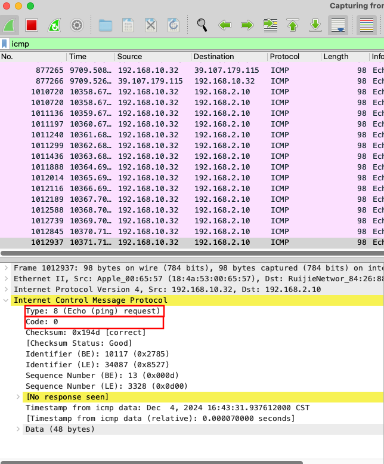

# Wireshark

## 基本使用

### 过滤规则

首先Wireshark的过滤功能有两个地方，一个是捕获时过滤，一个是显示时过滤。

#### 捕获时过滤

Wireshark 捕获过滤器是用 [libpcap](https://www.tcpdump.org/manpages/pcap-filter.7.html) 过滤器语言。
[捕获时过滤官方使用说明](https://www.wireshark.org/docs/wsug_html_chunked/ChCapCaptureFilterSection.html)

#### [显示时过滤](https://wiki.wireshark.org/DisplayFilters)

Wireshark 提供了一种显示筛选语言，使您能够 以精确控制显示哪些数据包。他们可以使用 检查是否存在协议或字段、字段的值，或者 甚至将两个字段相互比较。这些比较可以合并 使用逻辑运算符（如 “and” 和 “or”） 和括号 转换为复杂的表达式。因此需要注意显示时过滤与捕获时过滤使用的语法并不一样，尽管有些时候用起来非常相似。比如在捕获时过滤不能够使用tls，显示时可以使用。

最简单的显示过滤器是显示单个协议的过滤器。 要仅显示包含特定协议的数据包，请键入 protocol 进入 Wireshark 的显示过滤器工具栏。例如，仅 显示 TCP 数据包，在 Wireshark 的显示过滤器工具栏中键入 tcp。 同样，仅显示 packets containing a particular 字段，键入字段 进入 Wireshark 的显示过滤器工具栏。例如，仅显示 HTTP 请求，在 Wireshark 的显示过滤器工具栏中键入 http.request。
#### 显示过滤器中受支持的协议与协议字段
Wireshark 区分协议（例如 tcp）和协议字段（例如 tcp.port 的 Tcp.port 中）。
但是由于Wireshark支持的协议非常多，然后协议报文内的属性更多，因此此处仅引用官网提供的列表。


可见仅TCP支持的属性就有200多个，用的时候再查吧。

可以找到所有协议和协议字段的完整列表 在 “Display Filter Reference” 的 https://www.wireshark.org/docs/dfref/

##### 比较运算符列表

| English    | 别名     | 表达式 | 描述                                                 | 示例                                  |
|------------|-----------|--------|-------------------------------------------------------------|------------------------------------------|
| eq         | any_eq    | ==     | 相等（如果有多个则为任意值）                                | ip.src == 10.0.0.5                       |
| ne         | all_ne    | !=     | 	
不等于（如果多于一个则全部等于）                        | ip.src != 10.0.0.5                       |
|            | all_eq    | ===    | 相等（如果有多个则全部相等）                              | ip.src === 10.0.0.5                      |
|            | any_ne    | !==    | 不等于（如果有多个则为任意值）                        | ip.src !== 10.0.0.5                      |
| gt         |           | >      | 大于                                             | frame.len > 10                           |
| lt         |           | <      | 小于                                               | frame.len < 128                          |
| ge         |           | >=     | 大于或等于                               | frame.len ge 0x100                       |
| le         |           | <=     |小于或等于                                   | frame.len <= 0x20                        |
| contains   |           |        | 协议、字段或切片包含一个值              | sip.To contains "a1762"                  |
| matches    |           | ~      | 协议或文本字段与 Perl 兼容的正则表达式匹配   | http.host matches "acme\\.(org|com|net)" |

> !=（所有不相等）的含义在 Wireshark 3.6 中发生了变化。之前它表示“任何不相等”。

##### 数值类型

###### Unsigned integer
可以是 8、16、24、32 或 64 位。您可以用十进制、八进制表示整数， 十六进制或二进制。以下显示过滤器是等效的：

`ip.len le 1500`

`ip.len le 02734`

`ip.len le 0x5dc`

`ip.len le 0b10111011100`

###### Signed integer
可以是 8、16、24、32 或 64 位。与无符号整数一样，您可以使用 十进制、八进制、十六进制或二进制。

###### Boolean
可以是 1 或“True”、0 或“False”（不带引号）。
布尔字段无论其值为 true 或 false 都存在。例如， tcp.flags.syn 存在于所有包含该标志的 TCP 数据包中，无论是 SYN 标志为 0 或 1。要仅匹配设置了 SYN 标志的 TCP 数据包，您需要 使用tcp.flags.syn == 1或tcp.flags.syn == True。

###### Ethernet address
6 个字节，由冒号 (:)、点 (.) 或破折号 (-) 分隔，分隔符之间有一个或两个字节：

`eth.dst == ff:ff:ff:ff:ff:ff`

`eth.dst == ff-ff-ff-ff-ff-ff`

`eth.dst == ffff.ffff.ffff`
###### IPv4 address
`ip.addr == 192.168.0.1`
无类域间路由 (CIDR) 表示法可用于测试是否 IPv4 地址位于某个子网中。例如，这个显示 过滤器将查找 129.111 B 类网络中的所有数据包：

`ip.addr == 129.111.0.0/16`
###### IPv6 address
`ipv6.addr == ::1`
与 IPv4 地址一样，IPv6 地址可以匹配子网（CIDR）。
###### Text string
`http.request.uri == "https://www.wireshark.org/"`

字符串是字节序列。 lower() 等函数使用 ASCII，否则 没有假设特定的编码。字符串文字用 double 指定 引号。还可以使用字节转义序列指定字符 十六进制 \xhh 或八进制 \ddd，其中 h 和 d 是十六进制和八进制 分别为数字：
`dns.qry.name contains "www.\x77\x69\x72\x65\x73\x68\x61\x72\x6b.org"`
或者，可以使用原始字符串语法。此类字符串以 r 或 R 为前缀，并视为 反斜杠作为文字字符。
`http.user_agent matches r"\(X11;"`
###### Date and time
`frame.time == "Sep 26, 2004 23:18:04.954975"`

`ntp.xmt ge "2020-07-04 12:34:56"`
绝对时间字段的值表示为字符串，使用以下之一 上面两种格式。小数秒可以省略或最多指定到纳秒级精度；允许使用额外的尾随零，但不允许使用其他数字。 该字符串不能带有时区后缀，并且始终按照本地方式进行解析 时区，即使对于以 UTC 显示的字段也是如此。

在第一种格式中，缩写的月份名称必须是英文，无论 语言环境。在第二种格式中，可以省略任意数量的时间字段，在 从最不重要（秒）到最重要的顺序，但至少是整个 必须指定日期：
`frame.time < "2022-01-01"`
在第二种格式中，T 可能出现在日期和时间之间，如下所示 ISO 8601，但当删除不太重要的时间时则不会。

###### 正则表达式
在匹配的时候如果使用正则表达式需要注意：
包含正则表达式的字符串文字会被解析两次。一次通过Wireshark的显示 过滤引擎并再次由 PCRE2 库执行。使用时记住这一点很重要在使用`“matches”`运算符带有正则表达式时需要转义序列和特殊字符的。

例如，过滤器表达式 `frame matches "AB\x43" `使用字符串 "ABC" 作为输入 PCRE 模式。但是，表达式 `frame matches "AB\\x43" `与使用字符串 "AB\x43" 作为模式。在这种情况下，两个表达式给出相同的结果，因为 Wireshark 和 PCRE 两者都支持相同的字节转义序列（0x43 是 C 的 ASCII 十六进制代码）。
与之相反的例子是：`foo matches "bar\x28"`。因为0x28是ASCII码 ( 的代码输入到 PCRE 的模式是 "bar("。"bar("此正则表达式在语法上是 无效的（因为缺少右括号）。因此如果想要在显示过滤器正则中匹配括号 表达式必须用反斜杠转义（两次）。

###### 逻辑操作符

| English | 表达式 | Description                        | Example                                           |
|---------|--------|------------------------------------|---------------------------------------------------|
| and     | &&     | 逻辑与                      | ip.src == 10.0.0.5 and tcp.flags.fin             |
| or      | \|\|     | 逻辑或                        | ip.src == 10.0.0.5 or ip.src == 192.1.1.1        |
| xor     | ^^     | 逻辑异或                    | tr.dst[0:3] == 0.6.29 xor tr.src[0:3] == 0.6.29  |
| not     | !      | 逻辑非                      | not llc                                          |
| […]     |        | 子序列                       | See “Slice Operator” below.                      |
| in      |        | 存在于                    | http.request.method in {"HEAD", "GET"}. See “Membership Operator” below. |

###### 更多
实际上Wireshark涉及到更多的复杂表达式，不再详细赘述。
[参考官方文档](https://www.wireshark.org/docs/wsug_html_chunked/ChWorkBuildDisplayFilterSection.html)

## 具体协议实战分析

> 协议号：在网络报文中在IP层（网络层）存在一个协议号的概念，协议号用于标识该请求使用的协议是什么，比如ICMP是1，TCP是6
> 端口号：端口号是建立在传输层的基础之上，比如：TCP、UDP上，用于表示在传输层上使用哪个端口号，比如HTTPS的443.


### Wireshark捕获本机 HTTPS请求（TLS解密）
从 Wireshark 3.0 开始，TLS 剖析器已从 SSL 重命名为 TLS。使用 ssl 显示过滤器将发出警告，应使用tls。

Wireshark本身针对TLS协议的解密提供了一下三种主要方式：

1. 推荐方式，读取 TLS 密钥日志文件以进行解密的路径。
2. 使用 RSA 私有密钥进行解密。
3. 使用预共享密钥 （PSK） 解密。

密钥日志文件是一种通用机制，即使正在使用 Diffie-Hellman （DH） 密钥交换，它也始终启用解密。RSA 私钥仅在有限数量的情况下有效。

密钥日志文件是在设置 SSLKEYLOGFILE 环境变量时由 Firefox、Chrome 和 curl 等应用程序生成的文本文件。准确地说，它们的底层库（NSS、OpenSSL 或 boringssl）将所需的每个会话密钥写入文件。此文件随后可以在 Wireshark 中配置（#使用 （Pre）-Master Secret）。

RSA 私钥文件只能在以下情况下使用：
- 服务器选择的密码套件未使用 （EC）DHE。
- 协议版本为 SSLv3，（D）TLS 1.0-1.2。它不适用于 TLS 1.3。
- 私钥与服务器证书匹配。它不适用于客户端证书，也不适用于证书颁发机构 （CA） 证书。
- 会话尚未中断。握手必须包括 ClientKeyExchange 握手消息。

通常建议使用密钥日志文件，因为它在所有情况下都有效，但需要能够持续从客户端或服务器应用程序导出密钥。RSA 私钥的唯一优点是，它只需要在 Wireshark 中配置一次即可启用解密，但受上述限制的约束。

#### 相关设置项
转到 Edit -> Preferences。打开 Protocols （协议） 树并选择 TLS。或者，在数据包列表中选择一个 TLS 数据包，右键单击数据包详细信息视图中的 TLS 层，然后打开 Protocol preferences 菜单。

使用TLS协议解密需要注意以下设置项：
- (Pre)-Master-Secret log filename （tls.keylog_file）：设置为 TLS 密钥日志文件的路径以进行解密。
针对需要提供给Wireshark的TLS 密钥日志文件的生成步骤，下面将会以Firefox为示例进行TLS 密钥日志文件的生成：
    - 完全关闭浏览器（检查您的任务管理器以确保）。
    - 将环境变量 SSLKEYLOGFILE 设置为可写文件的绝对路径。
    - 启动浏览器。
    ```shell
    export SSLKEYLOGFILE=$HOME/Desktop/keylogfile.txt
    open -a firefox
    ```
    - 验证是否已创建步骤 2 中的位置。
    - 在 Wireshark 中，转到 Edit -> Preferences -> Protocols -> TLS，然后将 （Pre）-Master-Secret 日志文件名首选项更改为步骤 2 中的路径。
    - 启动 Wireshark 捕获。
    - 打开一个网站，例如 https://www.wireshark.org/。
    - 检查解密后的数据是否可见。例如，使用 tls and (http or http2) 过滤后即可看到TLS已被解密为HTTP。
    
- RSA 密钥列表：配置用于解密的 RSA 私钥。已弃用，取而代之的是 Preferences -> RSA Keys 对话框。

- Pre-Shared-Key：用于配置 PSK 密码套件的解密密钥。被一些 IoT 嵌入式设备使用，尤其是 MQTT。
- TLS debug file （tls.debug_logfile）：设置后将写入有关解密过程的内部详细信息。将包含解密结果和此过程中使用的密钥。这可用于诊断解密失败的原因。

启用 TLS 解密还需要以下 TCP 协议首选项：
- 允许 subdissector 重新组合 TCP 流。默认启用。
- 重新组合乱序段（自 Wireshark 3.0 起，默认禁用）。

#### 显示过滤器

在显示过滤器中仅显示TLS时应使用tls。
TLS 显示过滤器字段的[完整列表](https://www.wireshark.org/docs/dfref/t/tls.html)可在显示过滤器参考中找到。

#### 捕获过滤器

捕获时，您无法直接过滤 TLS 协议。但是，如果您知道使用的 [TCP](https://wiki.wireshark.org/Transmission_Control_Protocol) 端口，则可以过滤该端口，例如使用` tcp port 443`。


[Wireshark 官方使用说明](https://www.wireshark.org/docs/wsug_html_chunked/)

[Wireshark TLS部分使用说明](https://wiki.wireshark.org/TLS)

### Wireshark捕获本机 ICMP请求

#### ICMP协议介绍

互联网控制消息协议 (ICMP) 是一组通信规则，设备使用这些规则在网络中传达数据传输错误。在发送方和接收方之间的消息交换中，可能会出现某些意外错误。例如，消息可能太长，或者数据包可能无法按顺序到达，因此接收方无法正常解析。在这种情况下，接收方使用 ICMP 向发送方发送错误消息并请求重新发送消息，并且ICMP是面向无连接的协议，不保证消息送达。
互联网控制消息协议 (ICMP) 是计算机网络中重要的*网络层*协议。

它为网络设备提供了一种标准化机制，用于传送连接和网络状态等重要信息。所有连接到网络的设备，包括路由器和端点设备，都可以处理 ICMP 消息。ICMP 已经过调整，可以同时使用 IPv4 和 IPv6。

最常见的使用ICMP协议的就是ping。

ping 命令通过向目标设备发送 ICMP 回显请求数据包来测试网络设备的可访问性。如果设备可以访问，则会返回 ICMP 回显回复。它可以可靠地检查网络延迟并确保设备可用。
针对ping命令一下列出一些常见ICMP错误状态，以及其常见问题点：
1. 传输失败，常见故障。 网关配置错误。 
2. 来自本机的回复，无法访问目标主机。 配置了网关，但是无法访问网关。
3. 来自网关的回复，无法访问目标网络。 配置了网关，正常访问网关，网关设备缺少路由。
4. 来自缺路由的设备的回复，无法访问目标网络。  配置了网关，正常访问网关，网关设备路由正常，但是网关后边的设备有回包的路由，但是没有到达目标主机的路由。
5. 请求超时。  超时可能是到达了一个后续设备，但是该设备找不到下一个路由，但是回复保存消息时又找不到到达我们发送方的路由。 还有可能是找到了目标主机的路由，但是目标主机有防火墙规则不接受ICMP请求，导致请求超时。

还有一个就是traceroute 命令，跟踪数据包从源到目的地所采用的路径，常用于路由追踪。
traceroute 命令通过在回显请求中包含一个生存时间 (TTL) 值，数据包每通过一个路由器，该值就会减 1。当数据包到达 TTL 为零的路由器时，路由器会向源端发送一条 ICMP 消息，告诉发送方ttl被消耗完了，该设备就是第一跳。
 

该消息包含有关数据包所采用路由的信息。Traceroute 会显示数据包的确切路径，可以为您提供网络性能详情。
#### 报文内容



其实ICMP的报文中主要有两个标识Types Code，简要对照表如下：

|   Types   |  Code  | |
|--------|--------|----|
|   8    |  0   | 代表一个ping请求|
|   0    |  0   | 代表正常响应|
|   3    |  0   | 网络不可达，缺路由|
|   3    |  1   | 主机不可达，不缺路由，但是没有arp（找不到对应的mac地址）|
|   3    |  2   | 协议不可达|
|   3    |  3   | 端口不可达|
|   5    |  0   | 重定向|
|   11    |  0   | ttl被消耗完|


### DNS协议

DNS一般基于UDP，但是由于其在传输层加密、身份验证、可靠传递和消息长度的实现上存在一定问题。因此1989 年，RFC 1123 为 DNS 查询、回复，特别是区域传输指定了可使用 TCP 传输。

而且TLS作为高级融合素材，也可以与DNS结合，成为DNS over TLS （DoT），利用传输层安全（TLS）来保护整个连接，DoT 服务器侦听 TCP 端口 853。


#### 抓包
使用icmp进行显示拦截即可。正常情况下请求报文与返回报文是一对一的。
[参考链接](https://aws.amazon.com/cn/what-is/icmp/)