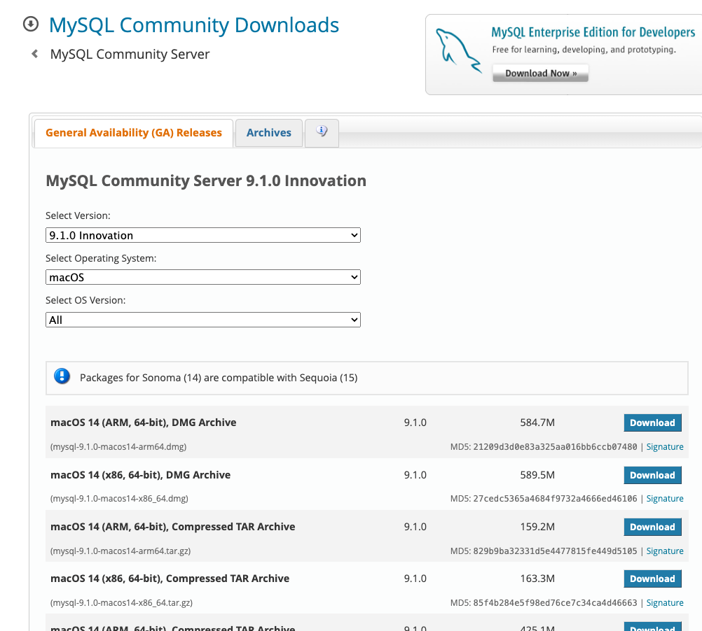

# 加密与安全

在计算机系统中，我们经常会遇到很多涉及到系统安全与数据加密的问题。

比如一个普通的http请求：假设一个用户向服务端发送请求，在请求发送的过程中，黑客可能会窃取到请求中的的内容，所以需要防窃听。在服务端收到请求处理后，返回黑客还可能会篡改请求响应的内容，因此客户端必须有能力识别出请求有没有被篡改。最后，黑客可能直接拦截我们的响应，假冒我们服务端给客户端发送其他的相应内容，客户端必须有能力识别出伪造的响应。

所以，应对潜在的安全威胁，需要做到三防：

- 防窃听
- 防篡改
- 防伪造

而计算机中的加密技术就是为了实现上述目标，现代计算机密码学理论是建立在严格的数学理论基础上的，密码学已经逐渐发展成一门科学。对于绝大多数开发者来说，设计一个安全的加密算法非常困难，验证一个加密算法是否安全更加困难，当前被认为安全的加密算法仅仅是迄今为止尚未被攻破。因此，要编写安全的计算机程序，我们要做到：

不要自己设计山寨的加密算法；
不要自己实现已有的加密算法；
不要自己修改已有的加密算法。

## 编码算法

编码算法虽然不是加密算法，但是在加解密的过程中往往会涉及到提前统一编码。并且为了避免将编码算法与加密算法混为一谈，专门在这里指出。

要学习编码算法，我们先来看一看什么是编码。

ASCII码就是一种编码，字母A的编码是十六进制的0x41，字母B是0x42，以此类推。
因为ASCII编码最多只能有128个字符，要想对更多的文字进行编码，就需要用Unicode。而中文的中使用Unicode编码就是0x4e2d。同时还有常用的UTF-8编码，使用UTF-8则需要3个字节，并且大部分UTF-8编码可以由Unicode推断出来。

| 汉字 | Unicode编码 | UTF-8编码  |
|------|-------------|------------|
| 中   | 0x4e2d      | 0xe4b8ad   |
| 文   | 0x6587      | 0xe69687   |
| 编   | 0x7f16      | 0xe7bc96   |
| 码   | 0x7801      | 0xe7a081   |

### URL编码

URL编码是浏览器发送数据给服务器时使用的编码，它通常附加在URL的参数部分，例如：

https://www.baidu.com/s?wd=%E4%B8%AD%E6%96%87

之所以需要URL编码，是因为出于兼容性考虑，很多服务器只识别ASCII字符。但如果URL中包含中文、日文这些非ASCII字符怎么办？不要紧，URL编码有一套规则：

如果字符是A~Z，a~z，0~9以及-、_、.、*，则保持不变；
如果是其他字符，先转换为UTF-8编码，然后对每个字节以%XX表示。
例如：字符`中`的UTF-8编码是0xe4b8ad，因此，它的URL编码是`%E4%B8%AD`。URL编码总是大写。

Java标准库提供了一个URLEncoder类来对任意字符串进行URL编码：
```java
import java.net.URLEncoder;
import java.nio.charset.StandardCharsets;

public class Main {
    public static void main(String[] args) {
        String encoded = URLEncoder.encode("中文!", StandardCharsets.UTF_8);
        System.out.println(encoded);
    }
}
```
上述代码的运行结果是%E4%B8%AD%E6%96%87%21，`中`的URL编码是%E4%B8%AD，`文`的URL编码是%E6%96%87，!虽然是ASCII字符，也要对其编码为%21。

但是和标准的URL编码稍有不同，URLEncoder把空格字符编码成+，而现在的URL编码标准要求空格被编码为%20。这是因为URL编码是针对于URI本身，也就是查询参数？之前的部分，而URLEncoder的作用是将请求参数按照application/x-www-form-urlencoded格式进行转换，因此URLEncoder本质上并不是进行URL编码。很多地方大家都对URLEncoder有一定的误解，因此只有当作为非URL结构部分时（post等请求，放到了body中也就是表单提交）我们才需要使用URLEncoder。
在URL编码中，URL 只能包含某些特定的字符集，比如字母（A-Z, a-z）、数字（0-9）以及少数特殊字符（如 -, _, ., ~）。其他所有字符都必须被编码，以便它们不会被错误地解释或者导致协议上的问题。例如，空格通常会被编码为 %20，而一些保留字符（如 ?, &, =, + 等）也会被编码成相应的百分号形式，以防止它们被误认为是 URL 的结构部分，导致协议解析错误。但是在post请求，参数放到body部分时使用application/x-www-form-urlencoded格式时转换为+。


如果服务器收到URL编码的字符串，就可以对其进行解码，还原成原始字符串。Java标准库的URLDecoder就可以解码：

import java.net.URLDecoder;
import java.nio.charset.StandardCharsets;

public class Main {
    public static void main(String[] args) {
        String decoded = URLDecoder.decode("%E4%B8%AD%E6%96%87%21", StandardCharsets.UTF_8);
        System.out.println(decoded);
    }
}
要特别注意：URL编码是编码算法，不是加密算法。URL编码的目的是把任意文本数据编码为%前缀表示的文本，编码后的文本仅包含A~Z，a~z，0~9，-，_，.，*和%，便于浏览器和服务器处理。

### Base64编码

URL编码是对字符进行编码，表示成%xx的形式，而Base64编码是对二进制数据进行编码，表示成文本格式。

Base64编码可以把任意长度的二进制数据变为纯文本，且只包含A~Z、a~z、0~9、+、/、=这些字符。它的原理是把3字节的二进制数据按6bit一组，用4个int整数表示，然后查表，把int整数用索引对应到字符，得到编码后的字符串。
举个例子：3个byte数据分别是e4、b8、ad，按6bit分组得到39、0b、22和2d：
```shell
┌───────────────┬───────────────┬───────────────┐
│      e4       │      b8       │      ad       │
└───────────────┴───────────────┴───────────────┘
┌─┬─┬─┬─┬─┬─┬─┬─┬─┬─┬─┬─┬─┬─┬─┬─┬─┬─┬─┬─┬─┬─┬─┬─┐
│1│1│1│0│0│1│0│0│1│0│1│1│1│0│0│0│1│0│1│0│1│1│0│1│
└─┴─┴─┴─┴─┴─┴─┴─┴─┴─┴─┴─┴─┴─┴─┴─┴─┴─┴─┴─┴─┴─┴─┴─┘
┌───────────┬───────────┬───────────┬───────────┐
│    39     │    0b     │    22     │    2d     │
└───────────┴───────────┴───────────┴───────────┘
```
因为6位整数的范围总是0~63，所以，能用64个字符表示：字符A~Z对应索引0~25，字符a~z对应索引26~51，字符0~9对应索引52~61，最后两个索引62、63分别用字符+和/表示。

在Java中，二进制数据就是byte[]数组。Java标准库提供了Base64来对byte[]数组进行编解码：
```java
import java.util.*;

public class Main {
    public static void main(String[] args) {
        byte[] input = new byte[] { (byte) 0xe4, (byte) 0xb8, (byte) 0xad };
        String b64encoded = Base64.getEncoder().encodeToString(input);
        System.out.println(b64encoded);
    }
}
```
编码后得到5Lit4个字符。要对Base64解码，仍然用Base64这个类：
```java
import java.util.*;

public class Main {
    public static void main(String[] args) {
        byte[] output = Base64.getDecoder().decode("5Lit");
        System.out.println(Arrays.toString(output)); // [-28, -72, -83]
    }
}
```
如果输入的byte[]数组长度不是3的整数，这种情况下，需要对输入的末尾补充0，确保最终bit位数达到6的整数倍（此时刚好每六位可以转化为一个字符），将每六位转换为8位形成一个新的字节，最终得到一个字节数组，之后再在后面补充=（八位），使最终新的字节数组的长度变成4的整数倍。也就是一下场景：
首先正常处理按照24bits为一组，直到剩余数据不够24bits。由于输入是八位一组，因此最终只能剩余以下两种情况：
剩余8 bits，首先在末尾用0填充至12 bits完整的两组（6bits一组，相当于补充4个0），每6位转化为一个字节，形成一个新的字节数组是原来的4/3倍，在填充2个“=”符号（八位）相当于源字节数组的12bits，最后相当于原数组刚好是24 bits（12+2*6）。
剩余16bits，首先在末尾用0填充至18 bits完整的三组6bits一组，相当于补充2个0），每6位转化为一个字节，形成一个新的字节数组是原来的4/3倍，在填充1个“=”符号（八位）相当于源字节数组的12bits，最后相当于原数组刚好是24 bits（18+6）。
而以上过程也保证了最终新的字节数组长度总是4的整数倍，所以即使不加=也可以计算出原始输入的byte[]。因此Base64编码的时候可以用withoutPadding()去掉=，解码出来的结果也是正常的。

因为标准的Base64编码会出现+、/和=，所以不适合把Base64编码后的字符串放到URL中。一种针对URL的Base64编码可以在URL中使用的Base64编码，它仅仅是把+变成-，/变成_：

Base64编码的目的是把二进制数据变成文本格式，这样在很多文本中就可以处理二进制数据。
Base64编码的缺点是传输效率会降低，因为它把原始数据的长度增加了1/3。

和URL编码一样，Base64编码是一种编码算法，不是加密算法。

如果把Base64的64个字符编码表换成32个、48个或者58个，就可以使用Base32编码，Base48编码和Base58编码。字符越少，编码的效率就会越低。

## 哈希算法

哈希算法（Hash）又称摘要算法（Digest），它的作用是：对任意一组输入数据进行计算，得到一个固定长度的输出摘要。

哈希算法最重要的特点就是：

相同的输入一定得到相同的输出；
不同的输入大概率得到不同的输出。
哈希算法的目的就是为了验证原始数据是否被篡改。

Java字符串的hashCode()就是一个哈希算法，它的输入是任意字符串，输出是固定的4字节int整数：
两个相同的字符串永远会计算出相同的hashCode，否则基于hashCode定位的HashMap就无法正常工作。这也是为什么当我们自定义一个class时，覆写equals()方法时我们必须正确覆写hashCode()方法。

### 哈希碰撞

哈希碰撞是指，两个不同的输入得到了相同的输出：
首先碰撞是一定会出现的，因为输出的字节长度是固定的，String的hashCode()输出是4字节整数，最多只有4294967296种输出，但输入的数据长度是不固定的，有无数种输入。所以，哈希算法是把一个无限的输入集合映射到一个有限的输出集合，必然会产生碰撞。
碰撞不可怕，我们担心的不是碰撞，而是碰撞的概率，因为碰撞概率的高低关系到哈希算法的安全性。一个安全的哈希算法必须满足：
- 碰撞概率低；
- 不能猜测输出。
不能猜测输出是指，输入的任意一个bit的变化会造成输出完全不同，这样就很难从输出反推输入（只能依靠暴力穷举）。假设一种哈希算法有如下规律：
```java
hashA("java001") = "123456"
hashA("java002") = "123457"
hashA("java003") = "123458"
```
那么很容易从输出123459反推输入，这种哈希算法就不安全。安全的哈希算法从输出是看不出任何规律的：
```java
hashB("java001") = "123456"
hashB("java002") = "580271"
hashB("java003") = ???
```
常用的哈希算法有：
| 算法         | 输出长度（位） | 输出长度（字节） |
|--------------|----------------|------------------|
| MD5          | 128 bits       | 16 bytes        |
| SHA-1        | 160 bits       | 20 bytes        |
| RipeMD-160   | 160 bits       | 20 bytes        |
| SHA-256      | 256 bits       | 32 bytes        |
| SHA-512      | 512 bits       | 64 bytes        |


根据碰撞概率，哈希算法的输出长度越长，就越难产生碰撞，也就越安全。

Java标准库提供了常用的哈希算法，并且有一套统一的接口。我们以MD5算法为例，看看如何对输入计算哈希：
```java
import java.security.MessageDigest;
import java.util.HexFormat;

public class Main {
    public static void main(String[] args) throws Exception {
        // 创建一个MessageDigest实例:
        MessageDigest md = MessageDigest.getInstance("MD5");
        // 反复调用update输入数据:
        md.update("Hello".getBytes("UTF-8"));
        md.update("World".getBytes("UTF-8"));
        byte[] result = md.digest(); // 16 bytes: 68e109f0f40ca72a15e05cc22786f8e6
        System.out.println(HexFormat.of().formatHex(result));
    }
}
```
使用MessageDigest时，我们首先根据哈希算法获取一个MessageDigest实例，然后，反复调用update(byte[])输入数据。当输入结束后，调用digest()方法获得byte[]数组表示的摘要，最后，把它转换为十六进制的字符串。

运行上述代码，可以得到输入HelloWorld的MD5是68e109f0f40ca72a15e05cc22786f8e6。

### 哈希算法的作用

因为相同的输入永远会得到相同的输出，因此，如果输入被修改了，得到的输出就会不同。
最常见的就是网站下载内容时，一般都会提供对应文件的MD5码，用于校验下载的文件是否被篡改。


哈希算法的另一个重要用途是存储用户密码。如果直接将用户的原始密码存放到数据库中，会产生极大的安全风险：

数据库管理员能够看到用户明文密码；
数据库数据一旦泄漏，黑客即可获取用户明文密码。
不存储用户的原始密码，那么如何对用户进行认证？

方法是存储用户密码的哈希，例如，MD5。

在用户输入原始密码后，系统计算用户输入的原始密码的MD5并与数据库存储的MD5对比，如果一致，说明密码正确，否则，密码错误。

这样一来，数据库管理员看不到用户的原始密码。即使数据库泄漏，黑客也无法拿到用户的原始密码。想要拿到用户的原始密码，必须用暴力穷举的方法，一个密码一个密码地试，直到某个密码计算的MD5恰好等于指定值。

那么这就有了哈希面临的一个问题：彩虹表攻击。
上面讲到了，如果只拿到MD5，从MD5反推明文密码，只能使用暴力穷举的方法。

然而黑客并不笨，暴力穷举会消耗大量的算力和时间。但是，如果有一个预先计算好的常用密码和它们的MD5的对照表，那么这个表就被成为彩虹表。
有了彩虹表，黑客从MD5值可以直接使用查表的方式找到你的原始密码。
这就是为什么不要使用常用密码，以及不要使用生日作为密码的原因。

即使用户使用了常用密码，我们也可以采取措施来抵御彩虹表攻击，方法是对每个密码额外添加随机数，这个方法称之为加盐（salt）。经过对原文内容增加随机盐值，就可以使黑客的彩虹表失效，即使用户使用常用密码，也无法从MD5简单的反推原始密码。

除了MD5还有许多其他的哈希算法。

### SHA-1
SHA-1也是一种哈希算法，它的输出是160 bits，即20字节。SHA-1是由美国国家安全局开发的，SHA算法实际上是一个系列，包括SHA-0（已废弃）、SHA-1、SHA-256、SHA-512等。

在Java中使用SHA-1，和MD5完全一样，只需要把算法名称改为"SHA-1"：
```java
import java.security.MessageDigest;
import java.util.HexFormat;

public class Main {
    public static void main(String[] args) throws Exception {
        // 创建一个MessageDigest实例:
        MessageDigest md = MessageDigest.getInstance("SHA-1");
        // 反复调用update输入数据:
        md.update("Hello".getBytes("UTF-8"));
        md.update("World".getBytes("UTF-8"));
        byte[] result = md.digest(); // 20 bytes: db8ac1c259eb89d4a131b253bacfca5f319d54f2
        System.out.println(HexFormat.of().formatHex(result));
    }
}
```
类似的，计算SHA-256，我们需要传入名称"SHA-256"，计算SHA-512，我们需要传入名称"SHA-512"。Java标准库支持的所有哈希算法可以在[这里](https://docs.oracle.com/en/java/javase/21/docs/specs/security/standard-names.html#messagedigest-algorithms)查到。

### BouncyCastle
[BouncyCastle](https://github.com/bcgit/bc-java)就是一个提供了很多哈希算法和加密算法的第三方库。它提供了Java标准库没有的一些算法，例如，RipeMD160哈希算法。

我们来看一下如何使用BouncyCastle这个第三方提供的算法。

首先，我们必须把BouncyCastle提供的jar包放到classpath中。这个jar包就是bcprov-jdk18on-xxx.jar，可以从官方网站下载。

Java标准库的java.security包提供了一种标准机制，允许第三方提供商无缝接入。我们要使用BouncyCastle提供的RipeMD160算法，需要先把BouncyCastle注册一下：
```java
public class Main {
    public static void main(String[] args) throws Exception {
        // 注册BouncyCastle:
        Security.addProvider(new BouncyCastleProvider());
        // 按名称正常调用:
        MessageDigest md = MessageDigest.getInstance("RipeMD160");
        md.update("HelloWorld".getBytes("UTF-8"));
        byte[] result = md.digest();
        System.out.println(HexFormat.of().formatHex(result));
    }
}
```

### Hmac算法

在前面讲到哈希算法时，我们说，存储用户的哈希密码时，要加盐存储，目的就在于抵御彩虹表攻击。

我们回顾一下哈希算法：

digest = hash(input)
正是因为相同的输入会产生相同的输出，我们加盐的目的就在于，使得输入有所变化：

digest = hash(salt + input)
这个salt可以看作是一个额外的“认证码”，同样的输入，不同的认证码，会产生不同的输出。因此，要验证输出的哈希，必须同时提供“认证码”。

Hmac算法就是一种基于密钥的消息认证码算法，它的全称是Hash-based Message Authentication Code，是一种更安全的消息摘要算法。

Hmac算法总是和某种哈希算法配合起来用的。例如，我们使用MD5算法，对应的就是HmacMD5算法，它相当于“加盐”的MD5：

HmacMD5 ≈ md5(secure_random_key, input)
因此，HmacMD5可以看作带有一个安全的key的MD5。使用HmacMD5而不是用MD5加salt，有如下好处：

HmacMD5使用的key长度是64字节，更安全；
Hmac是标准算法，同样适用于SHA-1等其他哈希算法；
Hmac输出和原有的哈希算法长度一致。
可见，Hmac本质上就是把key混入摘要的算法。验证此哈希时，除了原始的输入数据，还要提供key。

为了保证安全，我们不会自己指定key，而是通过Java标准库的KeyGenerator生成一个安全的随机的key。下面是使用HmacMD5的代码：

```java
import javax.crypto.*;
import java.util.HexFormat;

public class Main {
    public static void main(String[] args) throws Exception {
        KeyGenerator keyGen = KeyGenerator.getInstance("HmacMD5");
        SecretKey key = keyGen.generateKey();
        // 打印随机生成的key:
        byte[] skey = key.getEncoded();
        System.out.println(HexFormat.of().formatHex(skey));
        Mac mac = Mac.getInstance("HmacMD5");
        mac.init(key);
        mac.update("HelloWorld".getBytes("UTF-8"));
        byte[] result = mac.doFinal();
        System.out.println(HexFormat.of().formatHex(result));
    }
}
```
和MD5相比，使用HmacMD5的步骤是：

1. 通过名称HmacMD5获取KeyGenerator实例；
2. 通过KeyGenerator创建一个SecretKey实例；
3. 通过名称HmacMD5获取Mac实例；
4. 用SecretKey初始化Mac实例；
5. 对Mac实例反复调用update(byte[])输入数据；
6. 调用Mac实例的doFinal()获取最终的哈希值。
我们可以用Hmac算法取代原有的自定义的加盐算法，因此，存储用户名和密码的数据库结构如下：
| username | secret_key (64 bytes)                    | password                           |
|----------|------------------------------------------|------------------------------------|
| bob      | a8c06e05f92e...5e16                      | 7e0387872a57c85ef6dddbaa12f376de  |
| alice    | e6a343693985...f4be                      | c1f929ac2552642b302e739bc0cdbaac  |
| tim      | f27a973dfdc0...6003                      | af57651c3a8a73303515804d4af43790  |

之后在进行密码比对时，我们需要带着key一起进行计算：
```java
import javax.crypto.*;
import javax.crypto.spec.*;
import java.util.HexFormat;

public class Main {
    public static void main(String[] args) throws Exception {
        byte[] hkey = HexFormat.of().parseHex(
                "b648ee779d658c420420d86291ec70f5" + 
                "cf97521c740330972697a8fad0b55f5c" + 
                "5a7924e4afa99d8c5883e07d7c3f9ed0" + 
                "76aa544d25ed2f5ceea59dcc122babc8");
        SecretKey key = new SecretKeySpec(hkey, "HmacMD5");
        Mac mac = Mac.getInstance("HmacMD5");
        mac.init(key);
        mac.update("HelloWorld".getBytes("UTF-8"));
        byte[] result = mac.doFinal();
        System.out.println(HexFormat.of().formatHex(result)); // 4af40be7864efaae1473a4c601b650ae
    }
}
```

## 对称加密算法

上文讲了很多编码算法、哈希算法但是以上算法本质上都不是加密算法，因为首先编码算法不存在密码，其次哈希算法无法还原原文。
到了加密算法相关部分，一般将加密算法分为对称与非对称加密。
对称加密算法就是传统的用一个密码进行加密和解密。例如，我们常用的WinZIP和WinRAR对压缩包的加密和解密，就是使用对称加密算法：
从程序的角度看，所谓加密，就是这样一个函数，它接收密码和明文，然后输出密文：
```
secret = encrypt(key, message);
```
而解密则相反，它接收密码和密文，然后输出明文：
```
plain = decrypt(key, secret);
```
在软件开发中，常用的对称加密算法有：
| 算法  | 密钥长度       | 工作模式                     | 填充模式                                |
|-------|---------------|-----------------------------|----------------------------------------|
| DES   | 56/64         | ECB/CBC/PCBC/CTR/...       | NoPadding/PKCS5Padding/...            |
| AES   | 128/192/256   | ECB/CBC/PCBC/CTR/...       | NoPadding/PKCS5Padding/PKCS7Padding/... |
| IDEA  | 128           | ECB                         | PKCS5Padding/PKCS7Padding/...         |

密钥长度直接决定加密强度，而工作模式和填充模式可以看成是对称加密算法的参数和格式选择。Java标准库提供的算法实现并不包括所有的工作模式和所有填充模式，但是通常我们只需要挑选常用的使用就可以了。
最后注意，DES算法由于密钥过短，可以在短时间内被暴力破解，所以现在已经不安全了。

### AES加密

AES算法是目前应用最广泛的对称加密算法。我们先用ECB模式加密并解密：
```java
import java.security.*;
import java.util.Base64;

import javax.crypto.*;
import javax.crypto.spec.*;

public class Main {
    public static void main(String[] args) throws Exception {
        // 原文:
        String message = "Hello, world!";
        System.out.println("Message: " + message);
        // 128位密钥 = 16 bytes Key:
        byte[] key = "1234567890abcdef".getBytes("UTF-8");
        // 加密:
        byte[] data = message.getBytes("UTF-8");
        byte[] encrypted = encrypt(key, data);
        System.out.println("Encrypted: " + Base64.getEncoder().encodeToString(encrypted));
        // 解密:
        byte[] decrypted = decrypt(key, encrypted);
        System.out.println("Decrypted: " + new String(decrypted, "UTF-8"));
    }

    // 加密:
    public static byte[] encrypt(byte[] key, byte[] input) throws GeneralSecurityException {
        Cipher cipher = Cipher.getInstance("AES/ECB/PKCS5Padding");
        SecretKey keySpec = new SecretKeySpec(key, "AES");
        cipher.init(Cipher.ENCRYPT_MODE, keySpec);
        return cipher.doFinal(input);
    }

    // 解密:
    public static byte[] decrypt(byte[] key, byte[] input) throws GeneralSecurityException {
        Cipher cipher = Cipher.getInstance("AES/ECB/PKCS5Padding");
        SecretKey keySpec = new SecretKeySpec(key, "AES");
        cipher.init(Cipher.DECRYPT_MODE, keySpec);
        return cipher.doFinal(input);
    }
}
```
Java标准库提供的对称加密接口非常简单，使用时按以下步骤编写代码：

1. 根据算法名称/工作模式/填充模式获取Cipher实例；
2. 根据算法名称初始化一个SecretKey实例，密钥必须是指定长度；
3. 使用SecretKey初始化Cipher实例，并设置加密或解密模式；
4. 传入明文或密文，获得密文或明文。

ECB模式是最简单的AES加密模式，它只需要一个固定长度的密钥，固定的明文会生成固定的密文，这种一对一的加密方式会导致安全性降低，更好的方式是通过CBC模式，它需要一个随机数作为IV参数，这样对于同一份明文，每次生成的密文都不同：
```java
import java.security.*;
import java.util.Base64;
import javax.crypto.*;
import javax.crypto.spec.*;

public class Main {
    public static void main(String[] args) throws Exception {
        // 原文:
        String message = "Hello, world!";
        System.out.println("Message: " + message);
        // 256位密钥 = 32 bytes Key:
        byte[] key = "1234567890abcdef1234567890abcdef".getBytes("UTF-8");
        // 加密:
        byte[] data = message.getBytes("UTF-8");
        byte[] encrypted = encrypt(key, data);
        System.out.println("Encrypted: " + Base64.getEncoder().encodeToString(encrypted));
        // 解密:
        byte[] decrypted = decrypt(key, encrypted);
        System.out.println("Decrypted: " + new String(decrypted, "UTF-8"));
    }

    // 加密:
    public static byte[] encrypt(byte[] key, byte[] input) throws GeneralSecurityException {
        Cipher cipher = Cipher.getInstance("AES/CBC/PKCS5Padding");
        SecretKeySpec keySpec = new SecretKeySpec(key, "AES");
        // CBC模式需要生成一个16 bytes的initialization vector:
        SecureRandom sr = SecureRandom.getInstanceStrong();
        byte[] iv = sr.generateSeed(16);
        IvParameterSpec ivps = new IvParameterSpec(iv);
        cipher.init(Cipher.ENCRYPT_MODE, keySpec, ivps);
        byte[] data = cipher.doFinal(input);
        // IV不需要保密，把IV和密文一起返回:
        return join(iv, data);
    }

    // 解密:
    public static byte[] decrypt(byte[] key, byte[] input) throws GeneralSecurityException {
        // 把input分割成IV和密文:
        byte[] iv = new byte[16];
        byte[] data = new byte[input.length - 16];
        System.arraycopy(input, 0, iv, 0, 16);
        System.arraycopy(input, 16, data, 0, data.length);
        // 解密:
        Cipher cipher = Cipher.getInstance("AES/CBC/PKCS5Padding");
        SecretKeySpec keySpec = new SecretKeySpec(key, "AES");
        IvParameterSpec ivps = new IvParameterSpec(iv);
        cipher.init(Cipher.DECRYPT_MODE, keySpec, ivps);
        return cipher.doFinal(data);
    }

    public static byte[] join(byte[] bs1, byte[] bs2) {
        byte[] r = new byte[bs1.length + bs2.length];
        System.arraycopy(bs1, 0, r, 0, bs1.length);
        System.arraycopy(bs2, 0, r, bs1.length, bs2.length);
        return r;
    }
}
```
在CBC模式下，需要一个随机生成的16字节IV参数，必须使用SecureRandom生成。因为多了一个IvParameterSpec实例，因此，初始化方法需要调用Cipher的一个重载方法并传入IvParameterSpec。

观察输出，可以发现每次生成的IV不同，密文也不同。

# 参考链接
[廖雪峰的官方网站](https://liaoxuefeng.com/books/java/security/index.html)