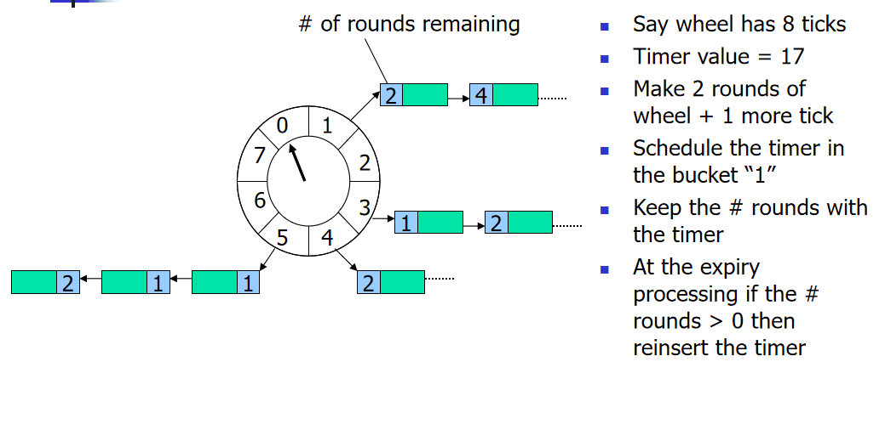

# 时间轮算法
> 时间轮(Timing Wheel)是George Varghese和Tony Lauck在1996年的论文[Hashed and Hierarchical Timing Wheels: data structures to efficiently implement a timer facility](https://www.cse.wustl.edu/~cdgill/courses/cs6874/TimingWheels.ppt)实现的，它在Linux内核中使用广泛，是Linux内核定时器的实现方法和基础之一。

## 什么是时间轮算法
> 时间轮(Timing Wheel)是一种环形的数据结构，就像一个时钟可以分成很多格子（Tick)，每个格子代表时间的间隔，它指向存储的具体任务（timerTask）的一个链表。



以上述在论文中的图片例子，这里一个轮子包含8个格子（Tick), 每个tick是一秒钟；

**任务的添加**:如果一个任务要在17秒后执行，那么它需要转2轮，最终加到Tick=1位置的链表中。

**任务的执行**:在时钟转2Round到Tick=1的位置，开始执行这个位置指向的链表中的这个任务。（# 这里表示剩余需要转几轮再执行这个任务）

## Netty中的HashedWheelTimer时间轮
> HashedWheelTimer是Netty根据时间轮(Timing Wheel)开发的工具类，它要解决什么问题呢？这里面有两个要点：延迟任务 + 低时效性。

在Netty中的一个典型应用场景是判断某个连接是否idle，如果idle（如客户端由于网络原因导致到服务器的心跳无法送达），则服务器会主动断开连接，释放资源。判断连接是否idle是通过定时任务完成的，但是Netty可能维持数百万级别的长连接，对每个连接去定义一个定时任务是不可行的，所以如何提升I/O超时调度的效率呢？

Netty根据时间轮(Timing Wheel)开发了HashedWheelTimer工具类，用来优化I/O超时调度(本质上是延迟任务）；之所以采用时间轮(Timing Wheel)的结构还有一个很重要的原因是I/O超时这种类型的任务对时效性不需要非常精准。


### HashedWheelTimer类解析

构造函数分析
```java
    /**
     * Creates a new timer.
     *
     * @param threadFactory        a {@link ThreadFactory} that creates a
     *                             background {@link Thread} which is dedicated to
     *                             {@link TimerTask} execution.
     * @param tickDuration         the duration between tick
     * @param unit                 the time unit of the {@code tickDuration}
     * @param ticksPerWheel        the size of the wheel
     * @param leakDetection        {@code true} if leak detection should be enabled always,
     *                             if false it will only be enabled if the worker thread is not
     *                             a daemon thread.
     * @param maxPendingTimeouts   The maximum number of pending timeouts after which call to
     *                             {@code newTimeout} will result in
     *                             {@link java.util.concurrent.RejectedExecutionException}
     *                             being thrown. No maximum pending timeouts limit is assumed if
     *                             this value is 0 or negative.
     * @param taskExecutor         The {@link Executor} that is used to execute the submitted {@link TimerTask}s.
     *                             The caller is responsible to shutdown the {@link Executor} once it is not needed
     *                             anymore.
     * @throws NullPointerException     if either of {@code threadFactory} and {@code unit} is {@code null}
     * @throws IllegalArgumentException if either of {@code tickDuration} and {@code ticksPerWheel} is &lt;= 0
     */
    public HashedWheelTimer(
            ThreadFactory threadFactory,
            long tickDuration, TimeUnit unit, int ticksPerWheel, boolean leakDetection,
            long maxPendingTimeouts, Executor taskExecutor) {

        checkNotNull(threadFactory, "threadFactory");
        checkNotNull(unit, "unit");
        checkPositive(tickDuration, "tickDuration");
        checkPositive(ticksPerWheel, "ticksPerWheel");
        this.taskExecutor = checkNotNull(taskExecutor, "taskExecutor");

        // Normalize ticksPerWheel to power of two and initialize the wheel.
        wheel = createWheel(ticksPerWheel);
        mask = wheel.length - 1;

        // Convert tickDuration to nanos.
        long duration = unit.toNanos(tickDuration);

        // Prevent overflow.
        if (duration >= Long.MAX_VALUE / wheel.length) {
            throw new IllegalArgumentException(String.format(
                    "tickDuration: %d (expected: 0 < tickDuration in nanos < %d",
                    tickDuration, Long.MAX_VALUE / wheel.length));
        }

        if (duration < MILLISECOND_NANOS) {
            logger.warn("Configured tickDuration {} smaller than {}, using 1ms.",
                        tickDuration, MILLISECOND_NANOS);
            this.tickDuration = MILLISECOND_NANOS;
        } else {
            this.tickDuration = duration;
        }

        workerThread = threadFactory.newThread(worker);

        leak = leakDetection || !workerThread.isDaemon() ? leakDetector.track(this) : null;

        this.maxPendingTimeouts = maxPendingTimeouts;

        if (INSTANCE_COUNTER.incrementAndGet() > INSTANCE_COUNT_LIMIT &&
            WARNED_TOO_MANY_INSTANCES.compareAndSet(false, true)) {
            reportTooManyInstances();
        }
    }
```
参数说明如下：
* threadFactory：线程工厂，用于创建工作线程， 默认是Executors.defaultThreadFactory()
* tickDuration：tick的周期，即多久tick一次
* unit: tick周期的单位
* ticksPerWheel：时间轮的长度，一圈下来有多少格
* leakDetection：是否开启内存泄漏检测，默认是true
* maxPendingTimeouts：最多执行的任务数，默认是-1，即不限制。在高并发量情况下才会设置这个参数。

### HashedWheelTimer实现原理


* Worker：worker工作线程主要负责任务调度触发，单线程运行。
* HashedWheelBucket： 时间轮上面的格子，内部持有HashedWheelTimeout组成的链表结构的头尾节点，多个格子组成的时间轮形成一圈又一圈的任务环
* HashedWheelTimeout： 往时间轮里面提交的任务会被封装成HashedWheelTimeout

在Worker初始化时，其内部run方法结构如下：
```java
        public void run() {
            // Initialize the startTime.
            startTime = System.nanoTime();
            if (startTime == 0) {
                // We use 0 as an indicator for the uninitialized value here, so make sure it's not 0 when initialized.
                startTime = 1;
            }

            // Notify the other threads waiting for the initialization at start().
            startTimeInitialized.countDown();

            do {
                // 核心的等待方法，等待直到下一个Tick，也就是时间轮中下一格被执行的时间
                final long deadline = waitForNextTick();
                if (deadline > 0) {
                    int idx = (int) (tick & mask);
                    processCancelledTasks();
                    HashedWheelBucket bucket =
                            wheel[idx];
                    transferTimeoutsToBuckets();
                    bucket.expireTimeouts(deadline);
                    tick++;
                }
            } while (WORKER_STATE_UPDATER.get(HashedWheelTimer.this) == WORKER_STATE_STARTED);

            // Fill the unprocessedTimeouts so we can return them from stop() method.
            for (HashedWheelBucket bucket: wheel) {
                bucket.clearTimeouts(unprocessedTimeouts);
            }
            for (;;) {
                HashedWheelTimeout timeout = timeouts.poll();
                if (timeout == null) {
                    break;
                }
                if (!timeout.isCancelled()) {
                    unprocessedTimeouts.add(timeout);
                }
            }
            processCancelledTasks();
        }
```

其中waitForNextTick()方法定义了时间轮中每一格的时间间隔。
```java
        /**
         * calculate goal nanoTime from startTime and current tick number,
         * then wait until that goal has been reached.
         * @return Long.MIN_VALUE if received a shutdown request,
         * current time otherwise (with Long.MIN_VALUE changed by +1)
         */
        private long waitForNextTick() {
            long deadline = tickDuration * (tick + 1);

            for (;;) {
                final long currentTime = System.nanoTime() - startTime;
                long sleepTimeMs = (deadline - currentTime + 999999) / 1000000;

                if (sleepTimeMs <= 0) {
                    if (currentTime == Long.MIN_VALUE) {
                        return -Long.MAX_VALUE;
                    } else {
                        return currentTime;
                    }
                }

                // Check if we run on windows, as if thats the case we will need
                // to round the sleepTime as workaround for a bug that only affect
                // the JVM if it runs on windows.
                //
                // See https://github.com/netty/netty/issues/356
                if (PlatformDependent.isWindows()) {
                    sleepTimeMs = sleepTimeMs / 10 * 10;
                    if (sleepTimeMs == 0) {
                        sleepTimeMs = 1;
                    }
                }

                try {
                    Thread.sleep(sleepTimeMs);
                } catch (InterruptedException ignored) {
                    if (WORKER_STATE_UPDATER.get(HashedWheelTimer.this) == WORKER_STATE_SHUTDOWN) {
                        return Long.MIN_VALUE;
                    }
                }
            }
        }
```
其实核心就是一个seelp方法，计算每一次应该sleep的时间。
然后只有当该时间轮被添加新的task时才会执行workerThread的start来开启后台线程计时。workerThread中的任务就是work中定义的run方法。

# Cron表达式

Cron表达式是一个字符串，字符串以5或6个空格隔开，分为6或7个域，每一个域代表一个含义，Cron有如下两种语法格式：

* Seconds Minutes Hours DayofMonth Month DayofWeek YearSeconds 
* Minutes Hours DayofMonth Month DayofWeek
## Corn表达式结构分析

Cron表达式是一个具有时间含义的字符串，字符串以5个空格隔开，分为6个域，格式为X X X X X X。其中X是一个域的占位符。单个域有多个取值时，使用半角逗号,隔开取值。每个域可以是确定的取值，也可以是具有逻辑意义的特殊字符。

## 域的取值
| 域             | 是否必需 | 取值范围                                 | 特殊字符         |
|----------------|----------|----------------------------------------|------------------|
| 秒 (Seconds)   | 是       | [0, 59]                                | `*` `,` `-` `/`  |
| 分钟 (Minutes) | 是       | [0, 59]                                | `*` `,` `-` `/`  |
| 小时 (Hours)   | 是       | [0, 23]                                | `*` `,` `-` `/`  |
| 日期 (Day of Month) | 是 | [1, 31]                                | `*` `,` `-` `/` `?` `L` `W` |
| 月份 (Month)   | 是       | [1, 12] 或 [JAN, DEC]                  | `*` `,` `-` `/`  |
| 星期 (Day of Week) | 是 | [1, 7]（1=周一，7=周日）或 [MON, SUN] | `*` `,` `-` `/` `?` `L` `#` |
| 年 (Year)      | 否       | 1970+                                  | `*` `,` `-` `/`  |
## 特殊字符解释

每一个域都使用数字，但还可以出现如下特殊字符，它们的含义是：

* \*：表示匹配该域的任意值。假如在Minutes域使用*, 即表示每分钟都会触发事件。
* ?：只能用在DayofMonth和DayofWeek两个域。它也匹配域的任意值，但实际不会。因为DayofMonth和DayofWeek会相互影响。例如想在每月的20日触发调度，不管20日到底是星期几，则只能使用如下写法： 13 13 15 20 * ?, 其中最后一位只能用？，而不能使用*，如果使用*表示不管星期几都会触发，实际上并不是这样。
* -：表示范围。例如在Minutes域使用5-20，表示从5分到20分钟每分钟触发一次
* /：表示起始时间开始触发，然后每隔固定时间触发一次。例如在Minutes域使用5/20,则意味着5分钟触发一次，而25，45等分别触发一次.
* ,：表示列出枚举值。例如：在Minutes域使用5,20，则意味着在5和20分每分钟触发一次。
* L：表示最后，只能出现在DayofWeek和DayofMonth域。如果在DayofWeek域使用5L,意味着在最后的一个星期四触发。（取决于操作系统和实现，部分框架1表示SUN周日）
* W:表示有效工作日(周一到周五),只能出现在DayofMonth域，系统将在离指定日期的最近的有效工作日触发事件。例如：在 DayofMonth使用5W，如果5日是星期六，则将在最近的工作日：星期五，即4日触发。如果5日是星期天，则在6日(周一)触发；如果5日在星期一到星期五中的一天，则就在5日触发。另外一点，W的最近寻找不会跨过月份 。
* LW:这两个字符可以连用，表示在某个月最后一个工作日，即最后一个星期五。
* #:用于确定每个月第几个星期几，只能出现在DayofMonth域。例如在4#2，表示某月的第二个星期三。

# 不同定时任务框架底层算法
* Java 自带的ScheduledExecutorService：基于**优先级队列（堆结构、小根堆）**来管理定时任务。
* Spring Schedule ： 基于ScheduledExecutorService。
* Quartz Scheduler：
    * 动态任务管理：支持动态增删改查任务，依赖数据库或内存存储任务状态。

    * 持久化与事务：通过 JDBCJobStore 实现任务持久化，支持分布式集群和故障恢复。

    * 触发器计算：基于 CronExpression 或 SimpleTrigger 生成触发时间序列，时间复杂度与任务数量相关（O(n) 查询或 O(log n) 堆排序）。

* ElasticJob ： ElasticJob 的早期版本（如 ElasticJob-Lite）依赖 Quartz 作为任务触发器，负责定时触发作业执行。后续版本逐步减少对 Quartz 的依赖，通过内部调度线程直接控制任务触发。

* xxl-job ：
    * 调度核心：调度中心内置时间轮算法（或优先级队列）管理任务触发，替代 Quartz，减少复杂度。
    * 任务触发流程：
        * 扫描数据库中到期的任务。
        * 根据路由策略（轮询、分片、故障转移）选择执行器。
        * 发送 HTTP 请求触发任务执行。

