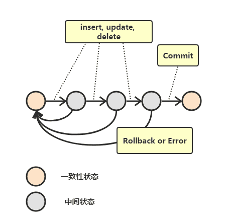
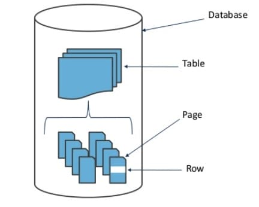

# 事务
事务指的是满足 ACID 特性的一组操作，可以通过 Commit 提交一个事务，也可以使用 Rollback 进行回滚。


## ACID

### 原子性(Atomicity)
事务被视为不可分割的最小单元，事务的所有操作要么全部提交成功，要么全部失败回滚。回滚可以用日志来实现，日志记录着事务所执行的修改操作，在回滚时反向执行这些修改操作即可。
### 一致性(Consistency)
数据库在事务执行前后都保持一致性状态。在一致性状态下，所有事务对一个数据的读取结果都是相同的。
### 隔离性(Isolation)

一个事务所做的修改在最终提交以前，对其它事务是不可见的。

### 持久性(Durability)

一旦事务提交，则其所做的修改将会永远保存到数据库中。即使系统发生崩溃，事务执行的结果也不能丢失。

可以通过数据库备份和恢复来实现，在系统发生崩溃时，使用备份的数据库进行数据恢复。

---------

事务的 ACID 特性概念简单，但不是很好理解，主要是因为这几个特性不是一种平级关系:
* 只有满足一致性，事务的执行结果才是正确的。
* 在无并发的情况下，事务串行执行，隔离性一定能够满足。此时只要能满足原子性，就一定能满足一致性。
* 在并发的情况下，多个事务并行执行，事务不仅要满足原子性，还需要满足隔离性，才能满足一致性。
* 事务满足持久化是为了能应对数据库崩溃的情况。


### AUTOCOMMIT

MySQL 默认采用自动提交模式。也就是说，如果不显式使用START TRANSACTION语句来开始一个事务，那么每个查询都会被当做一个事务自动提交。

## 并发场景下数据一致性问题

### 脏读

脏读指的是在一个事务A中读取一条数据时，事务B虽然仍未提交，但其修改了某一行的数据，事务A读取之后，事务B由于其他原因将进行回滚，此时事务A将产生错误数据。


### 不可重复读

不可重复读指的是在一个事务A中第一读取一条数据时值为A，但是同时有另一个事务更新了改行，导致值被更新为B，此时事务A再次读取时两次结果不一致。


### 幻读

幻读指的是事务A在进行一次范围条件查询之后，同时存在一个事务B新增了一行数据，而事务A再次进行查询时数据总行数不匹配，就像发生了幻觉一样。


### 丢失修改

丢失修改指的是假如两个事务都要对同一数据进行修改，他们都先执行查询后基于查询执行修改操作来实现数据更新。在第一个事务修改完该数据之后，第二个事务也修改该数据。那么第一个事务的修改结果会被第二个事务覆盖，从而出现修改丢失。

## 事务隔离级别
由于上述几种常见并发下的数据一致性问题，数据库通过不同的事务隔离级别来实现问题的避免。
在Mysql中事务的隔离级别主要有以下几种：

### 读未提交(READ UNCOMMITTED)
即开启一个事务后，可以读取到其他事务还未正式commit的信息。
在该隔离级别下常见的并发问题都会出现，仅保证了事务的原子性问题，基于UndoLog与RedoLog。
### 读已提交
即开启一个事务之后，内部的查询只能够读取到其他事务已经commit的数据。因此在该级别下不会出现脏读问题。但是仍存在其他两种问题。

本质是由读（S）/写（X）锁以及MVCC实现的并发控制。

你可能会好奇为什么有了读锁为什么还需要MVCC？
其实大部分数据库为了保证并发性，对于读锁的持有并不是持续到事务结束，而是获取读锁之后生成MVCC快照，之后就释放读锁，以此来提高读写之间的并发性。
读写锁用于锁定查询或更新的行，而MVCC则负责保证一个事务中只能查询到当前查询开始之前的最终数据即已提交的数据。与可重复读时不同这里的MVCC快照是每一次查询时生成。在读已提交级别时在查询可读的快照数据时会依照当前事务id来比较哪些数据可见，因此只能查询到比自己小的事务id的数据。
在这种场景下只能查询到已提交的数据，但是可能你当前事务过程中可以陆续有多个其他事务进行提交，会导致每次查询生成的快照数据不同导致**不可重复读**。
### 可重复读

即开启一个事务之后，针对同一个SQL查询，其查询出的数据值总是能够保持一致，即解决了不可重复读的问题。并且解决了在快照读情况下的幻读问题，因为全都是一样的快照。
本质上是基于读写锁加上MVCC版本控制实现快照读。
这里的快照由第一次查询时生成，之后再次查询仍然使用第一次的快照。因此快照读不存在不可重复读问题。
对于当前读的不可重复读问题使用读写锁即可保证，因此当前读也不存在不可重复读问题。
但是当前读场景下的幻读问题仍未解决。比如一个事务A先开启，然后你又开启了事务B，你进行了一次当前读即select for update此时读到了所已提交的数据，并对相关行加了X锁（如果是share mode是S锁），虽然这些行无法被更新，但是其他事务可以插入数据，这也就导致了幻读。
mysql为了避免采取串行化方式，引入了 Next-Key锁来解决部分幻读问题。但是Next-Key锁仍存在部分数据会出现幻读问题。比如事务A查询时使用了非唯一索引导致间隙锁定不准确。
### 可串行化
即所有事务顺序执行，因此不存在上述问题。

| 隔离级别   | 脏读 | 不可重复读 | 幻影读 |
|------------|------|------------|--------|
| 未提交读   | √    | √          | √      |
| 提交读     | ×    | √          | √      |
| 可重复读   | ×    | ×          | √      |
| 可串行化   | ×    | ×          | ×      |


下面将详细介绍上文中提到但为详细解释的技术

## Mysql中的读写锁

MySQL 中提供了两种锁粒度: 行级锁以及表级锁。
Mysql尽量只锁定需要修改的那部分数据，而不是所有的资源。锁定的数据量越少，发生锁争用的可能就越小，系统的并发程度就越高。但是加锁需要消耗资源，锁的各种操作(包括获取锁、释放锁、以及检查锁状态)都会增加系统开销。因此锁粒度越小，系统开销就越大。在选择锁粒度时，需要在锁开销和并发程度之间做一个权衡。



### 锁的类型

无论是表锁还是行锁，都存在两种类型，共享锁与排他锁。
* 排它锁(Exclusive)，简写为 X 锁，又称写锁。
* 共享锁(Shared)，简写为 S 锁，又称读锁。

有以下两个规定:
* 一个事务对数据对象 A 加了 X 锁，就可以对 A 进行读取和更新。加锁期间其它事务不能对 A 加任何锁。
* 一个事务对数据对象 A 加了 S 锁，可以对 A 进行读取操作，但是不能进行更新操作。加锁期间其它事务能对 A 加 S 锁，但是不能加 X 锁。

锁的兼容关系如下:

|     | X    | S    |
|-----|------|------|
| X   | ×    | ×    |
| S   | ×    | √    |


## Mysql中的意向锁

除了读写锁之外，Mysql为了解决表锁检查行锁的问题引入了意向锁。
使用意向锁(Intention Locks)可以更容易地支持多粒度的锁。

在存在行级锁和表级锁的情况下，事务 T 想要对表 A 加 X 锁，就需要先检测是否有其它事务对表 A 或者表 A 中的任意一行加了锁，那么就需要对表 A 的每一行都检测一次，这是非常耗时的。
意向锁在原来的 X/S 锁之上引入了 IX/IS，IX/IS 都是表锁，用来表示一个事务想要在表中的某个数据行上加 X 锁或 S 锁。
有以下两个规定:
* 一个事务在获得某个数据行对象的 S 锁之前，必须先获得表的 IS 锁或者更强的锁；
* 一个事务在获得某个数据行对象的 X 锁之前，必须先获得表的 IX 锁。

通过引入意向锁，事务 T 想要对表 A 加 X 锁，只需要先检测是否有其它事务对表 A 加了 X/IX/S/IS 锁，如果加了就表示有其它事务正在使用这个表或者表中某一行的锁，因此事务 T 加 X 锁失败。

由于意向锁仅用于表示 意向，并未实际加锁因此任何意向锁之间都是兼容的。
而S 锁只与 S 锁和 IS 锁兼容，也就是说事务 T 想要对数据行加 S 锁，其它事务可以已经获得对表或者表中的行的 S 锁。
X锁作为排他锁不与任何锁兼容。

|     | X    | IX   | S    | IS   |
|-----|------|------|------|------|
| X   | ×    | ×    | ×    | ×    |
| IX  | ×    | √    | ×    | √    |
| S   | ×    | ×    | √    | √    |
| IS  | ×    | √    | √    | √    |

## MVCC多版本并发控制

多版本并发控制(Multi-Version Concurrency Control, MVCC)是 MySQL 的 InnoDB 存储引擎实现隔离级别的一种具体方式，用于实现提交读和可重复读这两种隔离级别。而未提交读隔离级别总是读取最新的数据行，无需使用 MVCC。可串行化隔离级别需要对所有读取的行都加锁，单纯使用 MVCC 无法实现。

### 版本号

* 系统版本号: 是一个递增的数字，每开始一个新的事务，系统版本号就会自动递增。
* 事务版本号: 事务开始时的系统版本号。

### 隐藏的列

MVCC 在每行记录后面都保存着两个隐藏的列，用来存储两个版本号:
* 创建版本号: 指示创建一个数据行的快照时的系统版本号；
* 删除版本号: 如果该快照的删除版本号大于当前事务版本号表示该快照有效，否则表示该快照已经被删除了。

### Undo 日志

MVCC 使用到的快照存储在 Undo 日志中，该日志通过回滚指针把一个数据行(Record)的所有快照连接起来。


### 实现过程

以下实现过程针对可重复读隔离级别。

当开始新一个事务时，该事务的版本号肯定会大于当前所有数据行快照的创建版本号，理解这一点很关键。

#### Select

事务内多次查询必须读取到同一个数据行的快照，并且这个快照是距离现在最近的一个有效快照。但是也有例外，如果有一个事务正在修改该数据行，那么它可以读取事务本身所做的修改，而不用和其它查询的读取结果一致。

把没有对一个数据行做修改的事务称为 T，T 所要读取的数据行快照的创建版本号必须小于 T 的版本号，因为如果大于或者等于 T 的版本号，那么表示该数据行快照是其它事务的最新修改，因此不能去读取它。除此之外，T 所要读取的数据行快照的删除版本号必须大于 T 的版本号，因为如果小于等于 T 的版本号，那么表示该数据行快照是已经被删除的，不应该去读取它。

#### INSERT
将当前系统版本号作为数据行快照的创建版本号。

#### DELETE
将当前系统版本号作为数据行快照的删除版本号。
#### UPDATE
将当前系统版本号作为更新前的数据行快照的删除版本号，并将当前系统版本号作为更新后的数据行快照的创建版本号。可以理解为先执行 DELETE 后执行 INSERT。

### 快照读与当前读

#### 快照读

使用 MVCC 读取的是快照中的数据，这样可以减少加锁所带来的开销。
```sql
select * from table ...;
```
#### 当前读

读取的是最新的数据，需要加锁。以下第一个语句需要加 S 锁，其它都需要加 X 锁。

```sql
select * from table where ? lock in share mode;
select * from table where ? for update;
insert;
update;
delete;
```

## Next-Key Locks 临间锁

Next-Key Locks 是 MySQL 的 InnoDB 存储引擎的一种锁实现。MVCC 不能解决幻读的问题，Next-Key Locks 就是为了解决这个问题而存在的。在可重复读(REPEATABLE READ)隔离级别下，使用 MVCC + Next-Key Locks 可以解决大部分幻读问题。

首先介绍Next-Key Locks的两个内部锁

### Record Locks

锁定一个记录上的索引，而不是记录本身。

如果表没有设置索引，InnoDB 会自动在主键上创建隐藏的聚簇索引，因此 Record Locks 依然可以使用。

### Gap Locks

锁定索引之间的间隙，但是不包含索引本身。例如当一个事务执行以下语句，其它事务就不能在 t.c 中插入 15。

```sql
SELECT c FROM t WHERE c BETWEEN 10 and 20 FOR UPDATE;
```

有了上述两种锁我们就可以理解Next-Key Locks 。

### Next-Key Locks

它是 Record Locks 和 Gap Locks 的结合，不仅锁定一个记录上的索引，也锁定索引之间的间隙。例如一个索引包含以下值: 10, 11, 13, and 20，那么就需要锁定以下区间:
```sql
(negative infinity, 10]
(10, 11]
(11, 13]
(13, 20]
(20, positive infinity)
```

但是由于Next-Key Locks锁定的是索引的间隙，因此如果没有索引的查询或者是非唯一索引是有可能存在幻读的。

