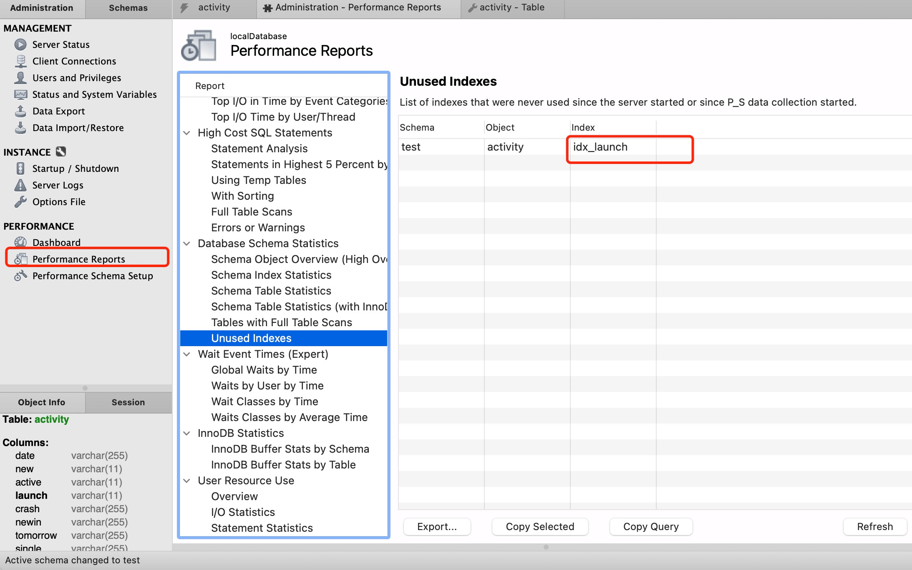
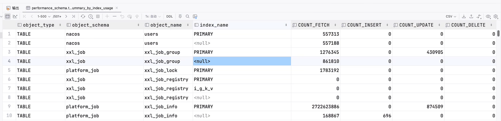

# 在判断一个SQL该如何优化之前我们需要先进性分析

## 使用 Explain 进行分析
Explain 用来分析 SELECT 查询语句，开发人员可以通过分析 Explain 结果来优化查询语句。
比较重要的字段有:
* select_type : 查询类型，有简单查询、联合查询、子查询等
* key : 使用的索引
* rows : 扫描的行数
* extral: 使用索引的情况

以下对extral字段中出现的一些参数进行说明：
#### Using index
使用了索引进行查询。

例如：

假设test表只有主键id有索引，name没有索引，那么查询时就是把所有满足id > 100的数据行返回给Server层，然后Server层根据name='123'进行过滤，所有使用explain时会发现extra那里显示的是Using where
```sql
SELECT * FROM test where id > 100 AND name = '123'
```
#### Using where
一般就是where条件中一些判断字段没有索引，那么这个条件的过滤就会在Server端进行 在innodb数据引擎将结果返回给Server层后，MySQL Server层对数据进行进一步的过滤，然后返回结果。

#### Using index condition
这个就是在MySQL5.6以后，做的一个优化，例如有一个联合索引(a，b，c)

查询条件为where a = '123' AND b like '%aa% AND c like '%cc%'时，按照联合索引的最左匹配法则，只有a可以用上索引，以前版本的MySQL中，innodb存储引擎就会在联合索引把满足a = '123'的数据的主键id找出来，然后回表，然后把所有数据发送给Sever端，Server端根据b like '%aa% AND c like '%cc%'对数据进行过滤，

现在有这个push down优化，因为联合索引中有b和c两个字段的信息，innodb在联合索引查找时就会考虑到b like '%aa% AND c like '%cc%'条件，所有回表的数据就都会是满足这三个条件的，然后返回给Server端的也都是满足条件的数据行，Server端就不会再自己进行数据过滤了。
#### Using filesort
如果在关联表查询时，Order By的所有字段都来自第一个表(也就是驱动表)，那么在处理驱动表时，从驱动表中取出满足条件的结果集时就会进行排序，不需要使用临时表存储数据行进行重排序，extral那一列就会显示是Using index。如果Order By的字段不在索引中，那么就需要在查找出结果集后，进行重排序，就会显示Using filesort。
#### Using temporary; Using fileSort
在进行关联表查询时，如果Order By中的字段不全是来自驱动表，也就是使用了被驱动表中的字段进行排序，那么会把关联结果全部查找出来，存放在临时表中，等所有的关联都结束后，再在内存中对数据行进行排序。

#### 具体优化方向
1. 优化索引使用情况。使用explain SQL查看解析结果，首先看结果中Extra那一列是否有Using Index，如果没有看是否是where判断条件的字段没有添加索引，不能使用索引。如果出现的是Using Where，可能是where子句里面判断的字段没有加索引，这样innodb就会把所有数据行查询出来，返回给MySQL Server层，Server层做的过滤。

2. 减少扫描的行数。查看explain SQL解析结果中rows那一列，看行数是不是特别多，通过添加索引的方式减少扫描的行数。

3. 只查询我们需要的列。看SQL中的查询字段是不是都是我们需要的，只选取我们需要的字段，而不是所有查询SQL都是使用SELECT *，这些多的字段的存在，会增大查询的时间，以及网络传输的数据量。

4. 优化join的方式，一般join的字段在被驱动表中有索引，那么join使用的算法就会是index Nested-Loop Join，如果没有索引那么就是block Nested-Loop Join。尽量让join的字段有索引可以使用，实在不行，可以增加join buffer Size的大小(默认是256K)。

5. 如果单表数据量大于1000万，考虑进行分库分表。
## 使用show profile对一条SQL查询分析当前会话中语句执行的资源消耗情况

1. profiling配置默认是不开启的，可以使用set profiling = ON;命令将配置暂时打开。

2. 执行一条查询SQL

3. 使用show profiles可以查看最近15条查询SQL及对应的查询idquery id

4. 假设查询id为9，使用这个命令show profile for query 9;可以查看每个步骤及其消耗的时间，关注耗时的地方进行优化。

示例如下：
```sql
set profiling = ON;
-- 执行有问题的SQL
select m.*
from menu m
         left join role_menu rm on m.id = rm.menu_id
         left join account_role ar on rm.role_id = ar.role_id
         left join role r on rm.role_id = r.id
where m.has_deleted = 0
  and r.status = 1
group by m.id, m.sort
order by m.sort;
-- 查询所有query id
show profiles;
-- 查询对应sql的步骤分析
show profile for query 52;

set profiling = OFF;
```
常见返回结果备注：
```shell
type:  
 | ALL              --显示所有的开销信息  
 | BLOCK IO         --显示块IO相关开销  
 | CONTEXT SWITCHES --上下文切换相关开销  
 | CPU              --显示CPU相关开销信息  
 | IPC              --显示发送和接收相关开销信息  
 | MEMORY           --显示内存相关开销信息  
 | PAGE FAULTS      --显示页面错误相关开销信息  
 | SOURCE           --显示和Source_function，Source_file，Source_line相关的开销信息  
 | SWAPS            --显示交换次数相关开销的信息
```
核心关注点：

① converting HEAP to MyISAM 查询结果太大，内存都不够用了往磁盘上搬了。常发生在MyISAM
② Creating tmp table 创建临时表

　　　　拷贝数据到临时表

　　　　用完再删除

③ Copying to tmp table on disk 把内存中临时表复制到磁盘，危险！！！这种通常是比较耗时的
④ locked
参考以上结果帮助我们进行详细的SQL优化。

## 主要可优化方向

1. 减少请求的数据量
* 只返回必要的列: 最好不要使用 SELECT * 语句。
* 只返回必要的行: 使用 LIMIT 语句来限制返回的数据。
* 缓存重复查询的数据: 使用缓存可以避免在数据库中进行查询，特别在要查询的数据经常被重复查询时，缓存带来的查询性能提升将会是非常明显的。

2. 减少服务器端扫描的行数

最有效的方式是使用索引来覆盖查询。

3. 针对SQL语句重构查询方式

将一个大连接查询分解成对每一个表进行一次单表查询，然后将结果在应用程序中进行关联，这样做的好处有:
* 让缓存更高效。对于连接查询，如果其中一个表发生变化，那么整个查询缓存就无法使用。而分解后的多个查询，即使其中一个表发生变化，其它表的查询缓存依然可以使用。
* 分解成多个单表查询，这些单表查询的缓存结果更可能被其它查询使用到，从而减少冗余记录的查询。
* 减少锁竞争；
* 在应用层进行连接，可以更容易对数据库进行拆分，从而更容易做到高性能和可伸缩。查询本身效率也可能会有所提升。
* 例如下面的例子中，使用 IN() 代替连接查询，可以让 MySQL 按照 ID 顺序进行查询，这可能比随机的连接要更高效。
```sql
-- 直接进行连接
SELECT * FROM tab
JOIN tag_post ON tag_post.tag_id=tag.id
JOIN post ON tag_post.post_id=post.id
WHERE tag.tag='mysql';
-- 在应用内联查
SELECT * FROM tag WHERE tag='mysql';
SELECT * FROM tag_post WHERE tag_id=1234;
SELECT * FROM post WHERE post.id IN (123,456,567,9098,8904);
```

# JOIN语句优化

首先我们需要知道Mysql的JOIN操作在底层究竟有几种查询方式：

Join 操作在Mysql中，使用Nested-Loop Join的算法思想去优化join，Nested-Loop Join翻译成中文则是“嵌套循环连接”。

首先我们需要明确驱动表与被驱动表的概念：
```sql
select * from t1 inner join t2 on t1.id=t2.tid
```
（1）t1称为外层表，也可称为驱动表。 
（2）t2称为内层表，也可称为被驱动表。

在Mysql的实现中，Nested-Loop Join具体有3种实现的算法：

Simple Nested-Loop Join：SNLJ，简单嵌套循环连接 
Index Nested-Loop Join：INLJ，索引嵌套循环连接 
Block Nested-Loop Join：BNLJ，缓存块嵌套循环连接 

在选择Join算法时，会有优先级，理论上会优先判断能否使用INLJ、BNLJ： Index Nested-LoopJoin > Block Nested-Loop Join > Simple Nested-Loop Join

下面将详细解释各种连接查询方式的优劣：

## Simple Nested-Loop
简单嵌套循环连接实际上就是简单粗暴的嵌套循环，如果table1有1万条数据，table2有1万条数据，那么数据比较的次数=1万 * 1万 =1亿次，这种查询效率会非常慢。实现伪代码如下。
```sql
List<Row> result = new ArrayList<>();
for(Row r1 in List<Row> t1){
    for(Row r2 in List<Row> t2){
        if(r1.id = r2.tid){
            result.add(r1.join(r2));
        }
    }
}
```

所以Mysql继续优化，然后衍生出Index Nested-LoopJoin、Block Nested-Loop Join两种NLJ算法。在执行join查询时mysql会根据情况选择两种之一进行join查询。

## Index Nested-LoopJoin（减少内层表数据的匹配次数）

索引嵌套循环连接是基于索引进行连接的算法，**索引是基于内层表的**，通过外层表匹配条件直接与内层表索引进行匹配，避免和内层表的每条记录进行比较， 从而利用索引的查询减少了对内层表的匹配次数，优势极大的提升了 join的性能：

* 原来的匹配次数 = 外层表行数 * 内层表行数 
* 优化后的匹配次数= 外层表的行数 * 内层表索引的高度。
伪代码如下：
```java
select * from t1 inner join t2 on t1.id=t2.tid
/*
  假设要执行上面的这个查询，然后t1作为外层表(也就是驱动表)，
  每次从t1表中取一行数据出来，
  然后根据t1.id去t2表的聚集索引下查询主键id等于t1.id的数据行，
  如果存在，就添加到结果集中，所以
  每次查询的匹配次数=t2表的聚集索引的层数
  总的查询匹配次数=外层表t1的行数 * t2表的聚集索引的层数
    */
List<Row> result = new ArrayList<>();
for(Row r1 in List<Row> t1){
    Row r2 = searchBTree(t1.id);
    result.add(r1.join(r2));
}
```
因为依靠于内层表join的列有索引，因此并不是任意链接都能使用。
使用场景：只有内层表join的列有索引时，才能用到Index Nested-Loop Join进行连接。

使用Index Nested-Loop Join算法时SQL的EXPLAIN结果extral列是Using index。

由于用到索引，如果索引是辅助索引而且返回的数据还包括内层表的其他数据，则会回内层表查询数据，多了一些IO操作。

## Block Nested-Loop Join（减少内层表数据的循环次数）

当有时候Join字段没法使用索引的时候，那样就不能用Index Nested-Loop Join的时候，此时默认就会使用Block Nested-Loop Join。

大体的原理：

Block Nested-Loop Join通过一次性缓存多条数据，把参与查询的列缓存到Join Buffer 里，然后拿join buffer里的数据批量与内层表的数据进行匹配，从而减少了内层循环的次数（遍历一次内层表就可以批量匹配一次Join Buffer里面的外层表数据）。

伪实现代码如下：
```java
select * from t1 inner join t2 on t1.tid=t2.tid
// 假设字段tid在t1表，t2表中都没有建立索引，那么查找时就不能使用索引了，
// 采用Block Nested-Loop Join算法就是每次从驱动表t1中加载一部分数据行到内存缓冲区Join Buffer 中来，
// 然后对t2表进行全表扫描，扫描时每次拿t2表中的数据行与Join Buffer中的数据进行匹配，匹配完成就添加到结果集。
// 所以全表扫描的次数=驱动表t1的行数/Join Buffer的大小。
// 因为Join Buffer是内存缓冲区，在内存中进行元素比较是比较快的，
// 而对t2表进行全表扫描是磁盘Io，是比较慢的，
// 所以应该是尽可能减少全表扫描的次数。
// 所以优化的方式一般是增大Join Buffer的大小，或者是选取数据量小的表作为驱动表，这样可以减少全表扫描的次数，减少磁盘IO。

List<Row> result = new ArrayList<>();
//可以把subList理解为每次从t1表中取出，加载到join buufer的那一部分数据
for( List<Row> subList in List<Row> t1){
    for(Row r2 in List<Row> t2){
        if(subList.contains(r2.tid){
            result.add(r1.join(r2));
        }
    }
}
```
### Join Buffer
（1）Join Buffer会缓存所有参与查询的列而不是只有Join的列。 
（2）可以通过调整join_buffer_size缓存大小。
（3）join_buffer_size的默认值是256K，join_buffer_size的最大值在MySQL 5.1.22版本前是4G，而之后的版本才能在64位操作系统下申请大于4G的Join Buffer空间。 （4）使用Block Nested-Loop Join算法需要开启优化器管理配置的optimizer_switch的设置block_nested_loop为on，默认为开启。

## 具体如何优化JOIN
有了以上基础知识我们可以得到一些优化的思路。
1. 在满足用Index Nested-Loop Join的场景下尽量小结果集驱动大结果集，减少外层循环的数据量： 
如果小结果集和大结果集连接的列都是索引列，mysql在内连接时也会选择用小结果集驱动大结果集，因为索引查询的成本是比较固定的，这时候外层的循环越少，join的速度便越快。
2. 为匹配的条件增加索引：争取使用Index Nested-Loop Join，减少内层表的循环次数 
3. 增大join buffer size的大小：当使用BNLJ时，一次缓存的数据越多，那么外层表循环的次数就越少。 
4. 减少不必要的字段查询： 
（1）当用到BNLJ时，字段越少，join buffer 所缓存的数据就越多，外层表的循环次数就越少； 
（2）当用到INLJ时，如果可以不回表查询，即利用到覆盖索引，则可能可以提示速度。（未经验证，只是一个推论）
5. 排序时尽量使用驱动表中的字段
因为如果使用的是非驱动表中的字段会对非驱动表（的字段排序）需要对循环查询的合并结果（临时表）进行排序，比较耗时，使用Explain时会发现出现Using temporary。

## JOIN的工作流程

所有JOIN的使用场景：
* full outer join 会包含两个表不满足条件的行

* left join 会包含左边的表不满足条件的行，一般会使用左边的表作为驱动表。

* right join 会包含右边的表不满足条件的行，一般会使用右边的表作为驱动表。

* inner join 就是只包含满足条件的行

* cross join 从表A循环取出每一条记录去表B匹配，cross join 后面不能跟on，只能跟where

## exits 和in，join的区别是什么？
exists是拿外表作为驱动表，外表的数据做循环，每次循环去内表中查询数据，因此应尽量让内表可以命中索引。
例如：

select * from t1 where t1.tid exists (select t2.tid from t2)
伪代码如下：
```java
//就是t1作为驱动表
List<Row> result = new ArrayList<>();
for(Row r1 in List<Row> t1){
    for(Row r2 in List<Row> t2){
        if(r1.id = r2.tid){
            result.add(r1.join(r2));
        }
    }
}
```
而 in的话正好相反，是用内表作为驱动表，内表的数据做循环，每次循环去外表查询数据，适合外边可以命中索引的情况。

```sql
select * from A where cc in (select cc from B) 
-- 效率低，用到了A表上cc列的索引；

select * from A where exists(select cc from B where cc=A.cc) 
-- 效率高，用到了B表上cc列的索引。
```

## not in 和not exists
如果查询语句使用了not in 那么内外表都进行全表扫描，没有用到索引；
而not extsts 的子查询依然能用到表上的索引。所以无论哪个表大，用not exists都比not in要快。

join的实现其实是先从一个表中找出所有行（或者根据where子句查出符号条件的行)，然后去下一个表中循环寻找匹配的行，依次下去，直到找到所有匹配的行，使用join不会去创建临时表，使用in的话会创建临时表，销毁临时表

**总结：**
所以不管是in子查询，exists子查询还是join连接查询，底层的实现原理都是一样的，本质上是没有任何区别的，关键的点在关联表的顺序，如果是join连接查询，MySQL会自动调整表之间的关联顺序，选择最好的一种关联方式。和上面in和exists比较的结论一样，小表驱动大表才是最优的选择方式。

无论in子查询，exists子查询还是join连接查询在实现与被驱动表进行数据比较时，都会先将驱动表的行数确定与被驱动表逐行比较。因此当被驱动表有索引时外部循环的层数减少可以有效提升效率。

## MySQL怎么排查使用率低的索引？

MySQL 5.5以后，有一个performance_schema的配置，默认为不开启，开启后，可以统计MySQL数据库的性能进行监测统计，会将内存使用情况，SQL语句使用情况，IO读取情况等等进行统计，并将统计结果写入到performance_schema这个数据库中，这个数据库里面有很多表，记录了性能统计结果。

在MySQL bentch中有一个界面会展示出没有使用到索引的结果。例如图中就是我们test数据库中有一个activity表有一个index索引没有使用到。

这个界面的数据来源也是来自于performance_schema这个数据库，里面总共有52个性能统计结果表，其中有一个table_io_waits_summary_by_index_usage表，里面统计了索引使用情况，里面有统计索引在查询，插入，更新，删除语句中使用到的次数。
```sql
SELECT
 object_type,//类型，这里是table
 object_schema,//索引所在的数据库名
 object_name,//索引所在的表名
 index_name,//索引名称
COUNT_FETCH,//这个索引在查询语句中使用到的的次数
COUNT_INSERT,//这个索引在插入语句中使用到的的次数
COUNT_UPDATE,//这个索引在更新语句中使用到的的次数
COUNT_DELETE//这个索引在删除语句中使用到的的次数
FROM
 PERFORMANCE_SCHEMA.table_io_waits_summary_by_index_usage;
```

table_io_waits_summary_by_index_usage这个表里面还有更详细的统计数据。

除了table_io_waits_summary_by_index_usage表还有许多其他相关表，用于统计其他信息。

MySQL Performance-Schema中总共包含52个表，主要分为几类：Setup表，Instance表，Wait Event表，Stage Event表Statement Event表，Connection表和Summary表。

比如table_lock_waits_summary_by_table表等用于排查事务超时的锁竞争问题。
[其他相关表说明](https://www.cnblogs.com/cchust/p/5057498.html)