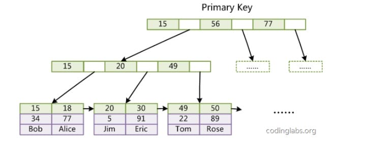
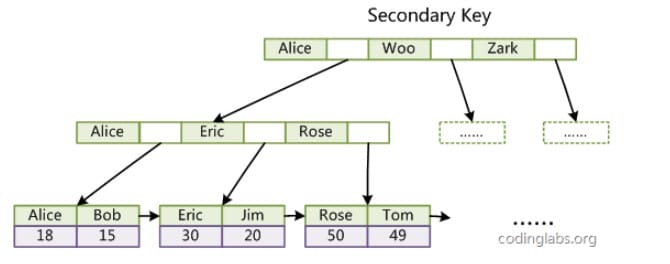

# 数据库常用的数据结构与算法基础

作为一个知名的关系型数据库，Mysql在底层许多地方都有着对数据结构与算法的极致运用。接下来将主要以Mysql为例从几个不同的功能点进行解析数据库中那些应用的很妙的算法与数据结构设计。

## 排序算法

> 对于所有数据库程序而言，良好的排序性能都是一个不可避免的难题。

当然排序算法有非常多种，每一种排序算法都有其优势与劣势。
Mysql在大规模数据时采用了归并排序，通过归并排序将问题拆分为小问题。

**为什么是归并排序？**
* 节省内存空间。归并排序是不创建新的序列而是直接修改输入序列。注：这种算法叫『原地算法』(in-place algorithm)
* 可以同时使用磁盘空间和少量内存而避免巨量磁盘 I/O。方法是只向内存中加载当前处理的部分。在仅仅100MB的内存缓冲区内排序一个几个GB的表时，这是个很重要的技巧。注：这种算法叫『外部排序』(external sorting)。
* 可以充分利用 多处理器/多线程/多服务器 上的优势。比如，分布式合并排序是Hadoop（那个著名的大数据框架）的关键组件之一。

## 查找算法（数据库索引）

索引是在存储引擎层实现的，而不是在服务器层实现的，所以不同存储引擎具有不同的索引类型和实现。


### 二叉搜索树

> 数据库中查询的时间复杂度限制，使我们无法直接使用矩阵进行查询，因此需要使用二叉搜索树(BST)。

使用二叉搜索树只需 log(N) 次运算，而如果你直接使用数据矩阵则需要 N 次运算。

> 在查找一个特定值这个树挺好用，但是当你需要查找两个值之间的多个元素时，就会有大麻烦了。你的成本将是 O(N)，因为你必须查找树的每一个节点，以判断它是否处于那 2 个值之间（例如，对树使用中序遍历）。而且这个操作不是磁盘I/O有利的，因为你必须读取整个树。我们需要找到高效的范围查询方法。

### B+树索引的引入

> 由于上述二叉搜索树的问题，就引入了基于二叉搜索树优化后的B+树来解决以上问题。

#### B+ Tree 原理

##### 数据结构

B Tree 指的是 Balance Tree，也就是平衡树（平衡多路查找树）。平衡树是一颗查找树，通过左右旋转让所有叶子节点位于同一层。

B+ Tree 是基于 B Tree 和叶子节点顺序访问指针进行实现，它具有 B Tree 的平衡性，并且通过顺序访问指针来提高区间查询的性能。

在 B+ Tree 中，一个节点中的 key 从左到右非递减排列，如果某个指针的左右相邻 key 分别是 key[i] 和 key[i+1]，且不为 null，则该指针指向节点的所有 key 大于等于 key[i] 且小于 key[i+1]。


##### 查询过程

进行查找操作时，首先在根节点进行二分查找，找到一个 key 所在的指针，然后递归地在指针所指向的节点进行查找。直到查找到叶子节点，然后在叶子节点上进行二分查找，找出 key 所对应的 data。

插入删除操作记录会破坏平衡树的平衡性，因此在插入删除操作之后，需要对树进行一个分裂、合并、旋转等操作来维护平衡性。因此过多的索引会导致插入删除性能降低。

##### 与红黑树比较

红黑树等平衡树也可以用来实现索引，但是文件系统及数据库系统普遍采用 B+ Tree 作为索引结构，主要有以下两个原因:

(一)更少的查找次数

平衡树查找操作的时间复杂度等于树高 h，而树高大致为 O(h)=O(logdN)，其中 d 为每个节点的出度。红黑树的出度为 2，而 B+ Tree 的出度一般都非常大，所以红黑树的树高 h 很明显比 B+ Tree 大非常多，检索的次数也就更多。

(二)利用计算机预读特性，优化范围查找

为了减少磁盘 I/O，磁盘往往不是严格按需读取，而是每次都会预读。预读过程中，磁盘进行顺序读取，顺序读取不需要进行磁盘寻道，并且只需要很短的旋转时间，因此速度会非常快。操作系统一般将内存和磁盘分割成固态大小的块，每一块称为一页，内存与磁盘以页为单位交换数据。数据库系统将索引的一个节点的大小设置为页的大小，使得一次 I/O 就能完全载入一个节点，并且可以利用预读特性，相邻的节点也能够被预先载入。

#### B+树索引

B+树索引是大多数 MySQL 存储引擎的默认索引类型。

因为不再需要进行全表扫描，只需要对树进行搜索即可，因此查找速度快很多。

除了用于查找，还可以用于排序和分组。可以指定多个列作为索引列，多个索引列共同组成键。适用于全键值、键值范围和键前缀查找，其中键前缀查找只适用于最左前缀查找。如果不是按照索引列的顺序进行查找，则无法使用索引。

InnoDB 的 B+Tree 索引分为主索引和辅助索引。

主索引的叶子节点 data 域记录着完整的数据记录，这种索引方式被称为聚簇索引。因为无法把实际数据行存放在两个不同的地方，所以一个表只能有一个聚簇索引。


辅助索引(聚簇索引c)的叶子节点的 data 域记录着主键的值，因此在使用辅助索引进行查找时，需要先查找到主键值，然后再到主索引中进行查找。



### 哈希索引

在Mysql中除了主流的B+树索引，还有哈希索引。

哈希索引能以 O(1) 时间进行指定元素查找，但是失去了有序性，因此它具有以下限制:
* 无法用于排序与分组；
* 只支持精确查找，无法用于部分查找和范围查找。

InnoDB 存储引擎有一个特殊的功能叫“自适应哈希索引”，当某个索引值被使用的非常频繁时，会在 B+Tree 索引之上再创建一个哈希索引，这样就让 B+Tree 索引具有哈希索引的一些优点，比如快速的哈希查找。

### 全文索引

其实MySQL中也有类似ES的全文索引用于简单的分词查询。全文索引（Full-Text Index）是一种用于加速文本数据搜索的索引类型。它允许你在文本列（如 VARCHAR、TEXT 等）上执行高效的全文搜索，而不仅仅是简单的模式匹配。

mysql的全文索引也使用倒排索引实现，它记录着关键词到其所在文档的映射。

最早全文索引仅支持MyISAM 存储引擎，但是5.6.4 版后也增加了InnoDB 存储引擎的支持，但是5.7版本之后Mysql内置了ngram全文检索插件，用于支持中文分词。

查找条件使用 MATCH AGAINST，而不是普通的 WHERE like。具体语法可以参考[MySQL官网](https://dev.mysql.com/doc/refman/8.4/en/fulltext-natural-language.html)

**以上内容就是目前Mysql中比较重要的索引实现。**

## 常见面试题

### 为什么使用索引？

索引可以让服务器快速定位到表的指定位置。

优点是

1. 大大减少了服务器需要扫描的数据量。

2. 帮助服务器避免排序带来的性能开销。

3. 将随机IO变成顺序IO。

### 聚簇索引是什么？

聚簇索引与非聚簇索引的最主要的区别是：叶节点是否存放一整行记录。

聚簇索引是依据B+树来实现的，索引节点(也就是非叶子节点)只存储索引值，叶子节点才会存具体的数据行，每个索引节点都是一个内存页(由于只存索引值，相比B树，B+树的每个索引节点的内存页可以存储更多的索引值)，每个叶子节点也都是一个内存页，内存页里面数据行按主键id从小到大的顺序存储，然后叶子节点之间是通过指针连接的，形成一个双向链表。所以聚簇索引的叶子节点在逻辑上是存储在一起的，在物理上是并不是连续的，而是通过双向链表连接的。假设说叶子节点在物理上的存储也是连续，那么如果中间的叶子节点中大量插入数据行，导致叶子节点的内存页容量不够时，需要后面的叶子节点全部后移，这样维护成本会很高。如果叶子节点只是通过双向链表进行连接，当中间的叶子节点容量不够时，可以新增一个内存页，插入在其中，作为一个叶子节点，只需要修改双向链表中的指针即可。


#### innodb的聚簇索引

innodb的索引是聚簇索引，就是所有数据都存在聚簇索引的的叶子节点中，其他二级索引的的叶子节点值存储KEY字段加对应列的主键值，如果使用二级索引查找数据，先根据索引查到二级索引对应的行的主键id，然后根据主键id去聚簇索引中查找对应的行的数据。（所以innodb必须要有主键）。


1. 对于聚簇索引表来说（左图），表数据是和主键一起存储的，主键索引的叶结点存储行数据(包含了主键值)，其他列，事务ID，回滚指针，二级索引（非聚簇索引）的叶结点存储行的主键值。非聚簇索引同样使用的是B+树作为索引的存储结构，非叶子节点都是索引关键字，同时非叶子节点中的关键字中不存储对应记录的具体内容或内容地址。叶子节点上的数据是索引关键字与主键id。

2. 对于MyISAM的非聚簇索引表来说（右图），表数据和索引是分成两部分存储的，主键索引和二级索引存储上没有任何区别。使用的是B+树作为索引的存储结构，所有的节点都是索引，叶子节点存储的是索引+指向索引对应的记录的数据的指针。
#### 聚簇索引的优点

1. 当你需要取出一定范围内的数据时，用聚簇索引比用非聚簇索引好。

2. 当通过聚簇索引查找目标数据时理论上比非聚簇索引要快，因为非聚簇索引定位到对应主键时还要多一次目标记录寻址,即多一次I/O。

#### 聚簇索引的缺点也即注意事项

1. 随机插入容易造成页分裂，按照主键的顺序插入是最快的方式，否则将会出现页分裂(就是存储数据行的内存页容量不够，需要新申请一个内存页分担一部分数据行)，影响性能。因此，对于InnoDB表，我们一般都会定义一个自增的ID列为主键。

2. 更新主键的代价很高，因为将会导致被更新的行移动。因此，对于InnoDB表，我们一般定义主键为不可更新。

3. 二级索引访问需要两次索引查找，第一次找到主键值，第二次根据主键值找到行数据。

    二级索引的叶节点存储的是主键值，而不是行指针（非聚簇索引存储的是指针或者说是地址），这是为了减少当出现行移动或数据页分裂时二级索引的维护工作。

### 什么是联合索引？

联合索引就是多列索引，就是可以多个字段建立一个索引，并且是最左前缀匹配元素，

```sql
create index a_b_c on user(a,b,c)
这样相当于是创建三个索引
a
a,b
a,b,c
```
就是在非聚簇索引对应的B+树中，索引的排序是先比较a的大小，再比较b的大小然后再比较c的大小。并且是遇到范围比较时就会停止匹配。

1. 最左前缀匹配原则，MySQL会一直向右匹配直到遇到范围查询（>、<、between、like）就停止匹配，比如 a="3" and  b="4" and c>"5" and d=6,如果建立(a,b,c,d)顺序的索引，d是无法使用索引的，如果建立(a,b,d,c)的索引则都可以使用到，a、b、d的顺序可以任意调整。
2. =和in可以乱序，比如 a=1 and b=2 and c=3 建立(a,b,c)索引可以任意顺序，MySQL的查询优化器会帮你优化成索引可以识别的形式。

一些示例：
```sql
select * from user where a > 1;
```
这样的语句可以走联合索引，但是不会走联合索引，因为符号这个范围的数据很多，查出之后，只能获得这些数据的主键，还需要根据主键去聚簇索引中查，效率比较低，还不如直接全部扫描，所以直接去聚簇索引下顺序得对全表进行扫描。

```sql
SELECT * FROM user WHERE a='2222' OR b='13281899972'
```
这个就不会走联合索引，因为只是查询b时不能根究索引查询，所以还是需要全表扫描，所以干脆a也不用索引了。
如果a，b都有索引，那么会单独根据a，b来查询，然后将结果集合并
关于or查询的真相是：
所谓的索引失效指的是：假如or连接的俩个查询条件字段中有一个没有索引的话,引擎会放弃索引而产生全表扫描。

```sql
SELECT * FROM user WHERE a=1 and  b= 2;

SELECT * FROM user WHERE b=7 and a=1;
```
这些是可以走联合索引的，

```sql
SELECT * FROM user WEHRE a=1 and b>2 and c=7
```
这个也会走联合索引，查出a=1的索引，然后查出b>2的所有数据，因为b是一个范围查找，所以到c就不会用索引，会将将这些数据载入内存，根据c进行筛选。

当然索引也不一定按照预期被采用，索引是否被使用还有以下评估策略：
1、根据搜索条件，找出所有可能使用的索引 
2、计算全表扫描的代价
3、计算使用不同索引执行查询的代价
4、对比各种执行方案的代价，找出成本最低的那一个 。

### 索引覆盖

就是假如有一个联合索引(a,b,c)，如果我们只是需要a,b,c这几个字段的数据，查询时就不需要根据主键id去聚簇索引里面回表查询了。
```sql
SELECT a,b,c FROM user where a = 1
```
### 哪些情况需要建索引

1. 主键，唯一索引
2. 经常用作查询条件的字段需要创建索引
3. 经常需要排序、分组和统计的字段需要建立索引
4. 查询中与其他表关联的字段，外键关系建立索引

### 哪些情况不适合建索引

1. 表的记录太少，万级以下的数据不需要创建索引

2. 经常增删改的表不需要创建索引

3. 数据重复且分布平均的字段不需要创建索引，如 true,false 之类。

4. 频发更新的字段不适合创建索引

5. where条件里用不到的字段不需要创建索引


### 主键，唯一性索引，普通索引的区别是什么？

一个表中可以有多个唯一性索引，但只能有一个主键。

1. 在查询时，如果是使用的是主键，或者是唯一性索引查询，查到后就返回了，普通索引还会继续向后遍历，直到第一个不满足条件的才会返回，普通索引会多检索几次。几乎没有什么影响。

2. 更新时唯一索引需要判断唯一性。

3. 主键是聚簇索引，普通索引是非聚簇索引。

### InnoDB和MyISAM的区别是什么？
#### InnoDB

是 MySQL 默认的事务型存储引擎，一般只有在需要它不支持的特性时，才考虑使用其它存储引擎。

实现了四个标准的隔离级别，默认级别是可重复读（REPEATABLE READ）。在可重复读隔离级别下，通过多版本并发控制（MVCC）+ Next-Key Locking 防止幻影读。

主索引是聚簇索引，在索引中保存了数据，从而避免直接读取磁盘，因此对查询性能有很大的提升。其次是聚簇索引每个叶子节点按照主键id从小到大顺序存储了大量数据行，而每个叶子节点在实现上是一个内存页，磁盘IO读取时是读取一个内存页，会进行一定的预读，所以在进行范围查找时，InnoDB引擎效率更高，而MyISAM则需要对查找范围内所有数据行进行随机读取。(每条数据都是存储在不同地址上)

内部做了很多优化，包括从磁盘读取数据时采用的可预测性读、能够加快读操作并且自动创建的自适应哈希索引、能够加速插入操作的插入缓冲区等。

支持真正的在线热备份。其它存储引擎不支持在线热备份，要获取一致性视图需要停止对所有表的写入，而在读写混合场景中，停止写入可能也意味着停止读取。
#### MyISAM

不支持事务，不支持行级锁，只能全表加锁，读取时会对表加共享锁，写入时会对表加排他锁。

