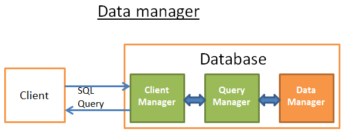

# 数据库的数据结构与算法

作为一个知名的关系型数据库，Mysql在底层许多地方都有着对数据结构与算法的极致运用。接下来将主要以Mysql为例从几个不同的功能点进行解析数据库中那些应用的很妙的算法与数据结构设计。

## 排序算法

> 对于所有数据库程序而言，良好的排序性能都是一个不可避免的难题。

当然排序算法有非常多种，每一种排序算法都有其优势与劣势。
Mysql在大规模数据时采用了归并排序，通过归并排序将问题拆分为小问题。

**为什么是归并排序？**
* 节省内存空间。归并排序是不创建新的序列而是直接修改输入序列。注：这种算法叫『原地算法』(in-place algorithm)
* 可以同时使用磁盘空间和少量内存而避免巨量磁盘 I/O。方法是只向内存中加载当前处理的部分。在仅仅100MB的内存缓冲区内排序一个几个GB的表时，这是个很重要的技巧。注：这种算法叫『外部排序』(external sorting)。
* 可以充分利用 多处理器/多线程/多服务器 上的优势。比如，分布式合并排序是Hadoop（那个著名的大数据框架）的关键组件之一。

## 查找算法（数据库索引）

索引是在存储引擎层实现的，而不是在服务器层实现的，所以不同存储引擎具有不同的索引类型和实现。

### 二叉搜索树

> 数据库中查询的时间复杂度限制，使我们无法直接使用矩阵进行查询，因此需要使用二叉搜索树(BST)。

使用二叉搜索树只需 log(N) 次运算，而如果你直接使用数据矩阵则需要 N 次运算。

> 在查找一个特定值这个树挺好用，但是当你需要查找两个值之间的多个元素时，就会有大麻烦了。你的成本将是 O(N)，因为你必须查找树的每一个节点，以判断它是否处于那 2 个值之间（例如，对树使用中序遍历）。而且这个操作不是磁盘I/O有利的，因为你必须读取整个树。我们需要找到高效的范围查询方法。

### B+树索引的引入

> 由于上述二叉搜索树的问题，就引入了基于二叉搜索树优化后的B+树来解决以上问题。

#### B+ Tree 原理

##### 数据结构

B Tree 指的是 Balance Tree，也就是平衡树（平衡多路查找树）。平衡树是一颗查找树，通过左右旋转让所有叶子节点位于同一层。

B+ Tree 是基于 B Tree 和叶子节点顺序访问指针进行实现，它具有 B Tree 的平衡性，并且通过顺序访问指针来提高区间查询的性能。

在 B+ Tree 中，一个节点中的 key 从左到右非递减排列，如果某个指针的左右相邻 key 分别是 key[i] 和 key[i+1]，且不为 null，则该指针指向节点的所有 key 大于等于 key[i] 且小于 key[i+1]。

##### 查询过程

进行查找操作时，首先在根节点进行二分查找，找到一个 key 所在的指针，然后递归地在指针所指向的节点进行查找。直到查找到叶子节点，然后在叶子节点上进行二分查找，找出 key 所对应的 data。

插入删除操作记录会破坏平衡树的平衡性，因此在插入删除操作之后，需要对树进行一个分裂、合并、旋转等操作来维护平衡性。因此过多的索引会导致插入删除性能降低。

##### 与红黑树比较

红黑树等平衡树也可以用来实现索引，但是文件系统及数据库系统普遍采用 B+ Tree 作为索引结构，主要有以下两个原因:

(一)更少的查找次数

平衡树查找操作的时间复杂度等于树高 h，而树高大致为 O(h)=O(logdN)，其中 d 为每个节点的出度。红黑树的出度为 2，而 B+ Tree 的出度一般都非常大，所以红黑树的树高 h 很明显比 B+ Tree 大非常多，检索的次数也就更多。

(二)利用计算机预读特性，优化范围查找

为了减少磁盘 I/O，磁盘往往不是严格按需读取，而是每次都会预读。预读过程中，磁盘进行顺序读取，顺序读取不需要进行磁盘寻道，并且只需要很短的旋转时间，因此速度会非常快。操作系统一般将内存和磁盘分割成固态大小的块，每一块称为一页，内存与磁盘以页为单位交换数据。数据库系统将索引的一个节点的大小设置为页的大小，使得一次 I/O 就能完全载入一个节点，并且可以利用预读特性，相邻的节点也能够被预先载入。

#### B+树索引

B+树索引是大多数 MySQL 存储引擎的默认索引类型。

因为不再需要进行全表扫描，只需要对树进行搜索即可，因此查找速度快很多。

除了用于查找，还可以用于排序和分组。可以指定多个列作为索引列，多个索引列共同组成键。适用于全键值、键值范围和键前缀查找，其中键前缀查找只适用于最左前缀查找。如果不是按照索引列的顺序进行查找，则无法使用索引。

InnoDB 的 B+Tree 索引分为主索引和辅助索引。

主索引的叶子节点 data 域记录着完整的数据记录，这种索引方式被称为聚簇索引。因为无法把实际数据行存放在两个不同的地方，所以一个表只能有一个聚簇索引。

辅助索引(聚簇索引c)的叶子节点的 data 域记录着主键的值，因此在使用辅助索引进行查找时，需要先查找到主键值，然后再到主索引中进行查找。

### 哈希索引

在Mysql中除了主流的B+树索引，还有哈希索引。

哈希索引能以 O(1) 时间进行指定元素查找，但是失去了有序性，因此它具有以下限制:
* 无法用于排序与分组；
* 只支持精确查找，无法用于部分查找和范围查找。

InnoDB 存储引擎有一个特殊的功能叫“自适应哈希索引”，当某个索引值被使用的非常频繁时，会在 B+Tree 索引之上再创建一个哈希索引，这样就让 B+Tree 索引具有哈希索引的一些优点，比如快速的哈希查找。

### 全文索引

其实MySQL中也有类似ES的全文索引用于简单的分词查询。全文索引（Full-Text Index）是一种用于加速文本数据搜索的索引类型。它允许你在文本列（如 VARCHAR、TEXT 等）上执行高效的全文搜索，而不仅仅是简单的模式匹配。

mysql的全文索引也使用倒排索引实现，它记录着关键词到其所在文档的映射。

最早全文索引仅支持MyISAM 存储引擎，但是5.6.4 版后也增加了InnoDB 存储引擎的支持，但是5.7版本之后Mysql内置了ngram全文检索插件，用于支持中文分词。

查找条件使用 MATCH AGAINST，而不是普通的 WHERE like。具体语法可以参考[MySQL官网](https://dev.mysql.com/doc/refman/8.4/en/fulltext-natural-language.html)

**以上内容就是目前Mysql中比较重要的索引实现。**

# 数据库的主要组成部分（并不是特指Mysql）

数据库一般可以用如下图形来理解：

### 核心组件：

* 进程管理器（process manager）：数据库需要具备一个妥善管理的进程/线程池。为了实现纳秒级操作，一些现代数据库都使用自己的线程而不是操作系统线程。
* 网络管理器（network manager）：网路I/O是个大问题，尤其是对于分布式数据库。所以数据库需要具备自己的网络管理器。
* 文件系统管理器（File system manager）：磁盘I/O是数据库的首要瓶颈。需要一个文件系统管理器来完美地处理OS文件系统甚至取代OS文件系统，是非常重要的。
* 内存管理器（memory manager）：为了避免磁盘I/O带来的性能损失，需要大量的内存。特别是如果你要处理大容量内存你需要高效的内存管理器，尤其是你有很多查询同时使用内存的时候。
* 安全管理器（Security Manager）：用于对用户的验证和授权。
* 客户端管理器（Client manager）：用于管理客户端连接。
* ……

### 工具
在数据库中一般中内置了一些常用的数据库工具，比如：

* 备份管理器（Backup manager）：用于保存和恢复数据。
* 恢复管理器（Recovery manager）：用于崩溃后重启数据库到一个一致状态。
* 监控管理器（Monitor manager）：用于记录数据库活动信息和提供监控数据库的工具。
* 管理员管理器（Administration manager）：用于保存元数据（比如表的名称和结构），提供管理数据库、模式、表空间的工具。
* ……
### 查询管理器
几乎我们所有的SQL都会经过这一部分进行优化处理
* 查询解析器（Query parser）：用于检查查询是否合法
* 查询重写器（Query rewriter）：用于预优化查询
* 查询优化器（Query optimizer）：用于优化查询
* 查询执行器（Query executor）：用于编译和执行查询

### 数据管理器

* 事务管理器（Transaction manager）：用于处理事务
* 缓存管理器（Cache manager）：数据被使用之前置于内存，或者数据被写入磁盘之前置于内存
* 数据访问管理器（Data access manager）：访问磁盘中的数据

## SQL查询的流程

首先一条SQL的传输会经过客户端管理器层。

### 客户端管理器

> 客户端管理器是处理客户端通信的。客户端可以是一个（网站）服务器或者一个最终用户或最终应用。客户端管理器通过一系列知名的API（JDBC, ODBC, OLE-DB …）提供不同的方式来访问数据库。客户端管理器也提供专有的数据库访问API。

**当你连接到数据库时：**
* 管理器首先检查你的验证信息（用户名和密码），然后检查你是否有访问数据库的授权。这些权限由DBA分配。
* 然后，管理器检查是否有空闲进程（或线程）来处理你对查询。
* 管理器还会检查数据库是否负载很重。
* 管理器可能会等待一会儿来获取需要的资源。如果等待时间达到超时时间，它会关闭连接并给出一个可读的错误信息。
* 如果得到了资源，然后管理器会把你的查询送给查询管理器来处理。
* 因为查询处理进程是流式处理的，一旦它从查询管理器得到数据，它会把部分结果保存到一个缓冲区并且开始给你发送。
* 如果遇到问题，管理器关闭连接，向你发送可读的解释信息，然后释放资源。

接下来合法并被分配到资源的查询就会来到查询管理器。

### 查询管理器

> 这部分是数据库的威力所在，在这部分里，一个写得糟糕的查询可以转换成一个快速执行的代码，代码执行的结果将被送到客户端管理器。

这个多步骤操作过程如下：
* 查询首先被解析并判断是否合法
* 然后被重写，去除了无用的操作并且加入预优化部分
* 接着被优化以便提升性能，并被转换为可执行代码和数据访问计划
* 然后计划被编译最后，被执行

作为SQL执行的核心部分，查询会在该层主要经过一下几个部分：

#### 查询解析器

> 每一条SQL语句都要送到解析器来检查语法，如果你的查询有错，解析器将拒绝该查询。比如，如果你写成”SLECT …” 而不是 “SELECT …”，那就没有下文了。

但这还不算完，解析器还会检查关键字是否使用正确的顺序，比如 WHERE 写在 SELECT 之前会被拒绝。

然后，解析器要分析查询中的表和字段，使用数据库元数据来检查：

* 表是否存在
* 表的字段是否存在
* 对某类型字段的 运算 是否 可能（比如，你不能将整数和字符串进行比较，你不能对一个整数使用 substring() 函数）

接着，解析器检查在查询中你是否有权限来读取（或写入）表。再强调一次：这些权限由DBA分配。

在解析过程中，SQL 查询被转换为内部表示（通常是一个树）。

如果一切正常，内部表示被送到查询重写器。

#### 查询重写器

在这一步，我们已经有了查询的内部表示，重写器的目标是：

* 预优化查询
* 避免不必要的运算
* 帮助优化器找到合理的最佳解决方案

重写器按照一系列已知的规则对查询执行检测。如果查询匹配一种模式的规则，查询就会按照这条规则来重写。下面是（可选）规则的非详尽的列表：

* 视图合并：如果你在查询中使用视图，视图就会转换为它的 SQL 代码。
* 子查询扁平化：子查询是很难优化的，因此重写器会尝试移除子查询 
* 去除不必要的运算符：比如，如果你用了 DISTINCT，而其实你有 UNIQUE 约束（这本身就防止了数据出现重复），那么 DISTINCT 关键字就被去掉了。
* 排除冗余的联接：如果相同的 JOIN 条件出现两次，比如隐藏在视图中的 JOIN 条件，或者由于传递性产生的无用 JOIN，都会被消除。
* 常数计算赋值：如果你的查询需要计算，那么在重写过程中计算会执行一次。比如 WHERE AGE > 10+2 会转换为 WHERE AGE > 12 ， TODATE(“日期字符串”) 会转换为 datetime 格式的日期值。

#### 查询优化器

> 所有的现代数据库都在用基于成本的优化（即CBO）来优化查询。原理是针对每个运算设置一个成本，通过应用成本最低廉的一系列运算，来找到最佳的降低查询成本的方法。

因此评估成本就会涉及到时间复杂度、CPU消耗磁盘IO等的评估。当然评估优化过程是复杂的，而且评估不能保证得到的一定是最好的，因为因素是多方面的。具体的评估优化过程就不在详细解释。

#### 查询执行器
在这个阶段，我们有了一个优化的执行计划，再编译为可执行代码。然后，如果有足够资源（内存，CPU），查询执行器就会执行它。计划中的操作符 (JOIN, SORT BY …) 可以顺序或并行执行，这取决于执行器。为了获得和写入数据，查询执行器与数据管理器交互，本文下一部分来讨论数据管理器。

### 数据管理器

在查询管理器中经过多次处理转换最终SQL到达数据管理器层，需要去进行实际数据的提取。

在这一步，查询管理器执行了查询，需要从表和索引获取数据，于是向数据管理器提出请求。但是有 2 个问题：
* 关系型数据库使用事务模型，所以，当其他人在同一时刻使用或修改数据时，你无法得到这部分数据。
* 数据提取是数据库中速度最慢的操作，所以数据管理器需要足够聪明地获得数据并保存在内存缓冲区内。

在该层又会经过缓存管理器（降低IO瓶颈）、事务管理器（保证每个查询在自己的事务内执行的）、锁管理器（确保隔离性、一致性和原子性）、日志管理器（数据库把数据保存在内存缓冲区内，但如果当事务提交时服务器崩溃，崩溃时还在内存里的数据会丢失，这破坏了事务的持久性，使用日志来进行保证）