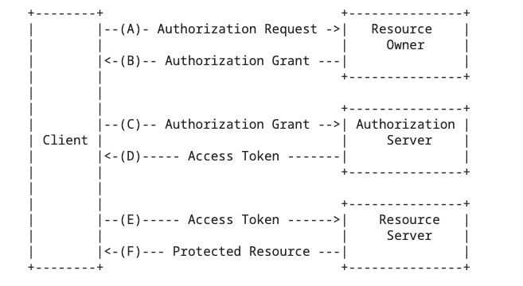

# 统一登录

统一登录一般不属于专业术语，常常用于描述业务需求。
统一登录的目标是让用户只需一次认证，就能访问多个应用或系统。虽然单点登录（SSO）是一种常见且成熟的实现方式，但统一登录的实现并不局限于传统的 SSO 方案。
比如：
1. 共享 Cookie/Session 方案
  原理：如果各子系统处于同一主域下，可以通过设置共享 Cookie 或 Session，实现用户登录状态的跨子系统共享。
  特点：这种方式简单直接，但受限于浏览器的同域策略，对跨域场景支持较弱，通常适用于内部系统或同一域名下的多个子系统。

# 单点登录（Single Sign On）

单点登录是一种技术方案，其目标与统一登录一致：用户在某个系统上完成一次认证后，可以在多个相互信任的应用之间无缝切换，而无需再次登录。
单点登录的核心在于所有系统通过统一的认证中心（额外搭建和维护统一认证服务器）进行信任建立，不需要在每个系统中重复实现认证逻辑，降低了系统间的耦合度。
常见的单点登录协议有：如 CAS、OAuth 2.0 + OpenID Connect

# CAS（ Central Authentication Service）

首先我们需要明确CAS的场景，CAS本身可以对应一个开源认证协议，但是同时基于该协议有一个同名的CAS开源项目，该项目内实现了基于CAS、OAuth2、OpenID Connect等协议实现登录授权的控制。
先说开源框架，CAS框架的主要作用就是解决SSO问题，因此该框架集成了多种协议、多种鉴权插件。
然后就是[CAS协议](https://apereo.github.io/cas/7.1.x/protocol/CAS-Protocol.html),在CAS协议内定义了多个系统间实现SSO时的请求认证流程、重定向时的端点地址、成功响应格式、整个CAS票据获取与验证过程等。

# [OAuth2.0](https://datatracker.ietf.org/doc/html/rfc6749)

[OAuth2.0](https://datatracker.ietf.org/doc/html/rfc6749)是一个授权协议，因此常常与CAS组合来实现整个认证与授权流程。
Oauth定义了四个角色：

-  资源所有者
     - 一个能够授予受保护资源的实体。
    当资源所有者是一个人时，它被称为终端用户。

-   资源服务器
    - 托管受保护资源的服务器能够接受并使用访问令牌响应受保护的资源请求。

-   客户
    - 代表申请提出受保护的资源请求资源所有者及其授权。术语“客户”确实并不意味着任何特定的实施特征（例如，该应用程序是在服务器，台式机还是其他上执行的设备）。

-   授权服务器
    - 成功后，服务器向客户发出访问令牌
      认证资源所有者并获得授权。

获取临时授权的流程如下：
