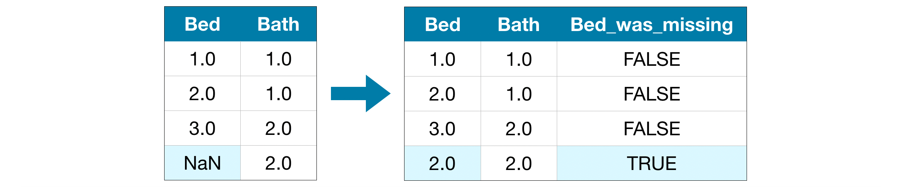
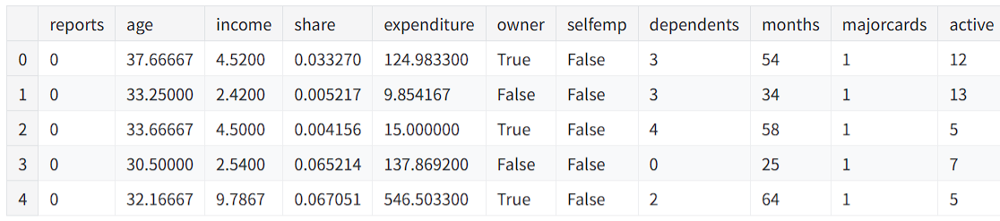

# 决策树

首先，我们将概述机器学习模型的工作原理及其使用方式。

## 我们假设一个场景：
你的表弟通过房地产投机赚了数百万美元。由于您对数据科学感兴趣，他愿意与您成为业务合作伙伴。他将提供资金，您将提供预测各种房屋价值的模型。
你问你的表弟他过去是如何预测房地产价值的，他说这只是直觉。但更多的询问表明，他从过去看到的房子中确定了价格模式，并使用这些模式来预测他正在考虑的新房子。

机器学习的工作方式相同。 我们将从一个名为 Decision Tree （决策树）的模型开始。有更高级的模型可以给出更准确的预测。但决策树很容易理解，它们是数据科学中最佳模型的基础模块。


为简单起见，我们将从最简单的决策树开始。


该决策树只将房屋分为两类。每一类中房屋的预测价格是同一类别中房屋的历史平均价格。

我们使用数据来决定如何将房屋分成两组，然后再次确定每组中的预测价格。 从数据中按模式分类的这一步称为拟合或训练模型。用于拟合模型的数据称为训练数据。

模型如何拟合的细节（例如，如何拆分数据）非常复杂，我们将其保存以备后用。拟合模型后，您可以将其应用于新数据以预测其他房屋的价格。

### 改进决策树


以上两个决策树中的哪一个更有可能通过拟合房地产训练数据而产生？

左侧的决策树（决策树 1）可能更有意义，因为它捕捉到了这样一个现实，即卧室较多的房屋往往比卧室较少的房屋售价更高。 该模型的最大缺点是它没有捕捉到影响房价的大多数因素，例如浴室数量、地块大小、位置等。

您可以使用具有更多“拆分”的树来捕获更多因子。这些被称为 “更深” 的树。这个树还考虑每栋房屋地块总大小等。
如下所示：


您可以通过跟踪决策树来预测任何房屋的价格，始终选择与该房屋特征相对应的路径。房屋的预测价格位于树的底部。 我们进行预测的底部点称为叶子。

叶子上的拆分和值将由数据决定，因此是后续我们将要查看处理数据。

# 随机森林（Random Forests）

决策树往往会带来深度选择的问题。具有大量叶子的深树将过度拟合，因为每个预测仅来自其叶子处的几座房屋的历史数据。但是，叶子很少的浅树性能会很差，因为它无法在原始数据中捕获尽可能多的区别。

即使是当今最复杂的建模技术也面临着欠拟合和过拟合之间的这种紧张关系。但是，许多模型都有自己的解决方法，可以带来更好的性能。我们将以随机森林为例。

随机森林使用许多树，它通过平均每个组件树的预测来做出预测。它通常比单个决策树具有更好的预测准确性，并且默认参数就可以有不错的表现。如果您深入学习建模，您可以学习更多性能更好的模型，但其中许多模型对于参数很敏感。

## 示例

前提：在数据加载结束时，我们定义以下变量：
* train_X 
* val_X 
* train_y 
* val_y 

```python
import pandas as pd
    
# Load data
melbourne_file_path = '../input/melbourne-housing-snapshot/melb_data.csv'
melbourne_data = pd.read_csv(melbourne_file_path) 
# Filter rows with missing values
melbourne_data = melbourne_data.dropna(axis=0)
# Choose target and features
y = melbourne_data.Price
melbourne_features = ['Rooms', 'Bathroom', 'Landsize', 'BuildingArea', 
                        'YearBuilt', 'Lattitude', 'Longtitude']
X = melbourne_data[melbourne_features]

from sklearn.model_selection import train_test_split

# split data into training and validation data, for both features and target
# The split is based on a random number generator. Supplying a numeric value to
# the random_state argument guarantees we get the same split every time we
# run this script.
train_X, val_X, train_y, val_y = train_test_split(X, y,random_state = 0)
```


以下代码我们构建一个随机森林模型类似于我们在Scikit -learn中构建决策树的方式类似 - 这次使用RandomForestRegressor类，而不是DecisionTreeRegressor。

```python
from sklearn.ensemble import RandomForestRegressor
from sklearn.metrics import mean_absolute_error

forest_model = RandomForestRegressor(random_state=1)
forest_model.fit(train_X, train_y)
melb_preds = forest_model.predict(val_X)
print(mean_absolute_error(val_y, melb_preds))
```

最终输出： 191669.7536453626

可能还有进一步改进的空间，但这比最佳决策树最终的的250,000已经有了改进。当我们更改单个决策树的最大深度时，有一些参数使您可以更改随机森林的性能。但是，随机森林模型的最佳特征之一是，即使没有这种调整，它们通常也可以合理地工作。

# 中级机器学习

基于以上两种简单的模型算法的使用我们对如何初步训练一个模型有了简单的了解。
但是实际的模型开发、优化过程中是更复杂的，比如：
* 处理真实数据集中常见的数据类型（缺失值、分类变量），
* 设计管道（pipelines ）以提高机器学习代码的质量，
* 使用高级技术进行模型验证（交叉验证），
* 构建（XGBoost） 的先进模型，以及
* 避免常见和重要的数据科学错误（泄漏）。

## 处理数据缺失值

在实际开发时数据缺失是非常常见的，比如：
两居室的房子不包括第三间卧室的大小值。
调查受访者可以选择不分享其收入。
如果您尝试使用具有缺失值的数据构建模型，大多数机器学习库（包括 scikit-learn）都会出现错误。因此，您需要选择以下三种常见策略之一。

### 1.删除具有缺失值的列


这种方法一般不推荐，除非某一列中的大多数都没有值，否则使用此方法将导致模型失去对许多（可能有用的！）信息。 作为一个极端的例子，请考虑一个具有10,000行的数据集，其中一个重要的列中仅缺少一个有效值。这种方法将完全丢弃该列！

### 2.补充缺失值


使用一些数字填充缺失值。 例如，我们可以为其填充每列平均值。但是这并不是固定的，平均值有时候甚至会不如直接删除缺失列，但这并不代表补充缺失值是更优的，而是我们补充的值不合适，我们可能会采取其他方式来填充值，比如众数等

在大多数情况下，补充的值不会完全正确，但是通常会比完全放弃列获得更准确的模型。

### 3.拓展列然后补充缺失值

补充缺失值是标准方法，通常效果很好。但是，估算的值可能会系统地高于或低于其实际值（该值未收集到数据集中）。或着缺少值的行可能在某种程度上是唯一的。在这种情况下，您的模型将通过考虑最初缺少哪些值来做出更好的预测。

在这种方法中，我们像以前一样将缺失的值进行估算补充。 此外，对于原始数据集中的每列丢失条目，我们添加了一个新列，以显示该列缺失值。

在某些情况下，这将有意义地改善结果。某些情况下，这也可能无济于事。

## 分类数据

分类变量只采用有限的枚举值，比如：
* 在一项调查中，询问您多久吃一次早餐并提供四个选项：“从不”、“很少”、“大多数日子”或“每天”。 在这种情况下，数据是分类的，因为响应属于一组固定的类别。
* 如果人们回答关于他们拥有哪个品牌的汽车的调查，回答将分为 “本田”、“丰田 ”和 “福特 ”等类别。 在这种情况下，数据也是分类的。

而此时针对这些缺失值我们也需要处理，主要有以下三种方法：

### 删除分类数据列
仅当列不包含有用信息时，此方法才会有效。
### 为分类数据编码（序数编码（Ordinal Encoding））

将每个唯一值分配给不同的整数。

使用此方法我们假定类别的顺序：“从不”（0） < “很少” （1） < “大多数天数” （2） < “每天” （3）。

这个假设在这个例子中是有道理的，因为这些类别有一个比较明显的排名一句。 并非所有分类变量在值中都有明确的排序，因此我们将这些分类变量称为有序变量。 对于基于树的模型（如决策树和随机森林），您可以通过预期序数来为数据编码，一般可以很好地处理序数变量。

### 独热编码

该词直译英文（One-Hot Encoding），独热编码通过创建新列，来指示原始数据中存在（或不存在）每个可能的值。 为了理解这一点，我们将通过一个示例来说明。


在原始数据集中，“Color” 是一个分类变量，具有三个类别：“Red”、“Yellow” 和 “Green”。 相应的 one-hot 编码为每个可能的值创建一个新列，原始数据集中的每一行都将被对应起来。 如果原始值为 “Red”，我们在 “Red” 列中放置一个 1;如果原始值为 “Yellow”，则在 “Yellow” 列中输入 1，依此类推。

与Oldinal编码（序数编码）相反，独热编码不假定类别的排序。 因此，如果分类数据中没有明确的排序（例如，“红色”既不是 也不是 ，则可以期望这种方法特别有效。 我们将这种没有内在排名的分类变量称为名义变量）。

但是如果分类变量具有大量枚举值（即，通常不会将其用于变量以上超过15个不同的值），则One-Hot编码通常不能很好地表现。

针对为分类数据编码还存在特殊情况，即有时候训练数据与验证数据由于数据集的影响，两者会具有不同的分类变量，即训练数据中的分类变量少于验证数据，即 训练数据中没有验证数据中的某些分类信息。
测试一般会细分出两种解决方法：
#### 放弃有问题的分类列
以下代码示例可以有效地将训练数据中没有验证数据中的某些分类信息的列打印出来
```python
# Categorical columns in the training data
object_cols = [col for col in X_train.columns if X_train[col].dtype == "object"]

# Columns that can be safely ordinal encoded
good_label_cols = [col for col in object_cols if
                   set(X_valid[col]).issubset(set(X_train[col]))]

# Problematic columns that will be dropped from the dataset
bad_label_cols = list(set(object_cols)-set(good_label_cols))

print('Categorical columns that will be ordinal encoded:', good_label_cols)
print('\nCategorical columns that will be dropped from the dataset:', bad_label_cols)
```
#### 


## Pipelines

管道是保持数据预处理和建模代码井井有条的一种简单方法。 具体来说，就是使用管道来捆绑预处理和建模这些步骤，让您可以像使用单个步骤一样使用整个捆绑管道。

许多人在没有管道的情况下将模型组合在一起，但使用管道可以为我们带来一些重要的好处。这些包括：

* 清理代码：在预处理的每个步骤中逐步处理每一条数据可能会变得混乱。 使用管道，您无需在每个步骤中手动跟踪训练和验证数据。
* 更少的错误：减少因使用错误的处理方式或忘记了预处理步骤导致的错误。
* 更容易生产应用：将模型从原型过渡到可大规模部署的模型可能非常困难。 我们不会在这里讨论许多相关问题，但管道可以提供一些帮助让我们减轻困难。
* 为模型验证提供更多可选项：比如交叉验证等。

### 定义预处理步骤（ Define Preprocessing Steps）
就像流水线管道一样将预处理和建模步骤捆绑在一起，我们使用ColumnTransformer类将不同的预处理步骤捆绑在一起。 
* 填补数值数据中的缺失值，并且
* 填补分类数据的缺失的值，并将单热编码应用于对应数据。
以下代码：
```python
from sklearn.compose import ColumnTransformer
from sklearn.pipeline import Pipeline
from sklearn.impute import SimpleImputer
from sklearn.preprocessing import OneHotEncoder

# Preprocessing for numerical data
numerical_transformer = SimpleImputer(strategy='constant')

# Preprocessing for categorical data
categorical_transformer = Pipeline(steps=[
    ('imputer', SimpleImputer(strategy='most_frequent')),
    ('onehot', OneHotEncoder(handle_unknown='ignore'))
])

# Bundle preprocessing for numerical and categorical data
preprocessor = ColumnTransformer(
    transformers=[
        ('num', numerical_transformer, numerical_cols),
        ('cat', categorical_transformer, categorical_cols)
    ])
```
### 定义模型

我们使用熟悉的 RandomForestRegressor 类定义一个随机森林模型。
```python
from sklearn.ensemble import RandomForestRegressor

model = RandomForestRegressor(n_estimators=100, random_state=0)
```
### 创建和评估流水线管道（Pipeline）

我们使用 Pipeline 类来定义一个pipeline 去绑定预处理和建模步骤的管道。 有几点重要事项需要注意：

* 使用管道，我们可以使得预处理训练数据和训练模型在一行代码中。 （相比之下，如果没有管道，我们必须分步进行插补、one-hot encoding 和模型训练。 如果我们必须同时处理数值和分类变量，这将变得特别混乱！）
* 使用管道，我们将 X_valid 中未处理的特征（features ）提供给 predict() 命令，管道会在生成预测之前自动预处理这些特征。 （但是，如果没有管道，我们必须记住在进行预测之前预处理验证数据。）

```python
from sklearn.metrics import mean_absolute_error

# Bundle preprocessing and modeling code in a pipeline
my_pipeline = Pipeline(steps=[('preprocessor', preprocessor),
                              ('model', model)
                             ])

# Preprocessing of training data, fit model 
my_pipeline.fit(X_train, y_train)

# Preprocessing of validation data, get predictions
preds = my_pipeline.predict(X_valid)

# Evaluate the model
score = mean_absolute_error(y_valid, preds)
print('MAE:', score)
```


## 交叉验证

机器学习是一个迭代过程。在这个过程中您将面临以下选择：使用哪些预测变量、使用哪些类型的模型、向这些模型提供哪些参数等。之前我们通过使用验证（或保留）数据来衡量模型质量，以数据驱动的方式做出了这些选择。

但是这种方法也有一些缺点。要体现这一点，假设您有一个包含 5000 行的数据集。您通常会将大约 20% 的数据保留为验证数据集，即 1000 行。但这在确定模型分数时会产生一定的随机性。也就是说，一个模型可能在这一组 1000 行上表现良好，但它在不同的 1000 行上不准确。

在极端情况下，您可以想象验证集中只有 1 行数据。如果您比较所有模型，哪一个模型会对单个数据点做出最佳预测将主要取决于运气！

一般来说，验证集越大，我们衡量模型质量的随机性（又名 “噪声”） 就越少，它就越可靠。但不幸的是，我们只能通过从训练数据中删除行来获得较大的验证集，而较小的训练数据集也意味着更差的模型！

### 什么是交叉验证

在交叉验证中，我们对数据的不同子集运行建模过程，以获得模型质量的多个度量。

例如，我们可以先将数据分成 5 个部分，每个部分占整个数据集的 20%。在本例中，我们已经将数据分成了 5 个 “folds”。


然后，我们为每个组运行一次实验：
* 在实验 1 中，我们使用第一个折叠作为验证（或保留）集，使用其他所有内容作为训练数据。这为我们提供了基于 20% 保留集的模型质量度量。
* 在实验 2 中，我们保留第二个折叠的数据（并使用除第二个折叠之外的所有内容来训练模型）。然后，使用维持集来获取模型质量的第二次估计值。
* 我们重复此过程，将每个弃牌使用一次作为维持集。综上所述，100% 的数据在某个时候被用作保留，我们最终得到了一个基于数据集中所有行的模型质量度量（即使我们没有同时使用所有行）。

### 什么场景下使用交叉验证

交叉验证可以更准确地衡量模型质量，这在您做出大量建模决策时尤为重要。但是，运行时间可能需要更长的时间，因为它会估计多个模型（每个折叠一个模型）。

那么，考虑到这些权衡，何时应该使用该方法呢？
* 对于小型数据集，额外的计算负担并不是什么大问题，此时可以进行交叉验证。
* 对于较大的数据集，单个验证集就足够了。您的代码将运行得更快，并且您可能有足够的数据，因此几乎不需要重用其中一些数据来保持模型可靠性。

对于大型数据集与小型数据集的构成，没有简单的阈值。但是，如果您的模型需要几分钟或更短的时间才能运行，则可能值得切换到交叉验证。

或者，您可以运行交叉验证，并查看每个实验组的分数是否接近。如果每个实验产生相同的结果，则单个验证集可能就足够了。

### 示例

```python
import pandas as pd

# Read the data
data = pd.read_csv('../input/melbourne-housing-snapshot/melb_data.csv')

# Select subset of predictors
cols_to_use = ['Rooms', 'Distance', 'Landsize', 'BuildingArea', 'YearBuilt']
X = data[cols_to_use]

# Select target
y = data.Price
```

然后，我们定义一个管道，该管道使用补充缺失值的方式来解决缺失值，并使用随机森林模型进行预测。

虽然可以在没有管道的情况下进行交叉验证，但这非常困难！使用管道将使代码非常简单。

```python
from sklearn.ensemble import RandomForestRegressor
from sklearn.pipeline import Pipeline
from sklearn.impute import SimpleImputer

my_pipeline = Pipeline(steps=[('preprocessor', SimpleImputer()),
                              ('model', RandomForestRegressor(n_estimators=50,
                                                              random_state=0))
                             ])
```

在模拟时我们使用 scikit-learn 中的 cross_val_score（） 函数获得交叉验证分数。 我们使用 参数cv 来设置折叠数。

```python


from sklearn.model_selection import cross_val_score

# Multiply by -1 since sklearn calculates *negative* MAE
scores = -1 * cross_val_score(my_pipeline, X, y,
                              cv=5,
                              scoring='neg_mean_absolute_error')

print("MAE scores:\n", scores)

```

上文参数解释：scoring 参数：选择要报告的模型质量度量方式：在本例中，我们选择了**负的**平均绝对误差 （MAE）。在 [scikit-learn](https://scikit-learn.org/stable/modules/model_evaluation.html) 的文档显示了所有的可选项列表。

我们指定取反的 MAE 有点令人惊讶。scikit-learn 有一个约定，其中定义了所有指标数字越高越好。在这里使用负数可以使它们与该约定保持一致，尽管负 MAE 在其他地方几乎闻所未闻。

我们通常需要单一的模型质量度量方式来比较替代模型。因此，我们取实验的平均值。
### 小结

使用交叉验证可以更好地衡量模型质量，并具有清理代码的额外好处：请注意，我们不再需要跟踪单独的训练集和验证集。因此，特别是对于小型数据集，这是一个很好的改进！

## 梯度提升（Gradient Boosting 、XGBoost）

在之前的大部分内容中，我们都使用随机森林法进行预测，该方法通过对许多决策树的预测求平均值，比单个决策树获得更好的性能。

我们将随机森林法称为 “集成法”的一种。根据定义，集成法结合了多个模型的预测（例如，在随机森林的中是几棵树）。

梯度提升是一种通过循环去迭代的方式将模型添加到集成中的方法。

它首先使用单个模型初始化集成，该模型的预测可能非常离谱。（即使它的预测非常不准确，后续通过在集成模型中继续补充来解决这些错误。）

然后，我们开始循环：

* 首先，我们使用当前集成模型为数据集中的每个观测值生成预测。预测结果是这样生成的，即我们将集成中所有模型的预测相加。
* 将这些预测用于计算损失函数（例如，均方误差）。
* 然后，我们使用 损失函数来拟合新模型并将其添加到集成中。具体来说，我们确定模型参数，以便将这个新模型添加到集成中将减少损失。（旁注：“gradient boosting”中的“gradient”指的是我们将在损失函数上使用梯度下降法来确定这个新模型中的参数。
* 最后，我们将新模型添加到 ensemble 中，然后 一直重复该过程


### 示例

```python
import pandas as pd
from sklearn.model_selection import train_test_split

# Read the data
data = pd.read_csv('../input/melbourne-housing-snapshot/melb_data.csv')

# Select subset of predictors
cols_to_use = ['Rooms', 'Distance', 'Landsize', 'BuildingArea', 'YearBuilt']
X = data[cols_to_use]

# Select target
y = data.Price

# Separate data into training and validation sets
X_train, X_valid, y_train, y_valid = train_test_split(X, y)
```

在后续示例中，我们将使用 XGBoost 库。XGBoost 代表极端梯度提升，这是梯度提升的一种实现，具有一些专注于性能和速度的附加功能。（Scikit-learn 有另一个版本的梯度提升，但 XGBoost 有一些技术优势。）

我们导入 XGBoost 的 scikit-learn API （xgboost.XGBRegressor 的 Exports）。 这允许我们构建和拟合模型，就像我们在 scikit-learn 中所做的那样。 正如您将在输出中看到的那样，XGBRegressor 类具有许多可调参数 -- 您很快就会了解这些参数！

```python
from xgboost import XGBRegressor

my_model = XGBRegressor()
my_model.fit(X_train, y_train)
# 对模型进行预测和评估。
from sklearn.metrics import mean_absolute_error

predictions = my_model.predict(X_valid)
print("Mean Absolute Error: " + str(mean_absolute_error(predictions, y_valid)))
```
### 参数调优

XGBoost 有一些参数会极大地影响准确性和训练速度。您应该了解的第一个参数是：
- n_estimators 
    指定上述建模周期的次数。 它等于我们在集成中包含的模型数量。
    *  值太低会导致欠拟合，从而导致对训练数据和测试数据的预测不准确。
    *  值过高会导致过度拟合，这会导致对训练数据进行准确的预测，但对测试数据的预测不准确（这是我们关心的）。

    典型值范围为 100-1000，但这在很大程度上取决于下面讨论的 learning_rate 参数。

    以下是通过 ensemble 设置模型数量的代码：
    ```python
    my_model = XGBRegressor(n_estimators=500)
    my_model.fit(X_train, y_train)
    ```
- early_stopping_rounds
    early_stopping_rounds 提供了一种自动查找 n_estimators 理想值的方法。early_stopping_rounds会导致模型在验证分数(即用于验证模型表现的方法)停止提高时停止迭代，即使我们没有达到 n_estimators 的硬停止状态。 为 n_estimators 设置一个较高的值，然后使用 early_stopping_rounds 找到停止迭代的最佳时间是明智的。

    由于随机机会有时会导致单轮验证分数没有提高，因此您需要指定一个数字，说明在停止之前允许多少轮直接恶化。 设置 early_stopping_rounds=5 是一个合理的选择。 在这种情况下，我们会在连续 5 轮验证分数恶化后停止。

    使用 early_stopping_rounds 时，您还需要留出一些数据来计算验证分数 - 这是通过设置 eval_set 参数来完成的。

    经验证较新版本的XGBoost将early_stopping_rounds参数放到了XGBRegressor的构造函数中

    下面是我们可以修改上面的示例以应用early_stopping_rounds：
    ```python
        my_model = XGBRegressor(early_stopping_rounds=5, n_estimators=500)
        my_model.fit(X_train, y_train, 
                    
                    eval_set=[(X_valid, y_valid)],
                    verbose=False)
    ```
    以后如果要用所有数据拟合模型，将 n_estimators 设置为在提前停止运行时发现最优的任何值。

- learning_rate

    我们可以将每个模型的预测值乘以一个小数字（称为学习率），然后再将它们相加，而不是简单地将每个组件模型的预测相加来获得预测。
    这意味着我们添加到 ensemble 中的每棵树对我们的帮助较小。 因此，我们可以为 n_estimators 设置更高的值而不会过拟合。 如果我们使用提前停止，将自动确定适当的树木数量。

    一般来说，较小的学习率（learning_rate）和大量的估计器（estimators）将产生更准确的 XGBoost 模型，尽管模型也需要更长的时间来训练，因为它在整个周期中进行更多的迭代。 默认情况下，XGBoost 设置 learning_rate=0.1。

    修改上面的示例以应用学习率参数：
    ```python
    my_model = XGBRegressor(early_stopping_rounds=5, n_estimators=1000, learning_rate=0.05)
    my_model.fit(X_train, y_train, 
                eval_set=[(X_valid, y_valid)], 
                verbose=False)
    ```
- n_jobs

    在考虑运行时的较大数据集上，您可以使用并行性来更快地构建模型。 通常将参数 n_jobs 设置为等于计算机上的内核数。 对于较小的数据集，这无济于事。
    生成的模型不会更好，因此对拟合时间进行微调通常只会分散注意力。但是，它在大型数据集中非常有用，否则您将花费很长时间等待 fit 命令。
    以下是修改后的示例：
    ```python
    my_model = XGBRegressor(n_estimators=1000, learning_rate=0.05, n_jobs=4)
    my_model.fit(X_train, y_train, 
                early_stopping_rounds=5, 
                eval_set=[(X_valid, y_valid)], 
                verbose=False)
    ```
### 总结
XGBoost 是一个领先的软件库，用于处理标准表格数据（您存储在 Pandas DataFrames 中的数据类型，而不是图像和视频等更奇特的数据类型）。通过仔细的参数调整，您可以训练高度准确的模型。

## Data Leakage 数据泄露

### 介绍
数据泄漏常发生在当您的训练数据包含有关目标的信息时，当模型用于实际预测时，类似的数据却无法提供。这会导致在训练数据（甚至可能是验证数据）时表现较好，但模型在生产中表现不佳。

换句话说，泄漏会导致模型看起来准确，直到你实际开始使用模型做出决策时模型变得非常不准确。

泄漏主要有两种类型：目标泄漏和训练测试污染（ target leakage and train-test contamination.）。

#### Target leakage  目标泄漏

使用在实际预测期间不可用的信息会导致过度拟合，即模型在训练和验证数据上表现非常好，但在生产环境中表现不佳。

因此这是非常重要的去根据数据获得的时间或时间顺序（因果）来考虑目标泄漏是否存在，而不仅仅是某个特征是否有助于做出良好的预测。

举个例子会有所帮助。假设您要预测谁会患肺炎。原始数据的前几行如下所示：


人们在患肺炎后服用抗生素药物以恢复。原始数据显示这些列之间有很强的关系，但在确定 got_pneumonia 的值后，took_antibiotic_medicine 经常也会跟随发生变化。这就是目标泄漏。

该模型将看到 took_antibiotic_medicine 的值为 False 的任何人都没有肺炎。由于验证数据与训练数据来自同一来源（都具有是否服用抗生素的特征数据），因此该模式将在验证中基本是重复于预测目标的，并且模型将具有很高的验证（或交叉验证）分数。

但是一旦到了实际预测时的用户都是没有服用抗生素的，但是不能因此预测其未来是否会得肺炎，因此该模型的表现会大打折扣。


#### Train-Test Contamination 训练-测试数据污染
当你在区分训练数据与验证数据时，会发生各种不同类型的泄漏。

回想一下，验证是用于衡量模型如何处理以前未考虑过的数据的指标。如果验证数据影响预处理行为，则可以以微妙的方式破坏整个验证过程。这有时称为训练测试污染。

例如，假设您在调用 train_test_split（） 之前运行预处理（例如为缺失值使用拟合 imputer进行填充），即你还没有分割数据就进行了缺失值的填充，此时填充的值很有可能会受测试数据影响。最终结果？您的模型在测试数据上可能会获得良好的验证分数，让您对它充满信心，但在部署它以做出决策时，性能会很差

毕竟，您将验证或测试数据中的数据都纳入到了预测过程中，因此它不能很好的推广到新数据，也可能在该特定数据上表现良好。当您进行更复杂的特征工程时，这个问题变得更加微妙（也更加危险）。

如果您的验证基于简单的训练-测试拆分，请从任何类型的拟合（fit）中完全排除验证数据，包括用于拟合时的预处理步骤。如果您使用 scikit-learn 管道，这会更容易。使用交叉验证时，在管道内进行预处理更为重要！

### 例子

例如我们将使用有关信用卡应用程序的数据集，并跳过基本的数据设置代码。 最终结果是，有关每个信用卡应用程序的信息都存储在 DataFrame X 中。 我们将使用它来预测 Series y 即信用卡的申请结果。



由于这是一个较小的数据集，我们将使用交叉验证来确保模型质量的准确度量。
```python
from sklearn.pipeline import make_pipeline
from sklearn.ensemble import RandomForestClassifier
from sklearn.model_selection import cross_val_score

# Since there is no preprocessing, we don't need a pipeline (used anyway as best practice!)
my_pipeline = make_pipeline(RandomForestClassifier(n_estimators=100))
cv_scores = cross_val_score(my_pipeline, X, y, 
                            cv=5,
                            scoring='accuracy')

print("Cross-validation accuracy: %f" % cv_scores.mean())
```
经过简单验证我们得到了Cross-validation accuracy: 0.981052
根据经验，您会发现一般情况下很少能找到在 98% 时间内准确的模型。这种情况会发生，但这种情况并不常见，我们应该更仔细地检查数据是否有目标泄漏。

以下是数据摘要，您也可以在 data （数据） 选项卡下找到：

* card：如果接受信用卡申请，则为 1，如果不接受，则为 0
* reports：主要贬损报告的数量
* age：年龄 n 岁加 12 岁
* income： 年收入（除以 10,000）
* share： 信用卡月消费与年收入的比率
* expenditure：平均每月信用卡支出
* owner：拥有房屋时为 1，出租时为 0
* selfempl：如果是个体经营者，则为 1，如果不是，则为 0
* dependents：1 + 依赖项数量
* months： 在当前地址居住的月份
* majorcards：持有的主要信用卡数量
* active：活跃信用账户的数量

其中一些变量看起来可疑。 例如，expenditure是指在这张卡上或申请前使用的卡上的支出吗？

此时，基于基本数据进行比较可能非常有帮助：
```python
expenditures_cardholders = X.expenditure[y]
expenditures_noncardholders = X.expenditure[~y]

print('Fraction of those who did not receive a card and had no expenditures: %.2f' \
      %((expenditures_noncardholders == 0).mean()))
print('Fraction of those who received a card and had no expenditures: %.2f' \
      %(( expenditures_cardholders == 0).mean()))
```
经过对基础数据中的比例进行比较，我们不难发现没有收到卡的每个人都没有消费，而收到卡的人中只有 2% 没有消费。我们的模型似乎具有很高的准确率也就不足为奇了。但这似乎也是一个目标泄漏的情况，其中 SPENDING 可能是指他们申请的卡上的支出。

由于share部分由expenditure决定，因此也应将其排除在外。 变量 active 和 majorcards 不太清楚，但从描述来看，它们听起来很令人担忧。 在大多数情况下，如果您无法追踪创建数据、收集数据的那些人以了解更多详细信息，但是安全总比后悔好。

我们将运行一个处理后没有目标泄漏的模型，如下所示：

```python
# Drop leaky predictors from dataset
potential_leaks = ['expenditure', 'share', 'active', 'majorcards']
X2 = X.drop(potential_leaks, axis=1)

# Evaluate the model with leaky predictors removed
cv_scores = cross_val_score(my_pipeline, X2, y, 
                            cv=5,
                            scoring='accuracy')

print("Cross-val accuracy: %f" % cv_scores.mean())
```

Cross-val accuracy: 0.830919

这个准确性要低很多，这可能会令人失望。 但是，我们可以预期它在用于新应用程序时大约 80% 的时间是正确的，而泄漏模型可能会比这糟糕得多（尽管它在交叉验证中的明显分数更高）。

### 结论

在许多大型数据科学应用程序中，数据泄露可能会造成数百万美元的错误。 仔细分离训练和验证数据可以防止训练-测试污染，而管道可以帮助实现这种分离。 同样，谨慎、常识和数据探索相结合可以帮助识别目标泄漏。

# Pandas
## 使用Pandas进行创建、读取、写入数据

### 开始
要使用 pandas，您通常从以下代码行开始。
```python
import pandas as pd
```

### 创建数据
pandas 中有两个核心对象：DataFrame 和 Series。

#### DataFrame

DataFrame 是一个表。它包含一个由各个条目组成的数组，每个条目都有一个特定的值。每个条目对应于一行（或记录）和一列。
```python
pd.DataFrame({'Yes': [50, 21], 'No': [131, 2]})
```


DataFrame 中的值不限于整数。例如，下面是一个 DataFrame，其值是字符串：
```python
pd.DataFrame({'Bob': ['I liked it.', 'It was awful.'], 'Sue': ['Pretty good.', 'Bland.']})
```
使用 pd.DataFrame() 构造函数来生成 DataFrame 对象。声明新 列 的语法是一个字典，其键是列名（在本例中为 Bob 和 Sue），其值是条目列表。这是构造新 DataFrame 的标准方法，也是您最有可能遇到的方法。

上述构造函数为列标签分配值，但只使用从 0 （0， 1， 2， 3， ...） 开始的升序计数来表示行标签。有时这没问题，但通常我们会希望自己分配这些标签。
在DataFrame 中使用的行标签列表称为 Index。我们可以在构造函数中使用 index 参数为其赋值：
```python
pd.DataFrame({'Bob': ['I liked it.', 'It was awful.'], 
              'Sue': ['Pretty good.', 'Bland.']},
             index=['Product A', 'Product B'])

```


#### Series
相比之下，Series 是一系列数据值。如果 DataFrame 是一个表，那么 Series 是一个列表。事实上，您可以创建一个只包含一个列的列表：

从本质上讲，Series 是 DataFrame 的单个列。因此，您可以像以前一样使用 index 参数将行标签分配给 Series。但是，Series 没有列名，它只有一个整体 name：

Series 和 DataFrame 密切相关。我们可以将 DataFrame 视为实际上只是一堆 “粘在一起” 的 Series 。

### 读取数据文件

能够手动创建 DataFrame 或 Series 非常方便。但是，大多数时候，我们实际上不会手动创建我们自己的数据。相反，我们将使用已经存在的数据。

数据可以以多种不同的形式和格式存储。到目前为止，其中最基本的是不起眼的 CSV 文件。当您打开 CSV 文件时，您会收到如下所示的内容：
```csv
Product A,Product B,Product C,
30,21,9,
35,34,1,
41,11,11
```
因此，CSV 文件是一个由逗号分隔的值表。因此得名：“Comma-Separated Values”，或 CSV。
现在让我们把我们的玩具数据集放在一边，看看当我们将其读入 DataFrame 时，真正的数据集是什么样子的。我们将使用 pd.read_csv() 函数将数据读入 DataFrame。这是这样的：
```python
wine_reviews = pd.read_csv("../winemag-data-130k-v2.csv")
# 我们可以使用 shape 属性来检查生成的 DataFrame 有多大：
wine_reviews.shape
```
(129971, 14)
因此，我们的新 DataFrame 有 130,000 条记录，分为 14 个不同的列。差不多有 200 万个条目！

pd.read_csv() 函数功能丰富，您可以指定 30 多个可选参数。例如，您可以在之前的数据集中看到 CSV 文件具有内置索引（序号），而 pandas 不会自动选择该索引。要让 pandas 将该列用于索引（而不是在创建新列用于索引），我们可以指定 index_col。


## Indexing, Selecting & Assigning(索引、选择和分配)

### 简介

选择要处理的 pandas DataFrame 或 Series 的特定值几乎是您将运行的任何数据作中的隐式步骤，因此在 Python 中处理数据时，您需要学习的第一件事是如何快速有效地选择与您相关的数据点。

### 原生形式访问
原生 Python 对象提供了索引数据的好方法。Pandas 继承了所有这些功能，这有助于我们快速上手。
```python
import pandas as pd
reviews = pd.read_csv("../input/wine-reviews/winemag-data-130k-v2.csv", index_col=0)
pd.set_option('display.max_rows', 5)
reviews
```


在 Python 中，我们可以通过将对象作为属性来访问对象的属性。例如，一个 book 对象可能有一个 title 属性，我们可以通过调用 book.title 来访问它。pandas DataFrame 中的列的工作方式大致相同。

因此，要访问 reviews 的 country 属性，我们可以使用：
```python
reviews.country
```
如果我们有一个 Python 字典，我们可以使用索引 （[]） 运算符访问它的值。我们可以对 DataFrame 中的列执行相同的作：
```python
reviews['country']
```
这是从 DataFrame 中选择特定 Series 的两种方法。它们在语法上都不比另一个更有效或更差，但索引运算符 [] 确实具有一个优点，即它可以处理带有保留字符的列名（例如，如果我们有一个 `country providence` 列，reviews.country providence 将不起作用）。

pandas 中的序列（Series）看起来不是有点像一本花哨的词典吗？差不多是这样，所以，要向下取到单个特定值，我们只需要再次使用索引运算符 [] 也就不足为奇了：
```python
reviews['country'][0]
```
### 在 pandas 中的索引

索引运算符和属性选择我们已经讲过了，因为它们的工作方式与 Python 生态系统的其余部分一样。作为新手，这使它们易于上手和使用。但是，pandas 有自己的访问器运算符 loc 和 iloc。这是更高级的使用方式。

#### 基于索引的选择
使用Pandas 索引两种范例之一。首先是基于索引的选择：根据数据中的数字位置选择数据。iloc 方法就是如此实现。
要选择 DataFrame 中的第一行数据，我们可以使用以下内容：
```python
reviews.iloc[0]
```

loc 和 iloc 都是行优先、列第二的。这与我们在原生 Python 中所做的相反，即列优先、行第二。这意味着是用这种方式检索行稍微容易一些，而获取检索列稍微困难一些。要获取 iloc 的列，我们可以执行以下方式：
```python
reviews.iloc[:, 0]
```
`:` 运算符来自原生 Python，表示“一切”。但是，当与其他选择器结合使用时，它可用于指示值范围。例如，要从第一行、第二行和第三行中选择 country 列，我们可以这样做：
```python
reviews.iloc[:3, 0]
```


最后，值得知道的是，负数可以在选择中使用。这将从值的末尾开始向前计数。例如，以下是数据集的最后五个元素。

#### 基于标签的选择
属性选择的第二种范例是 loc 运算符：基于标签的选择。在此范式中，重要的是根据数据值进行索引，而不是其位置。

例如，要获取 reviews 中的第一个条目，我们现在将执行以下作：
```python
reviews.loc[0, 'country']
```
iloc 在概念上比 loc 简单，因为它忽略了数据集的索引。当我们使用 iloc 时，我们将数据集视为一个大矩阵（一个二维列表），我们必须按位置索引。相比之下，loc 使用索引中的信息来完成其工作。由于你的数据集通常具有有意义的索引，因此使用 loc 通常更容易。例如，这里有一个作使用 loc 要容易得多：
```python
reviews.loc[:, ['taster_name', 'taster_twitter_handle', 'points']]
```

#### 在 loc 和 iloc 之间进行选择

在 loc 和 iloc 之间进行选择或转换时，有一个 “陷阱” 值得牢记，即这两种方法使用的索引方案略有不同。

iloc 使用 Python stdlib 索引方案，其中包含范围的第一个元素，排除最后一个元素。所以 0:10 将选择条目 0,...,9。loc，同时，包括索引。所以 0:10 将选择条目 0,...,10。

为什么会有这样的变化？请记住，loc 可以索引任何 stdlib 类型：例如字符串。如果我们有一个索引值为 Apples, ..., Potatoes, ... 的 DataFrame，并且我们想选择“苹果和土豆之间的所有按字母顺序排列的水果选择”，那么索引 df.loc['Apples':'Potatoes'] 比索引 df.loc['Apples', 'Potatoet'] 之类的内容要方便得多（t 在字母表中 s 之后）。

#### Manipulating the index（操作索引）

上文提到基于列标签方式的选择（Label-based selection）可以基于索引列中的标签提取数据。至关重要的是，我们使用的索引不是不可变的。我们可以以我们认为合适的任何列作索引。
此时基于列标签方式的选择使用时就可以在行范围确定时使用新指定的索引列，包括字符串类型。


#### 按条件选择

到目前为止，我们一直在使用 DataFrame 本身的结构属性为各种数据步幅编制索引。然而，为了对数据做一些有趣的事情，我们通常需要根据条件提出问题。

例如，假设我们特别关注意大利生产的优于平均水平的葡萄酒。
我们可以先检查每种葡萄酒是否是意大利葡萄酒：
```python
reviews.country == 'Italy'
```

此作根据每条记录的 country 生成一系列 True/False 布尔值。 然后可以在 loc 中使用这个结果来选择相关数据：
```python
reviews.loc[reviews.country == 'Italy']
```


此 DataFrame 有 ~20,000 行。原版有 ~130,000 个。这意味着大约 15% 的葡萄酒来自意大利。

我们还想知道哪些比平均水平好。葡萄酒的审查范围为 80 到 100 分，因此这可能意味着葡萄酒至少获得 90 分。

我们可以使用 & 符号 （&） 将两个问题放在一起进行按条件筛选：
```python
reviews.loc[(reviews.country == 'Italy') & (reviews.points >= 90)]
```


假设我们会购买任何意大利制造或评级高于平均水平的葡萄酒。为此，我们使用竖线 （|）注意这里直接使用or会报错：


Pandas 带有一些内置的条件选择器，我们将在此处重点介绍其中两个。

第一个是 isin。isin 允许您选择其值“位于”值列表中的数据。例如，以下是我们如何使用它来仅选择来自意大利或法国的葡萄酒：

```python
reviews.loc[reviews.country.isin(['Italy', 'France'])]
```


第二个是 isnull （及其同伴 notnull）。这些方法允许您突出显示为空（或非）空 （NaN） 的值。例如，要过滤掉数据集中缺少价格标签的葡萄酒，我们可以这样做：
```python
reviews.loc[reviews.price.notnull()]
```


### Assigning data¶ 分配数据

反过来将数据分配给 DataFrame 很容易。您可以分配一个常量值：

```pythons
reviews['critic'] = 'everyone'
reviews['critic']
```
或者使用迭代来赋值：
```python
reviews['index_backwards'] = range(len(reviews), 0, -1)
reviews['index_backwards']
```

## Summary Functions and Maps (摘要函数和数据映射)

之前，我们学习了如何从 DataFrame 或 Series 中选择相关数据。我们的从数据表中提取正确的数据对于完成工作至关重要。

但是，数据并不总是以我们想要的格式从内存中出来。有时我们自己必须提前重新格式化数据来时期可以被用于数据训练。本教程将介绍我们将学习涵盖多种不同的数据处理操作用于格式化数据，以获得 “恰到好处” 的输入。

### 摘要函数

Pandas 提供了许多简单的 “summary functions” （不是官方名称），它们可以以一些有用的方式重组数据。例如，考虑 describe() 方法：

```python
reviews.points.describe()
```

此方法可以为给定列的属性生成一些高级摘要。它会给予类型感知，这意味着其输出会根据输入的数据类型而变化。上面的输出仅对数字数据有意义;对于 String Data，我们得到的是：


如果您想获取有关 DataFrame 或 Series 中列的一些特定简单摘要统计数据，通常 pandas 都会有一个对应函数实现。

例如，要查看分配的分数的平均值（例如，平均评分的葡萄酒表现如何），我们可以使用 mean() 函数：
```python
reviews.points.mean()
```

要查看唯一值的列表，我们可以使用 unique() 函数：
```python
reviews.taster_name.unique()
```

要查看唯一值的列表以及它们在数据集中出现的频率，我们可以使用 value_counts() 方法：
```python
reviews.taster_name.value_counts()
```
### Maps（映射）

映射是一个从数学中借用的术语，指的是一个函数，它采用一组值并将它们“映射”到另一组值。在数据科学中，我们经常需要从现有数据创建新的表示形式，或者将数据从现在的格式转换为我们以后想要的格式。地图是处理这项工作的工具，因此它们对于完成您的工作极为重要！

在pandas您将经常使用两种映射方法。

#### map（）
map（） 是第一个，也是稍微简单的一个。例如，假设我们想将葡萄酒获得的分数以平均分为0点重新计算。我们可以按如下方式执行此作：
```python
review_points_mean = reviews.points.mean()
reviews.points.map(lambda p: p - review_points_mean)
```
传递给 map() 的函数应该是 Series 中的单个值（在上面的示例中为 point 值），并返回该值的转换版本。map() 返回一个新的 Series，其中所有值都已由您的函数转换。

#### apply()
apply（） 是等效于我们想通过在每一行上调用自定义方法来转换整个 DataFrame。

```python
def remean_points(row):
    row.points = row.points - review_points_mean
    return row

reviews.apply(remean_points, axis='columns')
```


如果我们用 axis='index' 调用 reviews.apply()，那么我们需要给出一个函数来转换每一列，而不是传递一个函数来转换每一行。

** 请注意，map() 和 apply() 分别返回新的、转换后的 Series 和 DataFrames。他们不会修改他们被调用的原始数据。如果我们查看 reviews 的第一行，我们可以看到它仍然具有其原始的 points 值。 **


Pandas 提供了许多常见的 Map作作为内置作。例如，这是用 points 求每一列的平均值更快方法：
```python


review_points_mean = reviews.points.mean()
reviews.points - review_points_mean


```

在此代码中，我们在左侧的大量值（Series 中的所有内容）和右侧的单个值（平均值）之间执行作。Pandas 查看了这个表达式，并发现我们必须打算从数据集中的每个值中减去该平均值。

Pandas 也会明白如果我们在等长的 Series 之间执行这些作该怎么办。例如，在数据集中组合国家和地区信息的一种简单方法是执行以下作：

```python


reviews.country + " - " + reviews.region_1


```

这些运算符比 map() 或 apply() 更快，因为它们使用了 pandas 内置的加速。所有标准 Python 运算符（>、<、== 等）都以这种方式工作。

但是，它们不如 map() 或 apply() 灵活，后者可以做更高级的事情，比如应用条件逻辑，这是单独通过加法和减法无法完成的。

## 分组和排序

之前学习的映射允许我们转换 DataFrame 或 Series 中的数据，一次转换整个列的一个值。但是，我们通常希望对数据进行分组，然后针对数据所在的组执行特定操作。

我们将使用 groupby()作来执行此作。 此外我们还将介绍一些其他主题，例如为 DataFrame 编制索引的更复杂的方法，以及如何对数据进行排序。

### Groupwise analysis  将数据进行分组分析

到目前为止，我们一直在大量使用的一个函数是 value_counts() 函数，用于统计分组后的每组数据条数。我们可以通过执行以下作来实现与value_counts() 等效的效果：
```python
reviews.groupby('points').points.count()
```


groupby() 方法创建了一组视图，将葡萄酒分值相同的分配到一组。然后，对于这些组中的每一个，我们抓取 points() 列并计算它出现的次数。 value_counts() 就是这么实现的。
除此之外，我们还可以对这些数据使用之前使用的任何摘要函数。例如，要获得每个分值类别中最便宜的葡萄酒，我们可以执行以下作：
```pythons
reviews.groupby('points').price.min()
```


您可以将我们生成的每个组视为 DataFrame 的一个切片，其中仅包含具有匹配值的数据。我们可以使用 apply() 方法直接访问此 DataFrame，然后我们可以以我们认为合适的任何方式操作数据。例如，这是从数据集中的每个酒庄中选择第一款评论的葡萄酒名称的一种方法：

```python
reviews.groupby('winery').apply(lambda df: df.title.iloc[0])
```


要进行更精细的控制，您还可以按多个列进行分组。例如，以下是我们如何按国家和省份挑选最好的葡萄酒：

```python
reviews.groupby(['country', 'province']).apply(lambda df: df.loc[df.points.idxmax()])
```


另一个值得一提的 groupby() 方法是 agg()，它允许你同时在 DataFrame 上运行一堆不同的函数。例如，我们可以生成数据集的简单统计摘要，如下所示：

```python
reviews.groupby(['country']).price.agg([len, min, max])
```


有效使用 groupby() 将允许您使用数据集做许多非常强大的事情。

### 多索引（Multi-indexes 类似联合索引）

到目前为止，在我们看到的所有示例中，我们一直在使用具有单标签索引的 DataFrame 或 Series 对象。groupby() 略有不同，因为根据我们运行的操作，它有时会导致所谓的多索引。


多索引与常规索引的不同之处在于它是由多个列组合成的。例如：

```pythons
countries_reviewed = reviews.groupby(['country', 'province']).description.agg([len])
countries_reviewed
```


其实根据索引类型也可以看出

```python
mi = countries_reviewed.index
type(mi)
```


多索引有几种处理其分层结构的方法，而单级索引则没有。多索引需要两级标签来检索值。处理多索引输出是 pandas 新手经常出现问题的地方。

pandas 文档的 MultiIndex/Advanced Selection 部分详细介绍了多索引的使用案例以及使用它们的说明。
但是，通常您最常使用的多索引方法是转换回常规索引，即 reset_index() 方法：

```python
countries_reviewed.reset_index()
```


### 排序

再次查看 countries_reviewed，我们可以看到分组按索引顺序返回数据，而不是按值顺序返回数据。也就是说，当输出 groupby 的结果时，行的顺序取决于索引中的值，而不是数据中的值。

要按照预期的顺序获取数据，我们可以自己排序。而 sort_values() 方法对此非常方便。

```python
countries_reviewed = countries_reviewed.reset_index()
countries_reviewed.sort_values(by='len')
```


sort_values() 默认为升序排序，其中最小值排在最前面。但是，大多数时候我们想要降序排序，其中较大的数字在前。这是这样的：

```python
countries_reviewed.sort_values(by='len', ascending=False)
```


要按索引值排序，请使用配套的 sort_index()方法。此方法具有相同的参数和默认顺序：

```python
countries_reviewed.sort_index()
```

最后，要知道您可以一次按多个列排序：

```python
countries_reviewed.sort_values(by=['country', 'len'])
```


## Data Types and Missing Values（数据类型和缺失值）
中DataFrame 或 Series 中列的数据类型称为 dtype。
可以使用 dtype 属性来获取特定列的类型。 例如，我们可以获取 reviews DataFrame 中 price 列的 dtype：
```python
reviews.price.dtype
```

或者，对整个DataFrame使用dtypes 属性会返回 DataFrame 中每一列的 dtype：
```python
reviews.dtypes
```


从数据类型我们可以看出 pandas 如何在内部存储数据。float64 表示它使用 64 位浮点数;int64 表示大小相似的整数，依此类推。
还有一个特点是完全由字符串组成的列没有自己的类型;而且它们被赋予 object 类型。
只要转换是合法有意义的，那么我们可以使用 astype() 函数将一种类型的列转换为另一种类型的列。例如，我们可以将 points 列从其现有的 int64 数据类型转换为 float64 数据类型：
```python
reviews.points.astype('float64')
```


当然DataFrame 或 Series 索引也有自己的 dtype：
```python
reviews.index.dtype
```

Pandas 还支持更多奇特的数据类型，例如分类数据和时间序列数据。

## Missing data  缺失数据
条目缺失值的值为 NaN，即"Not a Number"的缩写。由于技术原因，这些 NaN 值始终是 float64 dtype。
Pandas 提供了一些特定于缺失数据的方法。用于处理选择 NaN 条目，您可以使用 pd.isnull() （或其配套 pd.notnull()）。这是这样使用的：
```python
reviews[pd.isnull(reviews.country)]
```

替换缺失值是一种常见操作。 Pandas 为此问题提供了一个非常方便的方法：fillna()。fillna() 提供了几种不同的策略来缓解此类数据。例如，我们可以简单地将每个 NaN 替换为 "Unknown"：
```python
reviews.region_2.fillna("Unknown")
```

或者，我们可以用数据库中给定记录之后某个时间出现的第一个非 null 值来填充每个缺失值。这称为回填策略。

或者，我们可能有一个想要替换的非 null 值。例如，假设自此数据集发布以来，审阅者 Kerin O'Keefe 已将她的 Twitter 用户名从 @kerinokeefe 更改为 @kerino。在数据集中反映这一点的一种方法是使用 replace() 方法对数据进行替换：
```python
reviews.taster_twitter_handle.replace("@kerinokeefe", "@kerino")
```


这里值得一提的是 replace() 方法，因为它可以方便地替换数据集中给定某种 标记 值。比如缺失数据标志："Unknown"、"Undisclosed"、"Invalid" 等。

## Renaming and Combining 重命名和合并

通常，数据会带有列名、索引名或其他我们不满意的命名约定。在这种情况下，您将学习如何使用 pandas 函数将违规条目的名称更改为更好的名称。
有时候我们能到的数据并不是在一个 DataFrame 或 Series 中，而是需要采用一定规则将多个数据组合在一起进行训练。

### 重命名
我们在这里介绍的第一个函数是 rename()，它允许你更改索引名称和/或列名称。例如，要将数据集中的 points 列更改为 score，我们可以执行以下作：
```python
reviews.rename(columns={'points': 'score'})
```
rename() 允许您通过分别指定 index 或 column 关键字参数来重命名索引或列的名字。它支持多种输入格式，但通常 Python 字典是最方便的。下面是一个使用它来重命名索引的某些元素的示例。
```python
reviews.rename(index={0: 'firstEntry', 1: 'secondEntry'})
```
您可能会经常重命名列，但很少重命名索引值。 因为set_index() 通常更方便。

行索引和列索引都可以自定义 name 属性。推荐使用  rename_axis() 方法更改这些名称。例如：
```python
reviews.rename_axis("wines", axis='rows').rename_axis("fields", axis='columns')
```

### 合并数据

在对数据集执行操作时，我们有时需要组合不同的 DataFrame 和/或 Series。Pandas 有三种核心方法可以做到这一点。按照复杂性增加的顺序，它们是 concat()、join() 和 merge()。merge() 可以做的大部分工作也可以用 join() 更简单地完成，所以我们省略它，在这里专注于前两个函数。

最简单的组合方法是 concat()。给定一个元素列表，此函数将沿轴将这些元素混合在一起。

当我们的数据在不同的 DataFrame 或 Series 对象中但他们具有相同的字段（列）时，这很有用。一个例子是 YouTube 视频数据集，它根据来源国家/地区（例如，在本例中为加拿大和英国）拆分数据。如果我们想同时研究多个国家，我们可以使用 concat() 将它们合并到一起：
```python
canadian_youtube = pd.read_csv("../input/youtube-new/CAvideos.csv")
british_youtube = pd.read_csv("../input/youtube-new/GBvideos.csv")

pd.concat([canadian_youtube, british_youtube])
```
就复杂度而言，join合并器处于中间位置 。join() 允许您组合具有共同索引的不同 DataFrame 对象。例如，要下拉恰好在同一天在加拿大和英国流行的视频，我们可以执行以下操作：
```python
left = canadian_youtube.set_index(['title', 'trending_date'])
right = british_youtube.set_index(['title', 'trending_date'])

left.join(right, lsuffix='_CAN', rsuffix='_UK')
```

此处的 lsuffix 和 rsuffix 参数是必需的，因为数据在英国和加拿大数据集中具有相同的列名。如果不存在重名的列（因为，比如说，我们事先重命名了它们），我们就不需要它们。

