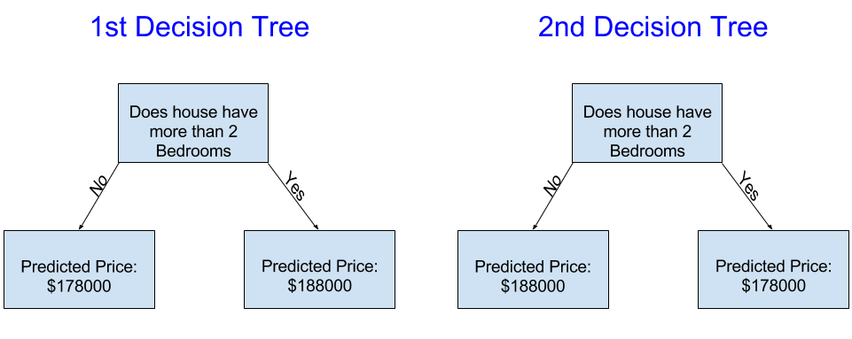

# 介绍

首先，我们将概述机器学习模型的工作原理及其使用方式。

## 我们假设一个场景：
你的表弟通过房地产投机赚了数百万美元。由于您对数据科学感兴趣，他愿意与您成为业务合作伙伴。他将提供资金，您将提供预测各种房屋价值的模型。
你问你的表弟他过去是如何预测房地产价值的，他说这只是直觉。但更多的询问表明，他从过去看到的房子中确定了价格模式，并使用这些模式来预测他正在考虑的新房子。

机器学习的工作方式相同。 我们将从一个名为 Decision Tree （决策树）的模型开始。有更高级的模型可以给出更准确的预测。但决策树很容易理解，它们是数据科学中最佳模型的基础模块。

为简单起见，我们将从最简单的决策树开始。

该决策树只将房屋分为两类。每一类中房屋的预测价格是同一类别中房屋的历史平均价格。

我们使用数据来决定如何将房屋分成两组，然后再次确定每组中的预测价格。 从数据中按模式分类的这一步称为拟合或训练模型。用于拟合模型的数据称为训练数据。

模型如何拟合的细节（例如，如何拆分数据）非常复杂，我们将其保存以备后用。拟合模型后，您可以将其应用于新数据以预测其他房屋的价格。

### 改进决策树

以上两个决策树中的哪一个更有可能通过拟合房地产训练数据而产生？

左侧的决策树（决策树 1）可能更有意义，因为它捕捉到了这样一个现实，即卧室较多的房屋往往比卧室较少的房屋售价更高。 该模型的最大缺点是它没有捕捉到影响房价的大多数因素，例如浴室数量、地块大小、位置等。

您可以使用具有更多“拆分”的树来捕获更多因子。这些被称为 “更深” 的树。这个树还考虑每栋房屋地块总大小等。
如下所示：

您可以通过跟踪决策树来预测任何房屋的价格，始终选择与该房屋特征相对应的路径。房屋的预测价格位于树的底部。 我们进行预测的底部点称为叶子。

叶子上的拆分和值将由数据决定，因此是后续我们将要查看处理数据。