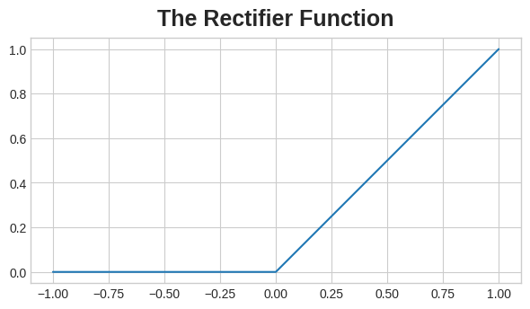
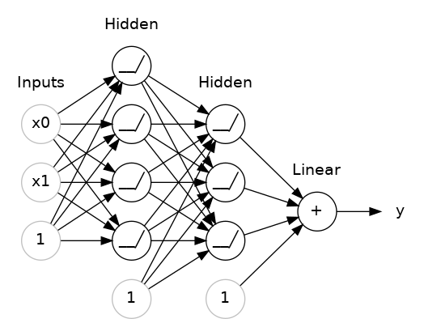

# 深度学习入门

近年来，人工智能领域一些最令人印象深刻的进步就是在深度学习领域。深度学习模型在自然语言翻译（Natural Language Translation）、图像识别（Image Recognition）和游戏博弈（Game Playing）等领域已经达到甚至超越人类水平的表现。

那么什么是深度学习呢？

深度学习是机器学习的一个分支，其核心特征是通过**多层（“深度”）计算堆叠来学习数据**的复杂表征。这种深度计算结构使深度学习模型能够解析现实世界数据中错综复杂的层级化模式（如图像的边缘→纹理→物体部件→完整物体，或语言的音素→单词→句子→语义），从而在诸多任务上取得突破性表现。

其中多层（“深度”）计算堆叠来学习数据指的是：    模型由多个非线性变换层（如全连接层、卷积层、注意力层）堆叠而成，每一层逐步提取更高层次的抽象特征。例如：图像识别中，浅层可能检测边缘，深层可能识别物体类别。

神经网络通过其强大的连接复杂性和可扩展性，成为深度学习的标志性模型。尽管单个神经元仅执行简单计算，但大量神经元通过多层次、高灵活性的互联，能够学习数据中极其复杂的模式。

深度学习简单来说就是为了解决在机器学习中的特征工程问题。深度学习通过构建多层神经网络来自动提取特征，从而减少了对人工特征工程的依赖。

往往大家会讲深度学习过程当成一个黑盒子，这也是因为深度学习的内部逻辑是非常复杂的。实际上深度学习的核心就是神经网络。神经网络是由大量的神经元（节点）组成的，每个神经元通过连接权重与其他神经元相连。通过调整这些权重，神经网络可以学习到输入数据的特征，从而进行分类、回归等任务。

使用 Keras 和 Tensorflow，学习如何进行：
* 创建**完全连接**的神经网络架构 
    （ 也称为 Dense Layer（密集层） 或 Linear Layer（线性层）。每一层的 每个神经元 都与下一层的 所有神经元 相连。例如：如果第 1 层有 3 个神经元，第 2 层有 2 个神经元，那么它们之间的连接权重矩阵就是 3×2 大小，该矩阵用于后续进行层与层，神经元之间的权重。）
* 运用神经网络解决经典的**回归与分类问题**
* 使用随机梯度下降法训练神经网络
* 使用 dropout、批量归一化和其他技术来提高性能。

## 线性单元

让我们从神经网络的基本组件开始：单个神经元。如图所示，具有一个输入的神经元（或单元）如下所示：


输入为 x。它与神经元的连接有一个权重，即 w。每当值流经连接时，您都会将该值乘以连接的权重。对于输入 x，到达神经元的是 w * x。神经网络通过修改其权重来“学习”。我们也常称这一个线性单元为**线性函数**。

b 是一种特殊的权重，我们称之为 bias（偏差）。偏差没有任何与之关联的输入数据;相反，我们在图中放置一个 1，这样到达神经元的值就是 b（因为 1 * b = b）。偏差使神经元能够独立于其输入修改输出。
y 是神经元最终输出的值。为了获得输出，神经元将它通过其连接接收到的所有值相加。这个神经元的激活是 y = w * x + b，或者作为公式 y=wx+by=wx+by = w x + b。
### 线性函数：

用于计算一个数据在每一个类别上的最终得分

f(x,W) = W* x+b 

其中W表示每一个数据点（将一个数据分成多个部分作为基本单元进行计算）对应的权重系数，x表示所有数据点对应的值，b表示每一种分类计算值是需要的浮动量。

下图是以一张图片为例，图片粗略的分为四个像素点，实际上像素点肯定更多，然后这是一个三分类的示例。


### 线性函数计算过程示例；
尽管单个神经元通常仅作为更大网络的一部分发挥作用，但从单个神经元模型作为基础开始学习通常很有用。单神经元模型其实就是线性模型。
让我们以"80种谷物"数据集为例来理解这个过程。假设我们训练一个模型，以"含糖量"（每份糖的克数）作为输入，"卡路里"（每份的热量）作为输出，最终得到模型的偏置项b=90，权重w=2.5。那么对于一份含5克糖的谷物，我们可以这样估算其卡路里含量：

而且，根据我们的公式，我们有 calories = 2.5 × 5 + 90 = 102.5 卡路里=2.5×5+90=102.5 ，正如我们预期的那样。

### 多个输入
上文使用的卡路里数据集其中有很多其他特征不仅仅是含糖量。如果我们想扩展我们的模型以包括纤维或蛋白质含量等内容，该怎么办？这很简单。我们可以向神经元添加更多的输入连接，每个额外的特征对应一个连接权重。具体计算时，我们将每个输入乘以其连接权重，然后将它们全部相加。


这个神经元最终的公式是 `y=w0*x0+w1*x1+w2*x2+b`.具有两个输入的线性单元将拟合一个二维平面，而具有多个输入的单元将拟合一个多维超平面。

### Keras中的线性单元
在 Keras 中创建模型的最简单方法是通过 keras.Sequential，它将神经网络创建为层堆栈。我们可以使用 dense 层创建上述模型（我们将在下一课中详细介绍）。

我们可以定义一个线性模型，接受三个输入特征（'sugars'、'fiber' 和 'protein'）并产生一个输出 （'calories'），如下所示：
```python
from tensorflow import keras
from tensorflow.keras import layers

# Create a network with 1 linear unit
model = keras.Sequential([
    layers.Dense(units=1, input_shape=[3])
])
```

第一个参数 units，用于定义我们想要多少个输出。在这种情况下，我们只预测 'calories'，因此我们将使用 units=1。
第二个参数 input_shape，我们告诉 Keras 输入的维度。设置 input_shape=[3] 可确保模型接受三个特征作为输入（'sugars'、'fiber' 和 'protein'）。

一个简单的神经单元模型就建立完成了。

> 为什么input_shape是一个 Python 列表？
> 我们将在后续演示中使用的数据将是表格数据，就像在 Pandas dataframe中一样。数据集中的每个特征都有一个输入。特征按列排列，因此我们需要使用 input_shape=[num_columns] Keras 在此处使用列表的原因是允许使用更复杂的数据集。例如，图像数据可能需要三个维度：[height, width, channels]


Keras 使用张量存储网络所有权重参数，其本质是 TensorFlow 优化的多维数组（类似 NumPy 数组但更强大） 

模型的权重作为张量列表保存在其 weights 属性中。获取您在上面定义的模型的权重。（如果需要，您可以使用类似以下内容来显示权重：
```python
# YOUR CODE HERE
w, b = model.weights
print("Weights\n{}\n\nBias\n{}".format(w, b))
# Check your answer
q_3.check()
```

与 NumPy 数组的关键区别

| 特性         | NumPy 数组     | TensorFlow 张量               |
|--------------|----------------|-------------------------------|
| **硬件加速** | 仅 CPU         | 支持 GPU/TPU                 |
| **自动微分** | 不支持         | 原生支持 (`GradientTape`)    |
| **分布式计算**| 手动实现       | 原生并行化                   |
| **计算图优化**| 无             | XLA 编译器优化               |

需要注意的是在训练之前，模型的权重是随机设置的。运行下面的单元格几次，以查看不同行生成的的随机初始化权重值。
```python
import tensorflow as tf
import matplotlib.pyplot as plt

model = keras.Sequential([
    layers.Dense(1, input_shape=[1]),
])

x = tf.linspace(-1.0, 1.0, 100)
y = model.predict(x)

plt.figure(dpi=100)
plt.plot(x, y, 'k')
plt.xlim(-1, 1)
plt.ylim(-1, 1)
plt.xlabel("Input: x")
plt.ylabel("Target y")
w, b = model.weights # you could also use model.get_weights() here
plt.title("Weight: {:0.2f}\nBias: {:0.2f}".format(w[0][0], b[0]))
plt.show()
```

## 深度神经网络

在本节中，我们将探索如何构建能够学习深度神经网络所擅长的复杂关系的神经网络。

这里的关键思想是模块化，从更简单的功能单元构建一个复杂的网络。我们之前已经了解了线性单元如何计算线性函数 -- 现在我们将了解如何组合和修改这些单个单元来模拟更复杂的关系。

### Layers 层

神经网络通常将其神经元组织成层。当我们将具有一组公共输入的线性单元收集在一起时，我们会得到一个密集层。

下图是一个由两个线性单元组成的密集层，接收两个输入和一个偏差。


您可以将神经网络中的每一层都视为执行某种相对简单的转换。通过深层堆栈，神经网络可以以越来越复杂的方式转换其输入。在训练有素的神经网络中，每一层都是一个转换，让我们更接近一个解决方案。

> 多种多样的层
> 在 Keras 中，“层”是一种非常通用的东西。从本质上讲，层可以是任何类型的数据转换。许多层，如卷积层和递归层，通过使用神经元来转换数据，主要区别在于它们形成的连接模式。其他 API 使用特征工程或仅进行简单的算术。这一个充满各种层次的世界等着你去发现 - 快来看看吧！

### 激活函数

然而，事实证明，两个中间没有任何内容的密集层并不比单个密集层本身好。密集的图层本身永远无法让我们走出线条和平面的世界。我们需要的是非线性的东西。也就是激活函数。

可以说如果没有激活函数，神经网络只能学习线性关系。为了拟合曲线，我们需要使用激活函数。


激活函数只是我们应用于层的每个输出（其激活）的某个函数。最常见的是max(0,x) 整流器函数.



整流函数的图形是一条直线，但负值部分会被"修正"为零。将这个函数应用于神经元的输出时，会在数据中产生一个转折点，从而使我们摆脱简单的线性关系。

当我们将整流器连接到线性单元时，我们会得到一个整流线性单元或 ReLU。（因此，通常将整流器函数称为“ReLU 函数”。 将 ReLU 激活应用于线性单元意味着输出变为 max(0, w * x + b)，我们可以将其绘制成下图：


### 堆叠全连接层
现在我们已经了解了一些非线性的特征，让我们看看如何堆叠层来获得复杂的数据转换。
下图是一个结构示例：堆叠全连接层 即构成"全连接网络"


输出层之前的层有时被称为隐藏层，因为我们无法直接看到它们的输出。

需要注意的是，上图中的最终 （输出） 层是一个线性单元 （意味着没有激活函数）。这使得这个网络适合于回归任务，用于试图预测一些可以是任意的数值任务。其他任务（如分类）可能需要对输出执行激活函数。

### Building Sequential Models （构建 Sequential 模型）

我们一直在使用的 Sequential 模型将按从头到尾的顺序将一系列层连接在一起：第一层获得输入，最后一层产生输出。下面是对应模型的代码示例：
```python
from tensorflow import keras
from tensorflow.keras import layers

model = keras.Sequential([
    # the hidden ReLU layers
    layers.Dense(units=4, activation='relu', input_shape=[2]),
    layers.Dense(units=3, activation='relu'),
    # the linear output layer 
    layers.Dense(units=1),
])
```
需要注意的是，所有的层是放到一个列表中，例如
```python
[
    # the hidden ReLU layers
    layers.Dense(units=4, activation='relu', input_shape=[2]),
    layers.Dense(units=3, activation='relu'),
    # the linear output layer 
    layers.Dense(units=1),
]
```
而不是作为单独的参数。要配置层使用的激活函数，只需在层中添加一个 activation 参数即可。对于输出层，我们不需要激活函数，因为我们正在执行回归任务。

## 随机梯度下降法

之前我们学习了如何通过堆叠全连接层来构建全连接网络。网络首次创建时，网络的所有权重都是随机设置的 -- 网络还一无所知。在本节中，我们将了解如何训练神经网络，了解观察神经网络的学习过程。

与所有机器学习任务一样，我们从一组训练数据开始。训练数据中的每个样本都包含一些特征 （输入） 和预期目标 （输出）。训练神经网络其实就是调整其权重，使其能够将特征转换为目标。例如，在 80 个谷物数据集中，我们想要得到一个神经网络，它可以获取每种谷物的 'sugar'、'fiber' 和 'protein' 含量，并对该谷物的 'calories' 产生预测。如果我们能成功地训练一个网络来做到这一点，那么它的权重必须以某种方式表示这些特征与训练数据中表达的目标之间的关系。

除了训练数据之外，我们还需要两样东西：
* 一个 “损失函数”，用于衡量网络预测的好坏。
* 一个 “优化器” ，可以告诉网络如何更改其权重。

### 损失函数

我们已经了解了如何设计网络架构，但尚未探讨如何让网络明确要解决的具体问题。这正是损失函数的作用所在。

损失函数通过测量目标的真实值与模型预测的值之间的差异。

针对不同的问题需要采用不同的损失函数。我们一直在探讨回归问题，这类问题的目标是预测数值型结果，比如预测80种谷物的卡路里含量、红酒品质评分等。其他回归任务可能还包括预测房价或汽车燃油效率等。

回归问题的常见损失函数是平均绝对误差或 MAE。对于每个预测y_pred 通过绝对差值 abs(y_true - y_pred) 来衡量与真实目标y_true的差异。

数据集上的总 MAE 损失是所有这些绝对差异的平均值。


除了 MAE 之外，您可能会看到的回归问题的其他损失函数是均方误差 （MSE） 或 Huber 损失（在 Keras 中均可用）。

在训练期间，模型将使用 loss 函数作为指南来查找其权重的正确值（loss 越低越好）。换句话说，损失函数会告诉神经网络它的目标。


### 优化器

我们已经描述了我们希望神经网络解决的问题，但现在我们需要说明如何解决它。这是优化器的工作。优化器是一种调整权重以最小化损失的算法。

实际上，深度学习中使用的所有优化算法都属于一个称为随机梯度下降的家族。它们是逐步训练网络的迭代算法。训练的步骤是这样的：

1. 对一些训练数据进行采样，并通过网络运行它以进行预测。
2. 测量预测值与真实值之间的损失。
3. 最后，沿使损失较小的方向调整权重。

然后一遍又一遍地这样做，直到损失达到你想要的程度（或者直到它不会进一步减少）。


上图是使用 Stochastic Gradient Descent 训练神经网络的过程。

每次迭代所使用的训练数据样本称为"小批量"(minibatch，通常简称为"batch")，而完整遍历一次全部训练数据则称为一个"epoch"(训练周期)。设置的epoch数量决定了网络将会看到每个训练样本的次数。

上面的这段动画展示了第一节中的线性模型通过随机梯度下降(SGD)进行训练的过程。浅红色圆点代表整个训练集，而实心红点则表示当前使用的小批量数据。每当SGD处理一个新批次时，它都会调整权重参数（w表示斜率，b表示截距），使其在该批次数据上趋向最佳值。经过连续批次的迭代，回归线最终收敛至最优拟合状态。可以观察到，随着权重值逐渐接近真实参数，损失值也在持续减小。

### Learning Rate and Batch Size  学习率和批量大小

可以注意到，回归线仅会朝每个批次的方向进行微调（而非完全匹配）。这些调整的幅度由学习率决定：较小的学习率意味着网络需要处理更多小批量数据才能使权重收敛到最优值。

学习率与小批量大小是影响SGD训练过程的两个最关键参数。它们之间的相互作用往往十分微妙，要确定这些参数的最佳选择并不总是显而易见的（我们将在练习中探讨这些影响）。

值得庆幸的是，对于大多数应用场景，并不需要进行大量超参数搜索就能获得令人满意的结果。Adam作为一种自适应学习率的SGD算法，无需参数调优就适用于绝大多数问题（从某种意义上说它是"自调节"的）。Adam堪称通用优化器的理想之选。

### 添加 Loss （损失函数）和 Optimizer（优化器）

在定义模型后，您可以使用模型的 compile 方法添加损失函数和优化器：
```python
model.compile(
    optimizer="adam",
    loss="mae",
)
```
需要特别说明的是，我们仅需通过字符串即可指定损失函数和优化器。虽然您也可以通过Keras API直接调用这些模块（例如需要进行参数调优时），但在当前场景下，默认参数配置已完全够用。
> 术语解析
> 梯度（gradient）本质上是一个矢量，其方向指示了权重参数的最优调整方向。更准确地说，梯度表征了如何调整权重才能使损失值以最快速度变化。我们将这一优化过程称为梯度下降（gradient descent），因为算法正是沿着梯度方向在损失曲面上向极小值点"下降"。
> "随机"（Stochastic）一词的本意是"由概率决定"。之所以称该训练过程具有随机性，是因为每次迭代使用的小批量数据（minibatch）都是从数据集中随机抽样得到的——这正是"SGD"（随机梯度下降）名称的由来！

#### 基于红葡萄酒品质数据集进行示例

现在，我们知道了开始训练深度学习模型所需的一切。那么让我们看看它的实际效果吧！我们将使用 Red Wine Quality 数据集。

该数据集由大约 1600 种葡萄牙红葡萄酒的理化测量值组成。还包括对每款葡萄酒进行盲品测试的质量评级。我们从这些测量中预测葡萄酒的感知质量的能力如何？

数据示例如下：


这个神经网络应该有多少个输入？我们可以通过查看dataframe中的列数来发现这一点。确保此处不要包含目标 （'quality'） —— 只包含输入特征。

```python
print(X_train.shape)
```

(1119, 11)

我们得到11 列表示 11 个输入。

在这里我们选择了一个具有 1500 多个神经元的三层网络。这个网络应该能够学习数据中相当复杂的关系。
```python
from tensorflow import keras
from tensorflow.keras import layers

model = keras.Sequential([
    layers.Dense(512, activation='relu', input_shape=[11]),
    layers.Dense(512, activation='relu'),
    layers.Dense(512, activation='relu'),
    layers.Dense(1),
])
```

模型架构的确定应当遵循系统化的设计流程。建议从简单结构入手，并以验证损失（validation loss）作为核心评估指标。后续练习环节将深入讲解模型开发的完整方法论。

在模型定义完成后，需要通过编译环节集成优化器与损失函数。
```python
model.compile(
    optimizer='adam',
    loss='mae',
)
```
现在我们准备好开始训练了！我们告诉 Keras 一次向优化器提供 256 行训练数据（batch_size），并在整个数据集（epochs）中执行 10 次。

```python
history = model.fit(
    X_train, y_train,
    validation_data=(X_valid, y_valid),
    batch_size=256,
    epochs=10,
)
```

您会注意到，Keras在模型训练过程中将持续更新损失值的变化情况。

通常，查看损失的更好方法是为其绘制图表。fit 方法实际上在 History 对象中保留了训练期间产生的损失的记录。我们将数据转换为 Pandas 数据帧，这样可以轻松绘图。


可以观察到，随着训练轮次（epoch）的增加，损失值逐渐趋于平稳。当损失曲线呈现这种水平状态时，表明模型已达到最佳学习效果，继续增加训练轮次已无必要。
